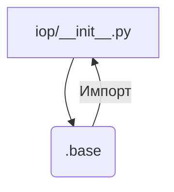

# <input code>

```python
## \file hypotez/src/suppliers/aliexpress/api/_examples/iop/__init__.py
# -*- coding: utf-8 -*-
#! venv/Scripts/python.exe # <- venv win
## ~~~~~~~~~~~~
""" module: src.suppliers.aliexpress.api._examples.iop """
from .base import *
```

# <algorithm>

Этот код представляет собой файл инициализации (`__init__.py`) для модуля `iop` внутри пакета `aliexpress.api._examples`.  Он просто импортирует все имена из модуля `base` в том же каталоге.  Блок-схема проста:



Пример:  Предположим, модуль `.base` содержит функции `get_product_data` и `process_product`.  После импорта, в модуле `iop` можно напрямую использовать эти функции, как если бы они были определены в `iop/__init__.py`.


# <mermaid>


В этом случае `iop/__init__.py` напрямую импортирует все имена из `iop/base.py` в текущее пространство имен (`iop/__init__.py`).  Зависимость  является прямой: `iop/__init__.py` импортирует `iop/base.py`.


# <explanation>

* **Импорты**:  `from .base import *` - импортирует *все* имена (переменные, функции, классы) из модуля `base`, находящегося в том же каталоге (`.base`).  Используя `*`,  код импортирует все из `.base`, это может сэкономить строки, но может вызвать конфликты имен, если несколько модулей используют одни и те же имена.  Этот подход требует ясного понимания структуры пакета, чтобы избежать потенциальных проблем.


* **Классы**:  Код не определяет новых классов.  Классы, если таковые имеются, должны быть определены в `base.py`


* **Функции**:  Функции, если таковые имеются, также определяются в `base.py`.  `from .base import *` позволяет использовать функции из `base` без явного перечисления их имён.


* **Переменные**:  Любые переменные будут импортированы из `base.py`, если они там присутствуют.


* **Возможные ошибки или области для улучшений**:  Импорт всех имен с помощью `*` может привести к нежелательным конфликтам имён в случае, если несколько модулей в разных частях иерархии проекта используют одинаковые имена. Рекомендуется явно импортировать только нужные имена, это сделает код более ясным и менее подверженным ошибкам:


```python
from .base import get_product_data, process_product
```

* **Взаимосвязи с другими частями проекта**: Модуль `iop` использует функциональность из модуля `base`.  Это указывает на  иерархическую структуру, где `base` является основой, а `iop` строит на этой основе.  Без доступа к `base.py`, трудно сказать, откуда приходят данные и как они используются в `iop`.
 Вероятнее всего, `base.py` содержит функции, специфичные для работы с AliExpress API или обработки данных о товарах (product data).  Модуль `iop` скорее всего предназначен для более специфической логики, которая опирается на методы `base`, например, для обработки определенного типа запросов или данных о товарах.


В целом, код простой, но его нужно рассматривать в контексте всей структуры проекта.  Импорт всех имён может быть удобен, но потенциально создаёт проблемы при масштабировании и сложном проектировании.