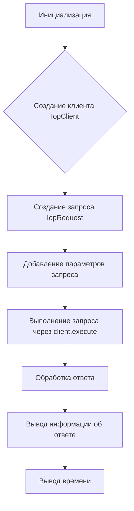
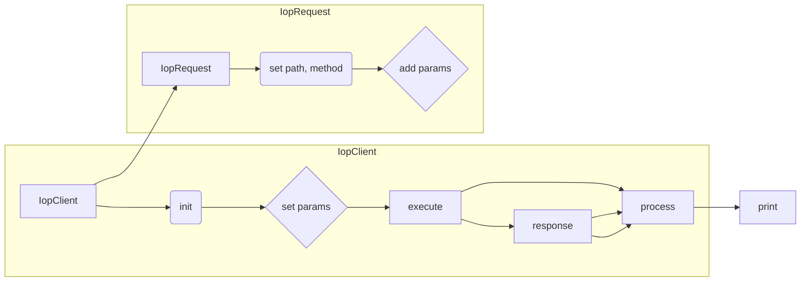

# <input code>

```python
## \file hypotez/src/suppliers/aliexpress/api/_examples/iop/test_internal.py
# -*- coding: utf-8 -*-\
#! venv/Scripts/python.exe # <- venv win
## ~~~~~~~~~~~~~\
""" module: src.suppliers.aliexpress.api._examples.iop """
"""   [File's Description]

 
 @section libs imports:
  - iop 
  - time 
Author(s):
  - Created by Davidka on 09.11.2023 .
"""


import iop
import time

# params 1 : gateway url
# params 2 : appkey
# params 3 : appSecret
client = iop.IopClient('https://api-pre.taobao.tw/rest', '100240', 'hLeciS15d7UsmXKoND76sBVPpkzepxex')
# client.log_level = iop.P_LOG_LEVEL_DEBUG
# create a api request set GET mehotd
# default http method is POST
request = iop.IopRequest('/product/item/get', 'GET')

# simple type params ,Number ,String
request.add_api_param('itemId','157432005')
request.add_api_param('authDO', '{"sellerId":2000000016002}')

response = client.execute(request)
#response = client.execute(request,access_token)

# response type nil,ISP,ISV,SYSTEM
# nil ：no error
# ISP : API Service Provider Error
# ISV : API Request Client Error
# SYSTEM : Iop platform Error
print(response.type)

# response code, 0 is no error
print(response.code)

# response error message
print(response.message)

# response unique id
print(response.request_id)

# full response
print(response.body)

print(str(round(time.time())) + '000')
```

# <algorithm>

**Блок-схема:**



**Примеры:**

* **A (Инициализация):**  `client = iop.IopClient(...)` - Создается экземпляр `IopClient` с заданными параметрами. Например, `https://api-pre.taobao.tw/rest` - URL API,  `100240` - ключ приложения, `hLeciS15d7UsmXKoND76sBVPpkzepxex` - секретный ключ приложения.
* **B (Создание клиента IopClient):**  Создание экземпляра `IopClient` устанавливает соединение с API.
* **C (Создание запроса IopRequest):**  `request = iop.IopRequest(...)`  Создается объект запроса, указывается путь к API и метод.
* **D (Добавление параметров запроса):** `request.add_api_param(...)` - Добавляются параметры для запроса (itemId, authDO).
* **E (Выполнение запроса):**  `response = client.execute(request)` - Отправляется запрос к API и получает ответ в переменной `response`.
* **F (Обработка ответа):**  Проверяются поля ответа (тип, код, сообщение, ID запроса и тело).
* **G (Вывод информации об ответе):**  Выводится информация об ответе (тип, код, сообщение, ID, тело).
* **H (Вывод времени):** Выводится отформатированное текущее время.

**Перемещение данных:**

Данные передаются между компонентами посредством вызовов методов классов.  Например,  параметры `request` передаются в метод `client.execute()`, а ответ сохраняется в `response`.


# <mermaid>



# <explanation>

**Импорты:**

* `import iop`: Импортирует модуль `iop`, который, вероятно, содержит классы и функции для взаимодействия с внешним API (Aliexpress).
* `import time`: Импортирует модуль `time` для работы с временем, здесь используется для вывода текущего времени.

**Классы:**

* `iop.IopClient`:  Представляет клиента для взаимодействия с API. Атрибуты: URL API, ключ приложения, секретный ключ приложения и уровень логирования. Методы: `execute`, скорее всего для отправки запроса.
* `iop.IopRequest`:  Представляет сам запрос. Атрибуты: путь к API и HTTP метод (по умолчанию POST). Метод `add_api_param` для добавления параметров запроса.

**Функции:**

* Нет самостоятельных функций, кроме встроенных Python (print).  Логика работы реализована внутри методов классов `IopClient` и `IopRequest`.

**Переменные:**

* `client`: Экземпляр класса `IopClient` для взаимодействия с API.
* `request`: Экземпляр класса `IopRequest` - запрос.
* `response`:  Объект, содержащий ответ от API.  Объект содержит атрибуты для типа, кода, сообщения и тела ответа.


**Возможные ошибки и улучшения:**

* Отсутствует проверка ошибок в коде. Если API вернет ошибку, то код просто её отобразит. Рекомендуется добавить обработку исключений (`try...except`) для более устойчивого кода.
* Отсутствует логирование ошибок. Для отладки и анализа проблем полезно записывать детали в лог-файл.
* Недостаточно комментариев. Некоторые строки кода можно дополнить комментариями, описывающими их назначение.
* `access_token` (в коде есть комментарий `#response = client.execute(request,access_token)`) - не используется. Если  `access_token` необходим, необходимо добавить его в запрос.
* Непонятно назначение строки `print(str(round(time.time())) + '000')`.

**Взаимосвязь с другими частями проекта:**

Код использует модуль `iop` (скорее всего, собственный или сторонний), который реализует интерфейс для взаимодействия с API.  Модуль `iop`  необходим для коммуникации с внешней системой. Это указывает на то, что  `iop` является библиотекой для работы с определёнными API, вероятно,  собственной разработке или из стороннего репозитория. Без доступа к коду `iop` сложно установить точные взаимосвязи.