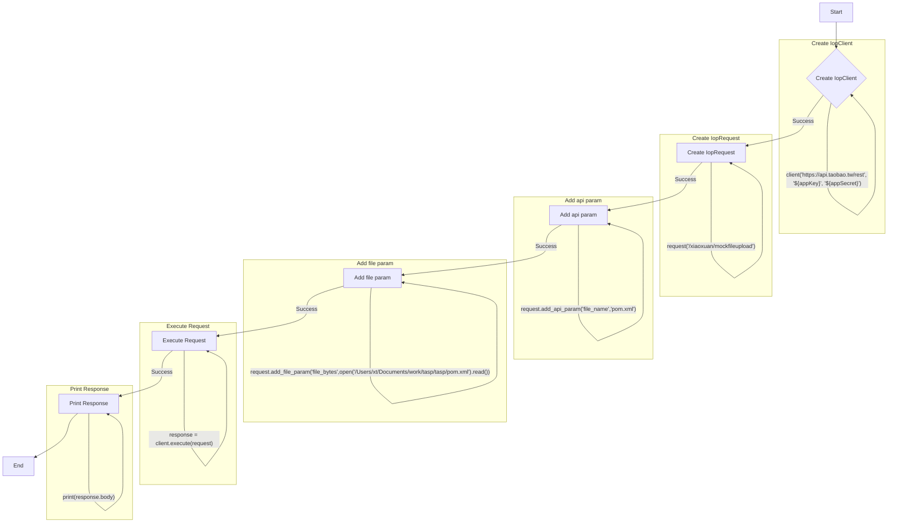

# <input code>

```python
## \file hypotez/src/suppliers/aliexpress/api/_examples/iop/test_upload.py
# -*- coding: utf-8 -*-
#! venv/Scripts/python.exe # <- venv win
## ~~~~~~~~~~~~~
""" module: src.suppliers.aliexpress.api._examples.iop """
# # -*- coding: utf-8 -*-
#
# import iop
#
# # params 1 : gateway url
# # params 2 : appkey
# # params 3 : appSecret
# client = iop.IopClient('https://api.taobao.tw/rest', '${appKey}', '${appSecret}')
#
# # create a api request
# request = iop.IopRequest('/xiaoxuan/mockfileupload')
#
# # simple type params ,Number ,String
# request.add_api_param('file_name','pom.xml')
#
# # file params, value should be file content
# request.add_file_param('file_bytes',open('/Users/xt/Documents/work/tasp/tasp/pom.xml').read())
#
# response = client.execute(request)
# #response = client.execute(request,access_token)
#
#
# # response type nil,ISP,ISV,SYSTEM
# # nil ：no error
# # ISP : API Service Provider Error
# # ISV : API Request Client Error
# # SYSTEM : Iop platform Error
# print(response.type)
#
# # response code, 0 is no error
# print(response.code)
#
# # response error message
# print(response.message)
#
# # response unique id
# print(response.request_id)
#
# # full response
# print(response.body)
```

# <algorithm>



# <mermaid>

```mermaid
graph LR
    subgraph IopClient
        A[IopClient] --> B(https://api.taobao.tw/rest, ${appKey}, ${appSecret});
        B --> C{Create IopClient Object};
    end
    subgraph IopRequest
        D[IopRequest] --> E(/xiaoxuan/mockfileupload);
        E --> F{Create IopRequest Object};
    end
    subgraph AddParams
        F --> G{add_api_param('file_name', 'pom.xml')};
        F --> H{add_file_param('file_bytes', fileContent)};
    end
    subgraph Execute
        C --> I{client.execute(request)};
        I --> J[Response Object];
    end
    subgraph PrintResponse
        J --> K{print(response.type)};
        J --> L{print(response.code)};
        J --> M{print(response.message)};
        J --> N{print(response.request_id)};
        J --> O{print(response.body)};
    end
    
    
    
    
    
    
    
    A --> D
    C --> F
    I --> J
    J --> K
    J --> L
    J --> M
    J --> N
    J --> O
```

# <explanation>

**Импорты:**

Код импортирует модуль `iop`.  По информации, предоставленной в коде, этот модуль, скорее всего, является собственным (или из стороннего пакета), предоставляющим API для взаимодействия с платформой iop. Связь с пакетами `src` не указана.

**Классы:**

Код использует класс `IopClient` из модуля `iop`. Этот класс, предположительно, отвечает за взаимодействие с внешним API.  Его атрибуты (вроде `gateway_url`, `app_key`, `app_secret`) и методы (такой как `execute`) позволяют делать запросы и обрабатывать ответы.  
Также используется класс `IopRequest`, вероятно, для подготовки запросов к API.  Его методы `add_api_param` и `add_file_param` добавляют параметры запроса, включая загрузку файла.


**Функции:**

Код не содержит пользовательских функций.

**Переменные:**

- `client`: Объект класса `IopClient`, используется для взаимодействия с API.
- `request`: Объект класса `IopRequest`, содержащий параметры для запроса.
- `response`: Объект, содержащий ответ от API. Содержит данные о типе ответа, коде, сообщении, уникальном идентификаторе и полном ответе.


**Возможные ошибки и области для улучшений:**

- **Захардкоженные пути:** Путь `/Users/xt/Documents/work/tasp/tasp/pom.xml` — это захардкоженный путь к файлу. При перемещении кода или изменении местоположения файла, потребуется изменить код. Лучше использовать относительные пути или механизмы конфигурации для хранения путей.
- **Обработка ошибок:** Отсутствует обработка ошибок при открытии файла или выполнении запроса.  Необходимо добавить `try...except` блоки для перехвата исключений (например, `FileNotFoundError` или исключений, возвращаемых `IopClient`).
- **Проверка типа:** Не проверяется, что `file_bytes` содержит данные файла, а не что-то другое. Примеры ошибок: строка, пустое значение.  Необходимо добавлять валидацию для этого параметра.
- **Валидация параметров:**  В коде отсутствуют валидация параметров для `appKey` и `appSecret`.  Это потенциальный риск безопасности.


**Цепочка взаимосвязей с другими частями проекта:**

Код использует API, предоставляет `iop`.  Более подробные детали о реализации данного API и  о его зависимости от других модулей требуют доступа к source коду `iop`.

**Выводы:**

Код демонстрирует взаимодействие с внешним API через класс `IopClient`. Однако, он требует улучшений в плане обработки ошибок, проверки типов и использованием переменных.  Захардкоженные пути делают код менее переносимым.  Необходимо улучшить модуль `iop` или добавить обработку ошибок для `IopClient` чтобы избежать неконтролируемого завершения программы.