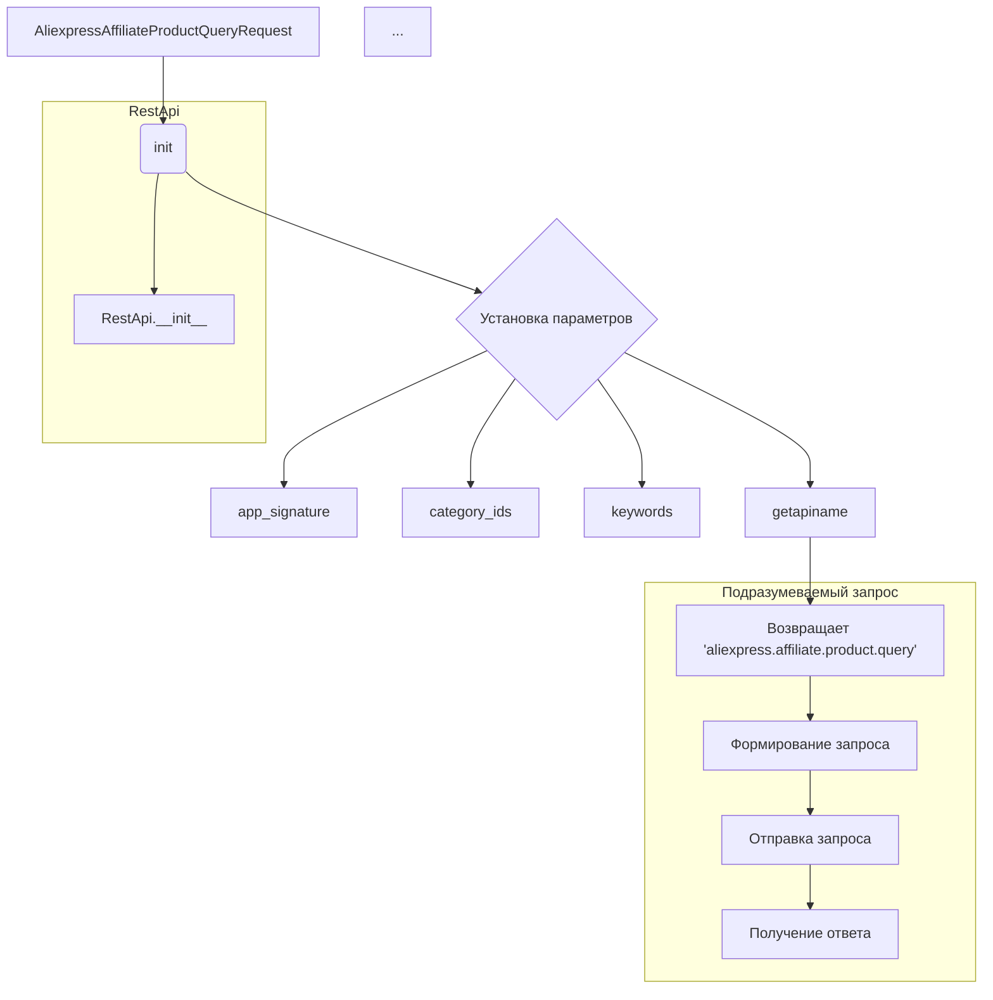

```MD
# <input code>

```python
## \file hypotez/src/suppliers/aliexpress/api/_examples/rest/AliexpressAffiliateProductQueryRequest.py
# -*- coding: utf-8 -*-\
#! venv/Scripts/python.exe # <- venv win
## ~~~~~~~~~~~~~\
""" module: src.suppliers.aliexpress.api._examples.rest """
'''
Created by auto_sdk on 2021.05.20
'''
from ..base import RestApi
class AliexpressAffiliateProductQueryRequest(RestApi):
	def __init__(self, domain="api-sg.aliexpress.com", port=80):
		RestApi.__init__(self,domain, port)
		self.app_signature = None
		self.category_ids = None
		self.delivery_days = None
		self.fields = None
		self.keywords = None
		self.max_sale_price = None
		self.min_sale_price = None
		self.page_no = None
		self.page_size = None
		self.platform_product_type = None
		self.ship_to_country = None
		self.sort = None
		self.target_currency = None
		self.target_language = None
		self.tracking_id = None

	def getapiname(self):
		return 'aliexpress.affiliate.product.query'
```

# <algorithm>

**Шаг 1:** Инициализация объекта `AliexpressAffiliateProductQueryRequest`.
* Пример: `request = AliexpressAffiliateProductQueryRequest(domain="api-us.aliexpress.com")`
* Данные: `domain`, `port` передаются в конструктор.
* Результат: Создается экземпляр класса с нулевыми значениями для всех атрибутов.

**Шаг 2:** Установка значений атрибутов.
* Пример: `request.category_ids = [1, 2, 3]`
* Данные: Различные параметры запроса (category_ids, keywords и т.д.) устанавливаются через атрибуты объекта.
* Результат: Объект `request` содержит необходимые данные для запроса.

**Шаг 3:** Получение имени API.
* Пример: `api_name = request.getapiname()`
* Данные: Нет входных данных.
* Результат: Строка `'aliexpress.affiliate.product.query'` - имя API.

**Шаг 4 (не показан в коде, но подразумевается):** Формирование и отправка запроса.
* Данные из атрибутов объекта request передаются в базовый класс `RestApi` для формирования и отправки запроса к API Aliexpress.
* Результат: Ответ от API.


# <mermaid>



# <explanation>

**Импорты:**

* `from ..base import RestApi`: Импортирует базовый класс `RestApi` из модуля `base` в папке `src.suppliers.aliexpress.api`.  `..` означает поднятие на уровень выше текущей папки. Эта строчка указывает на зависимость от базового класса для обработки REST запросов.

**Классы:**

* `AliexpressAffiliateProductQueryRequest(RestApi)`: Наследует от класса `RestApi`, расширяя его функциональность.  Этот класс предназначен для создания запросов к API Aliexpress для получения информации о продуктах с использованием аффилиатной программы.  Атрибуты `app_signature`, `category_ids`, `keywords` и т.д. содержат параметры запроса.  Метод `getapiname()` возвращает имя конечной точки API.

**Функции:**

* `__init__(self, domain="api-sg.aliexpress.com", port=80)`: Конструктор класса. Инициализирует атрибуты объекта, принимая значения по умолчанию для `domain` и `port`.  Это значит, что можно создать экземпляр класса без указания этих параметров.
* `getapiname(self)`: Возвращает строку `'aliexpress.affiliate.product.query'`.  Это имя конечной точки API, к которой нужно обратиться для получения данных.

**Переменные:**

* Атрибуты класса (например, `self.category_ids`, `self.keywords`) являются переменными, хранящими данные, необходимые для запроса.  Они инициализируются в конструкторе со значениями по умолчанию `None`.

**Возможные ошибки и улучшения:**

* Отсутствие валидации данных: Класс не проверяет корректность входных данных (например, `category_ids` - список целых чисел).  Добавление проверки позволит избежать ошибок при использовании.
* Не реализовано формирование и отправка запроса:  Класс определяет параметры запроса, но не содержит реализации логики формирования и отправки HTTP запроса к API.  Функциональность должна быть реализована, основываясь на `RestApi`.
* Недостаточно комментариев:  Добавление комментариев к коду, особенно к атрибутам и методам, значительно улучшит его читаемость и понимание.


**Взаимосвязи с другими частями проекта:**

Этот класс тесно связан с классом `RestApi`, являющимся его предком, для отправки запросов. Он, вероятно, используется в других частях проекта, таких как скрипты парсинга или обработки данных с API Aliexpress.  Необходимы дальнейшие данные для полного анализа взаимосвязей, как например, где и как используется этот класс.