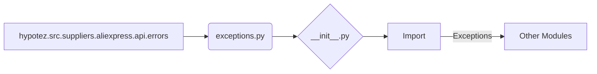

# <input code>

```python
## \file hypotez/src/suppliers/aliexpress/api/errors/__init__.py
# -*- coding: utf-8 -*-
#! venv/Scripts/python.exe # <- venv win
## ~~~~~~~~~~~~
""" module: src.suppliers.aliexpress.api.errors """
from .exceptions import *
```

# <algorithm>

Этот код представляет собой файл `__init__.py` для пакета `errors` в модуле `aliexpress.api` проекта `hypotez`.  Он выполняет импорт всех классов исключений, определенных в файле `exceptions.py` внутри того же пакета.  Поскольку это файл `__init__.py`, он позволяет другим частям проекта импортировать исключения из этого пакета, используя имя пакета `hypotez.src.suppliers.aliexpress.api.errors`.  В данном случае алгоритм крайне прост – он подключает все необходимые исключения.  Никакой обработки данных или вычислений не происходит.


# <mermaid>



# <explanation>

* **Импорты**:  Строка `from .exceptions import *` импортирует все классы из модуля `exceptions.py`.  Символ `.` в начале импорта указывает, что файл `exceptions.py` находится в той же директории, что и текущий файл `__init__.py`.  Это стандартный способ импортировать классы/функции из подмодулей.  Связь с другими пакетами (например, `src`) заключается в том, что эти исключения предназначены для обработки ошибок, связанных с API AliExpress, внутри более крупного проекта `hypotez`.


* **Классы**:  Файл `exceptions.py` (который не представлен в данном коде, но подразумевается) содержит классы исключений, специфичные для API AliExpress.  Эти классы наследуются от базовых исключений Python (например, `Exception`),  позволяя обрабатывать ошибки, связанные с работой с API, на разных уровнях проекта.


* **Функции**: В данном файле нет функций. Только импорты.

* **Переменные**:  Нет.

* **Возможные ошибки или области для улучшений**:

    * **Недостаточная информация об исключениях**:  Код не описывает, какие именно исключения импортируются.  Для лучшего понимания, в файле `exceptions.py` должны быть определены классы исключений со своими сообщениями об ошибках,  типами исключений и другими характеристиками.
    * **Документация**:  Добавление docstrings к классам исключений существенно улучшит понимание их роли и использования.
    * **Использование `from ... import` вместо `from ... import *`:**  При импорте из модулей стоит предпочесть `from module import specific_class`, если это возможно.  Использование `*` делает код более сложным для понимания, если нет явной необходимости импортировать все из модуля. Это связано с принципом наименьшего удивления – код должен быть понятным и предсказуемым.

* **Цепочка взаимосвязей**:  Этот файл `__init__.py` необходим для доступа к исключениям API AliExpress из других частей проекта `hypotez`.  Эти исключения могут быть использованы в контроллерах, сервисах или других модулях, которые взаимодействуют с API.  Например, обработчик запросов к API может использовать исключения из этого модуля для обработки ошибок, полученных от API AliExpress.