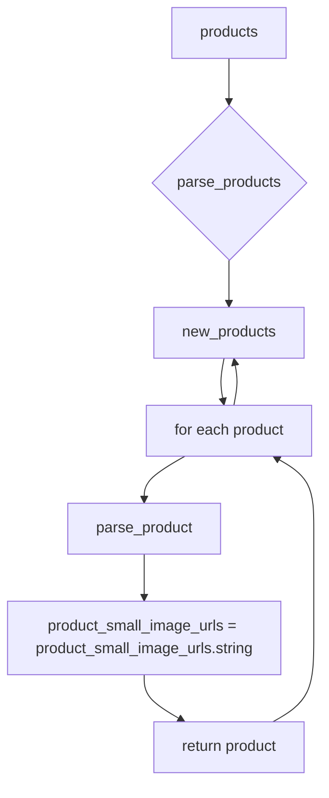

```MD
# Анализ кода файла hypotez/src/suppliers/aliexpress/api/helpers/products.py

## <input code>

```python
## \file hypotez/src/suppliers/aliexpress/api/helpers/products.py
# -*- coding: utf-8 -*-\
#! venv/Scripts/python.exe # <- venv win
## ~~~~~~~~~~~~~\
""" module: src.suppliers.aliexpress.api.helpers """
def parse_product(product):
    product.product_small_image_urls = product.product_small_image_urls.string
    return product

def parse_products(products):
    new_products = []

    for product in products:
        new_products.append(parse_product(product))

    return new_products
```

## <algorithm>

**Алгоритм работы кода:**

**Функция `parse_product`:**

1. Принимает объект `product` в качестве входных данных.
2. Извлекает значение атрибута `product_small_image_urls` из объекта `product`.  Обратите внимание, что предполагается, что `product_small_image_urls` является объектом, у которого есть атрибут `.string` (вероятно, это результат парсинга из какого-то источника данных).
3. Присваивает значение `string` атрибута `product_small_image_urls` самому объекту `product`.
4. Возвращает измененный объект `product`.

**Функция `parse_products`:**

1. Принимает список объектов `products` в качестве входных данных.
2. Создает пустой список `new_products`.
3. Проходит по каждому объекту `product` в списке `products`.
4. Для каждого объекта `product` вызывает функцию `parse_product`, передавая его в качестве аргумента.
5. Добавляет результат, который является измененным объектом `product`, в список `new_products`.
6. Возвращает список `new_products` с измененными объектами.

**Пример:**

Предположим, `products` содержит список объектов, где каждый объект имеет атрибут `product_small_image_urls` в виде объекта с методом `string`.


```
products = [product1, product2]
product1.product_small_image_urls = <объект с методом string>
product2.product_small_image_urls = <объект с методом string>
```

После выполнения `parse_products(products)`, `new_products` будет содержать список измененных объектов `product1` и `product2`, где `product_small_image_urls` будет содержать строковое значение.


## <mermaid>




## <explanation>

**Импорты:**

Нет импортов в данном коде.

**Классы:**

Код не определяет классы. Он работает с объектами, предположительно, полученными из другого места (например, из библиотеки для работы с API).

**Функции:**

* **`parse_product(product)`:**
    * **Аргументы:** `product` – объект, предположительно, представляющий данные о продукте.
    * **Возвращаемое значение:** Изменённый объект `product`.
    * **Описание:** Извлекает строковое значение из атрибута `product_small_image_urls` и сохраняет его в том же объекте.
    * **Пример:**  Если `product.product_small_image_urls`  имеет значение `<html.BeautifulSoup object at 0x...>`, то в результате выполнения функции `parse_product` `product.product_small_image_urls` будет содержать строку, полученную из `.string` этого объекта.
* **`parse_products(products)`:**
    * **Аргументы:** `products` – список объектов `product`.
    * **Возвращаемое значение:** Список `new_products` с изменёнными объектами `product`.
    * **Описание:** Циклически вызывает функцию `parse_product` для каждого элемента списка `products` и добавляет результат в новый список `new_products`.
    * **Пример:** Если `products` содержит 3 объекта, то `parse_products` вернёт новый список из 3 изменённых объектов.

**Переменные:**

* `product`: объект, представляющий продукт.
* `new_products`: список, хранящий изменённые объекты.
* `products`: список объектов, передаваемый в функцию для обработки.

**Возможные ошибки и улучшения:**

* **Обработка исключений:** Если `product.product_small_image_urls` не имеет атрибута `.string`, произойдёт ошибка `AttributeError`. Необходимо добавить обработку исключений (например, `try...except` блок).
* **Проверка типа:** Проверка, что `products` — действительно список, и каждый элемент в нём — объект с нужными атрибутами, увеличит надёжность кода.
* **Доступ к атрибутам:** Необходимо понимать, как выглядит объект `product` и какие методы доступны для него.

**Взаимосвязи с другими частями проекта:**

Функции `parse_product` и `parse_products` находятся в модуле `products.py`, который, вероятно, является частью API для работы с данными о продуктах на сайте AliExpress. Для корректной работы, эти функции требуют, чтобы `product` (или объекты, содержащиеся в `products`) имели необходимые атрибуты. Модуль скорее всего получает данные о продуктах из `aliexpress` API, обрабатывает их и передает дальше.  Эти данные, например, могут использоваться для добавления товаров в базу данных, вывода информации на сайт или дальнейшей обработки.