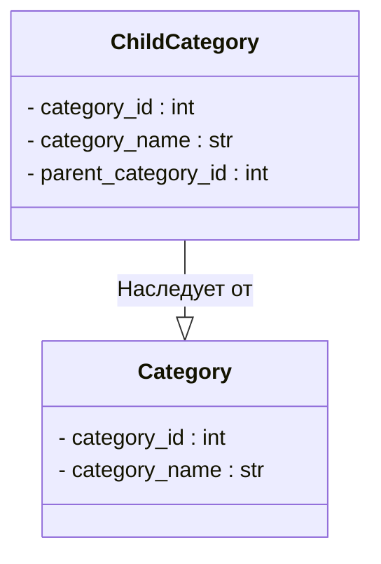

```MD
# Анализ кода из файла hypotez/src/suppliers/aliexpress/api/models/category.py

## <input code>

```python
# -*- coding: utf-8 -*-
#! venv/Scripts/python.exe # <- venv win
## ~~~~~~~~~~~~~\
""" module: src.suppliers.aliexpress.api.models """
class Category:
    category_id: int
    category_name: str


class ChildCategory(Category):
    parent_category_id: int
```

## <algorithm>

Алгоритм работы кода достаточно прост. Он описывает иерархию категорий, используя наследование.

**Шаг 1:** Определение класса `Category`.
    * Создается класс `Category`, который содержит атрибуты `category_id` (тип `int`) и `category_name` (тип `str`). Это базовый класс для представления категорий.
    * Пример: `Category(category_id=1, category_name="Электроника")`

**Шаг 2:** Определение класса `ChildCategory`.
    * Создается класс `ChildCategory`, который наследуется от класса `Category`.
    * Добавляется атрибут `parent_category_id` (тип `int`), описывающий родительскую категорию.
    * Пример: `ChildCategory(category_id=2, category_name="Телефоны", parent_category_id=1)`

**Взаимодействие:** `ChildCategory` содержит все данные, необходимые `Category`, плюс дополнительную информацию о родительской категории.

## <mermaid>



## <explanation>

**Импорты:**
В данном коде нет импортов.

**Классы:**
* **`Category`**: Базовый класс для представления категорий. Он определяет общие атрибуты `category_id` и `category_name` для всех категорий.
* **`ChildCategory`**: Класс, представляющий дочернюю категорию. Он наследуется от `Category`, что означает, что он содержит все атрибуты класса `Category` (category_id и category_name), а также дополнительный атрибут `parent_category_id`.

**Функции:**
Код не содержит функций.

**Переменные:**
`category_id`, `category_name`, `parent_category_id` — переменные-атрибуты классов, используемые для хранения идентификаторов и названий категорий. Они имеют типы `int` и `str` соответственно.

**Возможные ошибки или улучшения:**

* **Отсутствует логика работы с данными:** Код только определяет структуру данных, но не описывает, как эти данные будут получаться или использоваться. Необходимо добавить методы для получения, сохранения и обработки данных категорий.
* **Типы данных:** Хотя `category_id` объявлен как `int`, в реальном применении может понадобиться проверка на корректность типа для предотвращения ошибок.
* **Добавление методов:** Необходимо добавить методы (например, `__init__`) для инициализации объектов классов и, возможно, методы для доступа к атрибутам.
* **Взаимодействие с БД:** Возможно, потребуется взаимодействие с базой данных для хранения и извлечения данных о категориях.

**Цепочка взаимосвязей:**

Данный код является частью модуля `api/models` для работы с API AliExpress.  Он будет использоваться в других частях проекта для работы с категориями AliExpress.  Например, в `suppliers/aliexpress/api/controllers`, `suppliers/aliexpress/api/services` или `api/serializers` может существовать код, использующий эти классы для работы с API и взаимодействия с другими частями приложения.  Данные, полученные с AliExpress, вероятно, будут парситься и обрабатываться в этом коде, и его структура должна соответствовать структуре данных, предоставляемых API.