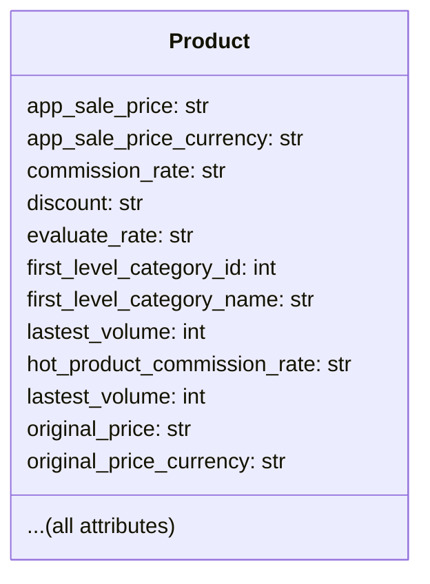

# <input code>

```python
## \file hypotez/src/suppliers/aliexpress/api/models/product.py
# -*- coding: utf-8 -*-
#! venv/Scripts/python.exe # <- venv win
## ~~~~~~~~~~~~~
""" module: src.suppliers.aliexpress.api.models """
from typing import List


class Product:
    app_sale_price: str
    app_sale_price_currency: str
    commission_rate: str
    discount: str
    evaluate_rate: str
    first_level_category_id: int
    first_level_category_name: str
    lastest_volume: int
    hot_product_commission_rate: str
    lastest_volume: int
    original_price: str
    original_price_currency: str
    product_detail_url: str
    product_id: int
    product_main_image_url: str
    product_small_image_urls: List[str]
    product_title: str
    product_video_url: str
    promotion_link: str
    relevant_market_commission_rate: str
    sale_price: str
    sale_price_currency: str
    second_level_category_id: int
    second_level_category_name: str
    shop_id: int
    shop_url: str
    target_app_sale_price: str
    target_app_sale_price_currency: str
    target_original_price: str
    target_original_price_currency: str
    target_sale_price: str
    target_sale_price_currency: str
```

# <algorithm>

```mermaid
graph TD
    A[Product Class] --> B(app_sale_price);
    A --> C(app_sale_price_currency);
    A --> D(commission_rate);
    A --> E(discount);
	... (and so on for all attributes)
```

This code defines a class `Product` with numerous attributes to store various information about a product from AliExpress.  There's no algorithm per se, as it just defines the structure.  Data is stored in the `Product` objects via their attributes. No methods are included; this is just a data structure.


# <mermaid>



The diagram shows a simple class `Product` with many attributes.  No dependencies are shown because there are no external calls in this piece of code.


# <explanation>

* **Импорты**:
    The only import is `from typing import List`. This is standard Python typing that allows specifying the expected type of a variable (in this case, a list of strings).  It's used to ensure type safety in the `product_small_image_urls` attribute.

* **Классы**:
    The `Product` class is defined. This class is designed to represent a product from AliExpress. Its role is to encapsulate all the data associated with a single product. The attributes represent different product details.  Crucially, this code only defines the *structure* of a product. It doesn't contain any logic (methods) to manipulate the data.

* **Функции**:
    There are no functions defined in this snippet.  This is just a class definition.

* **Переменные**:
    All variables are attributes of the `Product` class. They are defined as various types, e.g., `str`, `int`, `List[str]`, which indicates the expected format of the data stored in the corresponding attributes.

* **Возможные ошибки или области для улучшений**:

    * **Data Validation:** The code lacks any validation of the data that will be stored in the attributes.  For example, `app_sale_price` should likely be a number, not just a string.  Input sanitization is a critical component missing.
    * **Missing Methods:**  This code doesn't include methods for accessing or manipulating the data stored in `Product` objects (e.g., to get the `sale_price`, set it, or perform calculations).
    * **Duplicate Attribute**: The `lastest_volume` attribute appears twice, potentially a typo.
    * **Type Hinting**: While typing is used for `List`, the other attributes should also benefit from type hinting (e.g., `Float`, `Decimal`, `Date`) for more robust data management.

* **Взаимосвязи с другими частями проекта:**  The `Product` class likely plays a role in handling and storing data related to AliExpress products.  Without further context of the larger project, it is hard to say how the data contained in this `Product` instance is used. For example, it is likely involved in functions or classes in `aliexpress/api` and potentially interacts with parts in `suppliers` for product retrieval.

**In Summary:**  The code defines a data structure for representing an AliExpress product.  It needs significant additions (data validation, methods, type hinting) to be part of a working application.  Further context from the surrounding project is essential to understand its complete purpose and integration.