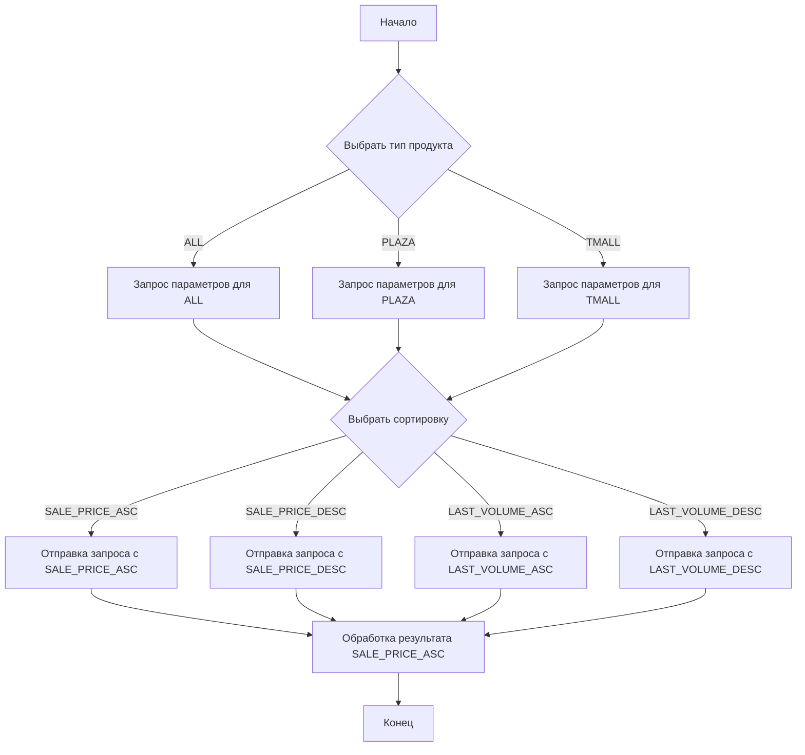
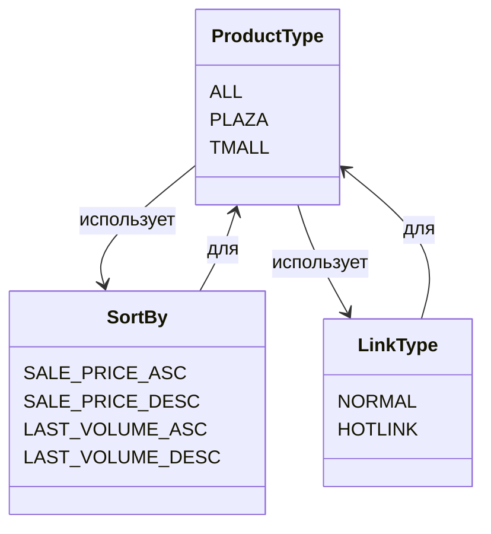

# <input code>

```python
## \file hypotez/src/suppliers/aliexpress/api/models/request_parameters.py
# -*- coding: utf-8 -*-
#! venv/Scripts/python.exe # <- venv win
## ~~~~~~~~~~~~~
""" module: src.suppliers.aliexpress.api.models """
class ProductType:
    ALL = 'ALL'
    PLAZA = 'PLAZA'
    TMALL = 'TMALL'

class SortBy:
    SALE_PRICE_ASC = 'SALE_PRICE_ASC'
    SALE_PRICE_DESC = 'SALE_PRICE_DESC'
    LAST_VOLUME_ASC = 'LAST_VOLUME_ASC'
    LAST_VOLUME_DESC = 'LAST_VOLUME_DESC'

class LinkType:
    NORMAL = 0
    HOTLINK = 2
```

# <algorithm>



Пример: Пользователь хочет получить список продуктов типа PLAZA, отсортированных по цене (возрастанию).

1. Начало выполнения кода.
2. Выбор типа продукта: PLAZA.
3. Выбор сортировки: SALE_PRICE_ASC.
4. Отправка запроса с параметрами PLAZA и SALE_PRICE_ASC к API.
5. Получение данных от API.
6. Обработка полученных данных.
7. Конец выполнения.


# <mermaid>



# <explanation>

Этот код определяет три класса, представляющие собой перечисления (enums) для параметров запросов к API AliExpress.

* **Импорты**: Нет импортов.  Этот код является отдельным модулем, не использующим внешние библиотеки.  Он находится в структуре пакета `hypotez/src/suppliers/aliexpress/api/models`.  Такая структура предполагает, что в проекте есть другие модули для работы с поставщиками данных, API и моделями данных.

* **Классы**:
    * **`ProductType`**: Представляет типы продуктов (ALL, PLAZA, TMALL).  Эти константы используются для фильтрации продуктов при запросе данных к API AliExpress.
    * **`SortBy`**: Представляет варианты сортировки (по цене и объёму продаж).  Они нужны для упорядочения результатов запроса.
    * **`LinkType`**: Представляет типы ссылок.  `NORMAL` и `HOTLINK` вероятно указывают на разные типы ссылок на продукты.

* **Функции**: Нет функций.  Код определяет только классы перечислений (enums).

* **Переменные**: Нет переменных. Все значения представляют собой строковые литералы (константы).

* **Возможные ошибки или области для улучшений**:
    * Отсутствует логика обработки самих запросов к API, то есть нет действий, которые принимают значения из перечислений для формирования и отправки запроса. Необходима функция или класс для выполнения запроса к API AliExpress, используя данные из этих перечислений.
    * Отсутствует обработка ошибок. При ошибке запроса к API, вероятно, требуется специальная обработка ошибок.
    * Отсутствует документация к классу. Добавление docstrings к классам и методам значительно улучшило бы читаемость кода и понимание его назначения.

**Цепочка взаимосвязей с другими частями проекта:**

Этот файл содержит данные, необходимые для построения запросов к API AliExpress.  Другие модули в `hypotez/src/suppliers/aliexpress/api` будут использовать эти значения для формирования запросов и обработки полученных данных.  Затем результаты могут быть использованы другими частями проекта для обработки данных продукта или для других операций.