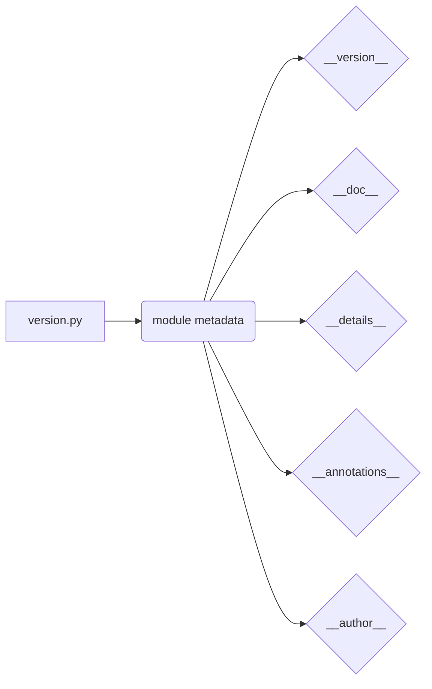

```MD
# Анализ кода файла hypotez/src/suppliers/aliexpress/api/version.py

## <input code>

```python
## \file hypotez/src/suppliers/aliexpress/api/version.py
# -*- coding: utf-8 -*-\
#! venv/Scripts/python.exe # <- venv win
## ~~~~~~~~~~~~~\
""" module: src.suppliers.aliexpress.api """

"""
- `__version__`: This variable holds the version of the module or package.
- `__name__`: Contains the name of the module. If the script is being run directly, the value will be `"__main__"`.
- `__doc__`: The module's documentation string.
- `__details__`: This variable likely contains additional details about the module, but the exact purpose depends on the specific module or package.
- `__annotations__`: Contains type annotations for variables and functions in the module.
- `__author__`: The name(s) of the author(s) of the module.
"""
__name__:str
__version__="3.12.0.0.0.4"
__doc__:str
__details__:str="Details about version for module or class"
__annotations__

__author__='hypotez '
```

## <algorithm>

Этот код не содержит алгоритма в виде последовательности шагов. Он определяет переменные, которые хранят метаданные о модуле (например, версия, описание, автор).  Данные не перемещаются между функциями или классами.

## <mermaid>



## <explanation>

Этот файл `version.py` определяет переменные, которые используются для хранения метаданных о модуле `src.suppliers.aliexpress.api`.  Эти переменные содержат информацию о версии, документации, авторе и т.д.  Такой подход часто используется в Python для организации и документирования кода.

### Импорты

Файл не содержит импортов, он содержит только определения переменных.

### Классы

В файле нет определений классов.

### Функции

В файле нет определений функций.

### Переменные

- `__version__`: Строковая переменная, содержащая версию модуля (`3.12.0.0.0.4`).
- `__doc__`: Строковая переменная, содержащая строку документации модуля.
- `__details__`: Строковая переменная, содержащая дополнительные сведения о модуле.
- `__annotations__`:  Переменная, которая, вероятно, будет содержать аннотации типов (в Python 3.5 и выше). В данном случае она пуста.
- `__author__`: Строковая переменная, содержащая имя автора модуля.

### Возможные ошибки или улучшения

* **Неиспользуемые переменные**: Переменные `__name__`, `__doc__`, `__annotations__` определены, но не инициализированы и не используются в коде.  Это может быть ошибкой или преднамеренным выбором, но рекомендуется, чтобы такие переменные были объявлены только при наличии инициализирующих значений.  Неинициализированные переменные могут повлечь за собой неожиданные ошибки при использовании.
* **Дополнительные метаданные**: Возможно, файл `version.py` должен быть частью системы управления версиями, и эти переменные играют роль в системе сборки/документирования.  Определения этих переменных помогают системам, например, для генерации файлов `README` или `setup.py` для пакетов.
* **Включить обработку исключений**: В данном случае, в файле отсутствует логика, поэтому исключения обрабатывать не нужно.  Если бы в файле был код, необходимо было бы добавить обработку исключений.


### Взаимосвязь с другими частями проекта

Этот файл `version.py` служит для хранения метаданных о модуле `src.suppliers.aliexpress.api`.  Эти метаданные могут использоваться другими частями проекта, например, системами сборки, пакетами или системами документации. Файл `version.py` является частью структуры пакета `aliexpress`, что указывает на то, что он служит для определения свойств модуля.