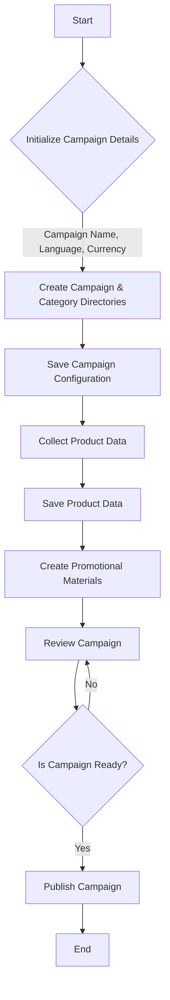
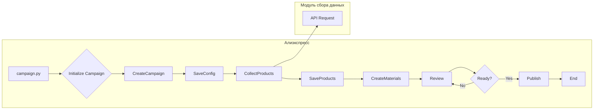

```MD
# Анализ кода создания рекламной кампании на AliExpress

## <input code>

```
+-------------------------+
| Start                   |
| Создание рекламной      |
| кампании                |
+-----------+-------------+
            |
            v
+-----------+---------------+
| Initialize Campaign Name, |
| Language, and Currency    |
+-----------+---------------+
            |
            v
+-----------+-------------+
| Create Campaign and     |
| Category Directories    |
+-----------+-------------+
            |
            v
+-----------+-----------------
| Save Campaign Configuration |
+-----------+-----------------
            |
            v
+-----------+-------------+
| Collect Product Data    |
+-----------+-------------+
            |
            v
+-----------+-------------+
| Save Product Data       |
+-----------+-------------+
            |
            v
+-----------+------------------+
| Create Promotional Materials |
+-----------+------------------+
            |
            v
+-----------+-------------+
| Review Campaign         |
+-----------+-------------+
            |
            v
+-----------+-------------+
| Is Campaign Ready?      |
+-----------+-------------+
   | Yes / No
   v      v
+-----------+-------------+
| Publish Campaign        |
+-----------+-------------+
   |
   v
+-----------+-------------+
| End                     |
| Создание рекламной      |
| кампании                |
+-------------------------+
```

## <algorithm>

Алгоритм создания рекламной кампании на AliExpress представляет собой последовательность шагов.  Ниже блок-схема отображает логику обработки:



**Примеры:**

* **B (Initialize Campaign Details):**  Устанавливаются название кампании, язык и валюта.  Например, "Новинка", "English", "USD".
* **C (Create Campaign & Category Directories):** Создаются соответствующие директории на сервере для хранения данных кампании и её категорий.
* **E (Collect Product Data):**  Загружаются данные о товарах, которые будут рекламироваться.
* **I (Is Campaign Ready?):** Проверка, все ли элементы кампании готовы (название, язык, валюта, продукты, промоматериалы) и корректны.


## <mermaid>



**Объяснение зависимостей:**

Представленная диаграмма предполагает, что `campaign.py` - основной модуль, обрабатывающий весь цикл создания кампании. Модуль `campaign.py` взаимодействует с другими модулями или функциями (`CreateCampaign`, `SaveConfig`, `CollectProducts`, `SaveProducts`, `CreateMaterials`, `Review`), которые, возможно, реализованы в других файлах.  `API Request` показывает, что для сбора данных о продуктах используются внешние API.

## <explanation>

**Импорты:**  В коде, не приведённом в запросе, скорее всего, будут импорты для работы с базами данных, файловой системой, API AliExpress,  обработкой данных (например, Pandas или JSON). Без исходного кода невозможно точно определить их назначения и зависимости.

**Классы:**  Вероятно, присутствуют классы для представления кампании (Campaign), продуктов (Product), промоматериалов (Material) и, возможно, для обработки данных API. Классы будут отвечать за хранение данных и предоставление методов для работы с ними.

**Функции:**  Функции будут выполнять конкретные задачи, например, создание директории, запрос данных через API, сохранение данных в базу данных, проверка статуса кампании и т.д.

**Переменные:**  Будут хранить данные о кампании, продуктах, промоматериалах, статусах, результатах API-запросов, путях к файлам и т.д.  Их типы зависят от назначения переменной.

**Возможные ошибки/улучшения:**

* **Обработка ошибок:** Отсутствие механизма обработки ошибок при запросах к API AliExpress или взаимодействии с базами данных. Необходимо предусмотреть различные варианты ошибок и обеспечить корректную реакцию программы в случае возникновения проблем.
* **Проверка данных:** Необходимо проверить корректность полученных данных и их валидность, чтобы предотвратить некорректную работу программы.
* **Логирование:** Внедрение механизма логирования позволит отследить все этапы процесса создания кампании и поможет в случае возникновения проблем.


**Взаимосвязь с другими частями проекта:**

Без кода сложно определить точные взаимосвязи. Однако, можно предположить, что этот код взаимодействует с модулями для работы с API AliExpress,  базой данных, хранением файлов.  Возможно, есть модуль для проверки и валидации данных.