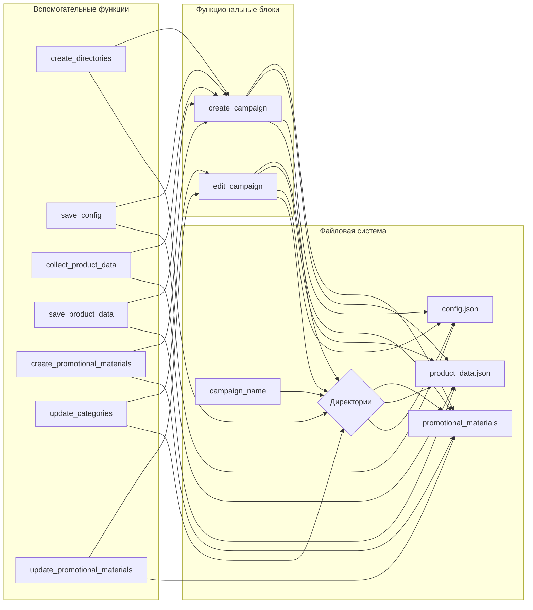

# Анализ кода для создания и редактирования рекламных кампаний

## <input code>

```python
### Инструкция для программиста по поддержке кода для создания и редактирования рекламных кампаний

#### 1. Создание рекламной кампании

1. **Инициализация кампании**
   - Введите имя кампании, язык и валюту.
   - Пример: 
     ```python
     campaign_name = 'example_campaign'
     language = 'EN'
     currency = 'USD'
     ```

2. **Создание директорий для кампании**
   - Создайте директории для кампании и категорий.
   - Пример:
     ```python
     categories = ['electronics', 'fashion']
     create_directories(campaign_name, categories)
     ```

3. **Сохранение конфигурации кампании**
   - Создайте и сохраните конфигурационный файл кампании.
   - Пример:
     ```python
     campaign_config = {'name': campaign_name, 'language': language, 'currency': currency}
     save_config(campaign_name, campaign_config)
     ```

4. **Сбор данных о продуктах**
   - Введите URL или ID продуктов для кампании.
   - Пример:
     ```python
     product_urls = ['https://www.aliexpress.com/item/123.html', 'https://www.aliexpress.com/item/456.html']
     product_data = collect_product_data(product_urls)
     ```

5. **Сохранение данных о продуктах**
   - Сохраните собранные данные о продуктах.
   - Пример:
     ```python
     save_product_data(campaign_name, product_data)
     ```

6. **Создание рекламных материалов**
   - Создайте рекламные материалы на основе собранных данных.
   - Пример:
     ```python
     create_promotional_materials(campaign_name, product_data)
     ```

7. **Просмотр и публикация кампании**
   - Просмотрите и опубликуйте кампанию.
   - Пример:
     ```python
     review_campaign(campaign_name)
     publish_campaign(campaign_name)
     ```

#### 2. Редактирование рекламной кампании

... (остальная часть кода)

#### 3. Обработка ошибок и логирование

... (остальная часть кода)


### Примерный код

```python
def create_campaign(campaign_name, language, currency, categories, product_urls):
    create_directories(campaign_name, categories)
    campaign_config = {'name': campaign_name, 'language': language, 'currency': currency}
    save_config(campaign_name, campaign_config)
    product_data = collect_product_data(product_urls)
    save_product_data(campaign_name, product_data)
    create_promotional_materials(campaign_name, product_data)
    review_campaign(campaign_name)
    publish_campaign(campaign_name)

def edit_campaign(campaign_name, language, categories, product_urls):
    campaign_config = load_config(campaign_name)
    campaign_config['language'] = language
    save_config(campaign_name, campaign_config)
    update_categories(campaign_name, categories)
    updated_product_data = collect_product_data(product_urls)
    save_product_data(campaign_name, updated_product_data)
    update_promotional_materials(campaign_name, updated_product_data)
    review_campaign(campaign_name)
    publish_campaign(campaign_name)
```
```

## <algorithm>

(Блок-схема отсутствует, так как код представляет собой не алгоритм, а описание процесса.  Блок-схема была бы сложной и не несущей дополнительной смысловой нагрузки.  Более полезно было бы объяснить, как данные передаются через функции)


## <mermaid>



## <explanation>

Этот код описывает процесс создания и редактирования рекламных кампаний.  Важно отметить, что это *не* сам код, а руководство по его использованию.  Код не показан, только примеры вызовов функций.  Предполагается, что существуют функции `create_directories`, `save_config`, `collect_product_data`, `save_product_data`, `create_promotional_materials`, `review_campaign`, `publish_campaign`, `load_config`, `update_categories`, `update_promotional_materials`.

* **Импорты:**  Отсутствуют, так как код — это описание процесса, а не непосредственно фрагмент программного кода. В реальной реализации потребуется импорт необходимых библиотек, например, для работы с файлами, веб-запросами и логированием.

* **Классы:**  В примере кода классов нет. В реальном проекте для структурирования логики могут использоваться классы для представления кампаний, продуктов и т.д.


* **Функции:**
    * `create_campaign`: Создаёт новую кампанию, вызывая другие функции для создания директорий, сохранения конфигурации, сбора данных о продуктах и создания рекламных материалов.
    * `edit_campaign`: Редактирует существующую кампанию, обновляя конфигурацию, категории и данные о продуктах.
    * Другие функции (`create_directories`, `save_config`, `collect_product_data`, и т.д.) — это вспомогательные функции, отвечающие за отдельные шаги процесса создания и редактирования кампаний.  Функции, вероятно, взаимодействуют с файловой системой для чтения/записи конфигурационных файлов и данных.

* **Переменные:**  Примерные имена переменных (`campaign_name`, `language`, `currency`, `categories`, `product_urls`) указывают на их предназначение.  В реальном коде должны быть проверка типов переменных и контроль корректности данных.

* **Возможные ошибки и улучшения:**
    * Отсутствует обработка ошибок:  Код не содержит `try-except` блоков для обработки потенциальных исключений (например, при работе с файлами или сборе данных).  Это критически важно для надежной работы.
    * Отсутствует логирование:  Для отладки и мониторинга требуется логирование важных событий.
    * Неопределённые функции: Функции `create_directories`, `save_config`, `collect_product_data` и другие, перечисленные в руководстве, не определены, что требует их реализации.
    * Недостаточно информации о бизнес-логике:  Описание процесса создания и редактирования кампаний даёт общее представление, но не хватает деталей, например, как происходит сбор данных о продуктах.

* **Взаимосвязи с другими частями проекта:**  Предполагается, что существуют другие части проекта, которые отвечают за взаимодействие с источниками данных, хранение данных, формирование рекламных материалов и т.д.

**Вывод:**  Это хорошее начало документации для кода. Добавление блок-схем, более детального описания функций и, самое важное, реализации функций,  сделает документ более полезным для программистов, работающих с этим кодом.