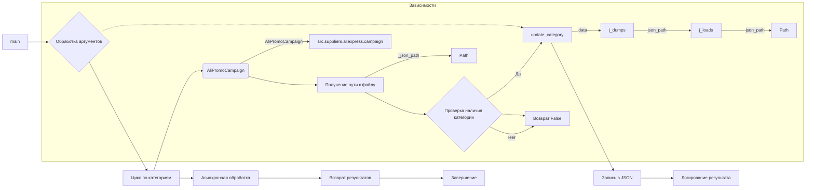

# Анализ кода функции подготовки рекламных кампаний AliExpress

## <input code>

```python
# ... (код из запроса)
```

## <algorithm>

Алгоритм работы кода можно представить в виде следующей блок-схемы:

1. **Инициализация:** Принимаются аргументы командной строки (`campaign_name`, `categories`, `language`, `currency`, `force`).
2. **Обработка аргументов:**
    * Если `categories` указан как строка, преобразовать его в список.
    * Если `categories` не указан, получить список категорий из каталога `campaigns_directory`.
3. **Цикл по категориям:** Для каждой категории из списка:
    * **Создание объекта `AliPromoCampaign`:**  Создаётся экземпляр класса `AliPromoCampaign` с заданными параметрами.
    * **Получение пути к файлу конфигурации:** Определяется путь к файлу JSON с конфигурацией категории (`_json_path`).
    * **Проверка наличия категории:** Проверяется, что в объекте `a` есть атрибут `category`. Если нет, возвращается `False`.
    * **Обновление категории в JSON:** Вызывается функция `update_category` для обновления категории в файле JSON по пути `_json_path`.
    * **Обработка результата:** Если обновление прошло успешно, логирование успешного завершения обработки категории. В противном случае, логирование ошибки.
4. **Асинхронная обработка:** Функция `main` асинхронно собирает результаты обработки каждой категории с помощью `asyncio.gather`.
5. **Завершение:** Возвращаются результаты обработки каждой категории (имя категории и результат).


**Примеры:**

* **Вход:** `campaign_name='summer_sale'`, `categories=['electronics', 'fashion']`, `language='EN'`, `currency='USD'`, `force=False`
* **Выход:** Список кортежей вида `[('electronics', True), ('fashion', True)]` или `[('electronics', True), ('fashion', False)]`

**Передача данных:**

Аргументы командной строки передаются в функции `main` и `process_campaign_category`. Объект `AliPromoCampaign` хранит данные о кампании и категории, передаваемые в `update_category`. Функция `update_category` обновляет данные в файлах JSON.

## <mermaid>



**Описание диаграммы:**

* `main` - главная функция, которая получает аргументы и запускает асинхронную обработку.
* `AliPromoCampaign` - класс, представляющий рекламную кампанию.
* `update_category` - функция, обновляющая данные в файлах JSON.
* `j_loads`, `j_dumps` - функции для работы с JSON данными.
* `Path` - тип данных из `pathlib`.
* `src` - общий префикс для импортируемых модулей.


## <explanation>

**Импорты:**

* `from types import SimpleNamespace`: Импортирует класс `SimpleNamespace` для создания объектов, которые имитируют именованные пространства имён.
* `import asyncio`: Импортирует модуль `asyncio` для асинхронной обработки.
* `from pathlib import Path`: Импортирует класс `Path` для работы с путями к файлам.
* `from typing import List, Optional`: Импортирует типы данных `List` и `Optional` для аннотаций типов.
* `from src import gs`: Импортирует модуль `gs` из пакета `src`. Возможно, он содержит функции для работы с Google Drive.
* `from src.suppliers.aliexpress.campaign import AliPromoCampaign`: Импортирует класс `AliPromoCampaign` из пакета `src.suppliers.aliexpress.campaign`, который, предположительно, содержит данные о рекламных кампаниях AliExpress.
* `from src.utils import get_directory_names, j_loads, j_loads_ns, j_dumps`: Импортирует функции для работы с файлами JSON (`j_loads`, `j_dumps`) и каталогами (`get_directory_names`). Функции `j_loads_ns` не используется.
* `from src.logger import logger`: Импортирует логгер для записи сообщений об ошибках и успехах.


**Классы:**

* `AliPromoCampaign`: Представляет рекламную кампанию. Не указанны атрибуты и методы класса, но по имени можно сделать вывод, что этот класс содержит данные о рекламной кампании, включая имя, категории и конфигурацию.

**Функции:**

* `update_category`: Обновляет данные категории в файле JSON. Аргументы: `json_path` (путь к файлу JSON), `category` (объект с данными категории). Возвращает `True`, если обновление успешно, `False` в противном случае.
* `process_campaign_category`: Обрабатывает одну категорию для кампании. Аргументы: `campaign_name`, `category_name`, `language`, `currency`, `force`. Возвращает `True`, если категория успешно обработана, `False` - в противном случае.
* `process_campaign`: Обрабатывает всю кампанию для всех категорий. Аргументы: `campaign_name`, `categories`, `language`, `currency`, `force`. Возвращает список кортежей (`(category, result)`).
* `main`: Асинхронная функция, которая запускает обработку кампании. Аргументы такие же как у `process_campaign`.


**Переменные:**

* `campaigns_directory`: Путь к каталогу с рекламными кампаниями.


**Возможные ошибки/улучшения:**

* Необходимо более детальное описание класса `AliPromoCampaign`.
* Обработка исключений в `update_category` и `process_campaign_category` могла бы быть более конкретной и информативной.
* Не ясна логика работы `get_directory_names`.
* Неясно, как `j_loads_ns` используется, если он не используется, то следует убрать его из импорта.
* Отсутствие документации к `gs`.
* Асинхронность функции `main` не требуется, если нет большого количества категорий.


**Взаимосвязи с другими частями проекта:**

Код использует функции и классы из модулей `src.utils` и `src.logger`, что указывает на наличие других модулей и пакетов. Класс `AliPromoCampaign`  предположительно, взаимодействует с другими компонентами для получения и обработки данных о кампаниях и категориях.