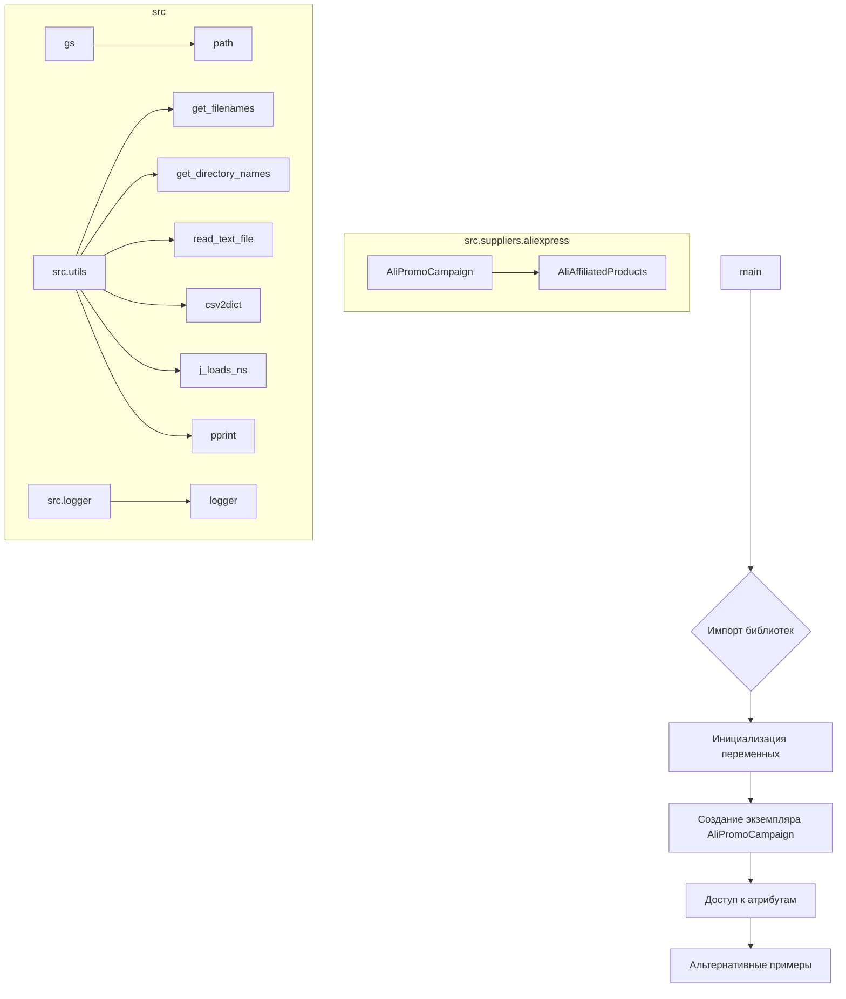

```MD
# <input code>

```python
## \file hypotez/src/suppliers/aliexpress/campaign/_examples/_example_ali_promo_campaign.py
# -*- coding: utf-8 -*-\
#! venv/Scripts/python.exe
#! venv/bin/python/python3.12

"""
.. module: src.suppliers.aliexpress.campaign._examples 
	:platform: Windows, Unix
	:synopsis:

"""
MODE = 'dev'


"""
	:platform: Windows, Unix
	:synopsis:

"""


"""
	:platform: Windows, Unix
	:synopsis:

"""


"""
  :platform: Windows, Unix

"""
"""
  :platform: Windows, Unix
  :platform: Windows, Unix
  :synopsis:
"""MODE = 'dev'
  
""" module: src.suppliers.aliexpress.campaign._examples """


""" Примеры создания рекламной кампании """


import header
from pathlib import Path
from types import SimpleNamespace
from src import gs
from src.suppliers.aliexpress import AliPromoCampaign
from src.suppliers.aliexpress import AliAffiliatedProducts
from src.utils import get_filenames, get_directory_names, read_text_file, csv2dict
from src.utils import j_loads_ns
from src.utils import pprint
from src.logger import logger

campaigns_directory = Path(gs.path.google_drive, 'aliexpress', 'campaigns')
campaign_names = get_directory_names(campaigns_directory)

campaign_name = '280624_cleararanse'
category_name = 'gaming_comuter_accessories'
language = 'EN'
currency = 'USD'

a:SimpleNamespace = AliPromoCampaign(campaign_name = campaign_name, 
                     category_name = category_name, 
                     language = language, 
                     currency = currency) 

campaign = a.campaign
category = a.category
products = a.category.products

# dict
a = AliPromoCampaign(campaign_name,category_name,{'EN':'USD'})
# string
a = AliPromoCampaign(campaign_name,category_name, 'EN','USD')
```

# <algorithm>

**Шаг 1:** Импорты. Код импортирует необходимые библиотеки и модули.

*   **`header`**: Вероятно, модуль, содержащий общие настройки и конфигурацию проекта.
*   **`pathlib`**: Для работы с путями к файлам.
*   **`types`**: Для создания экземпляра `SimpleNamespace`.
*   **`src.gs`**: Доступ к глобальным настройкам, вероятно, содержащим информацию о Google Drive.
*   **`src.suppliers.aliexpress.AliPromoCampaign`**: Класс для работы с рекламными кампаниями AliExpress.
*   **`src.suppliers.aliexpress.AliAffiliatedProducts`**: Класс для работы с аффилированными продуктами AliExpress (не используется в примере).
*   **`src.utils`**: Модуль с вспомогательными функциями (получение файлов, чтение файлов, преобразование CSV в словари и т.д.).
*   **`src.logger`**: Модуль для работы с логгированием.


**Шаг 2:** Инициализация переменных. Определяются переменные для имени кампании, категории, языка и валюты.

**Шаг 3:**  Создание экземпляра класса `AliPromoCampaign`.
Создается экземпляр класса `AliPromoCampaign` с предоставленными значениями имени кампании, категории, языка и валюты.
**Шаг 4:** Доступ к атрибутам экземпляра `AliPromoCampaign`. Используя `.` (точку), происходит обращение к атрибутам `campaign`, `category` и `products` экземпляра `a`.
**Шаг 5:** Альтернативные примеры инициализации.  Иллюстрируется, как можно инициализировать класс с использованием словаря или строковых значений языка и валюты.

**Пример данных:**

| Переменная | Значение | Тип |
|---|---|---|
| `campaign_name` | `280624_cleararanse` | строка |
| `category_name` | `gaming_comuter_accessories` | строка |
| `language` | `EN` | строка |
| `currency` | `USD` | строка |


# <mermaid>



# <explanation>

**Импорты:**

*   `header`: Вероятно, содержит общие настройки и константы для проекта. Связь с `src` не ясна без дальнейшего анализа.
*   `pathlib`: Предоставляет инструменты для работы с файловыми путями.
*   `types.SimpleNamespace`:  Позволяет создать объект, у которого есть атрибуты, доступные по точкам.
*   `src.gs`: Доступ к переменным, вероятно, содержащим данные о Google Drive.
*   `src.suppliers.aliexpress.AliPromoCampaign`: Класс для работы с рекламными кампаниями AliExpress.  Этот класс определен в `src/suppliers/aliexpress`.
*   `src.suppliers.aliexpress.AliAffiliatedProducts`: Класс для работы с аффилированными продуктами AliExpress (в данном примере не используется).
*   `src.utils`: Модуль с утилитами, такими как `get_filenames`, `get_directory_names`, `read_text_file`, `csv2dict`, `j_loads_ns`, `pprint`, что указывает на его общую вспомогательную роль.
*   `src.logger`: Модуль для ведения журналов (логирования).

**Классы:**

*   `AliPromoCampaign`: Класс для работы с рекламными кампаниями AliExpress.  Он, вероятно, имеет атрибуты, которые представляют информацию о кампании, такие как `campaign`, `category`, `products`. В данном примере демонстрируется его использование и инициализация.  Необходима информация о методах этого класса для более полного понимания его функциональности.

**Функции (в примере нет функций, указанных явно):**

*   Функции `get_filenames`, `get_directory_names`, `read_text_file`, `csv2dict`, `j_loads_ns`, `pprint` вероятно из модуля `src.utils`.  Они выполняют вспомогательные задачи.

**Переменные:**

*   `MODE`:  Вероятно, константа, определяющая режим работы (например, `'dev'` или `'prod'`).
*   `campaigns_directory`: Путь к каталогу с рекламными кампаниями на Google Drive.
*   `campaign_names`: Список имён каталогов кампаний.
*   `campaign_name`, `category_name`, `language`, `currency`:  Хранят информацию о конкретной кампании.


**Возможные ошибки/улучшения:**

*   Отсутствие обработки ошибок (например, если файл не найден или невалиден).
*   Не указано местоположение `header` и не очевидно, для чего он используется.
*   Недостаточно информации о классе `AliPromoCampaign`, необходимы примеры его методов и атрибутов.
*   В примере инициализации класса `AliPromoCampaign` показаны два способа, которые могут работать по-разному.


**Взаимосвязь с другими частями проекта:**

Код взаимодействует с различными частями проекта через импортированные модули (`src.gs`, `src.suppliers.aliexpress`, `src.utils`, `src.logger`).  Полное понимание взаимодействия потребует дополнительного анализа этих модулей.