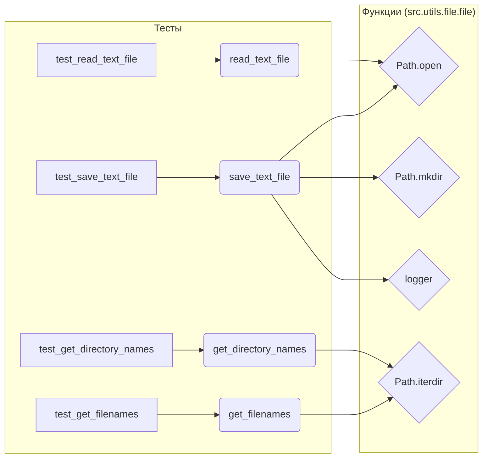

# <input code>

```python
## \file hypotez/src/suppliers/aliexpress/campaign/_pytest/test_ali_campaign_editor_jupyter_widgets.py
# -*- coding: utf-8 -*-\n#! venv/Scripts/python.exe\n#! venv/bin/python/python3.12\n\n"""
.. module: src.suppliers.aliexpress.campaign._pytest 
	:platform: Windows, Unix
	:synopsis:

"""
MODE = 'dev'


"""
	:platform: Windows, Unix
	:synopsis:

"""


"""
	:platform: Windows, Unix
	:synopsis:

"""


"""
  :platform: Windows, Unix

"""
"""
  :platform: Windows, Unix
  :platform: Windows, Unix
  :synopsis:
"""MODE = 'dev'
  
""" module: src.suppliers.aliexpress.campaign._pytest """


""" file.py tests """

import header 
import pytest
from unittest.mock import patch, mock_open, MagicMock
from pathlib import Path
from src.utils.file.file import (
    save_text_file,
    read_text_file,
    get_filenames,
    get_directory_names,
)


# Tests for save_text_file function
@patch("src.utils.file.file.Path.open", new_callable=mock_open)
@patch("src.utils.file.file.Path.mkdir")
@patch("src.utils.file.file.logger")
def test_save_text_file(mock_logger, mock_mkdir, mock_file_open):
    """Test saving text to a file.

    Args:
        mock_logger (MagicMock): Mocked logger instance.
        mock_mkdir (MagicMock): Mocked mkdir instance.
        mock_file_open (MagicMock): Mocked file open instance.

    Example:
        >>> test_save_text_file()
    """
    save_text_file("test.txt", "This is a test.")
    mock_file_open.assert_called_once_with("w", encoding="utf-8")
    mock_file_open().write.assert_called_once_with("This is a test.")
    mock_mkdir.assert_called_once()


# Tests for read_text_file function
@patch(
    "src.utils.file.file.Path.open", new_callable=mock_open, read_data="This is a test."
)
def test_read_text_file(mock_file_open):
    """Test reading text from a file.

    Args:
        mock_file_open (MagicMock): Mocked file open instance.

    Returns:
        None

    Example:
        >>> content: str = test_read_text_file()
        >>> print(content)
        'This is a test.'
    """
    content = read_text_file("test.txt")
    assert content == "This is a test."
    mock_file_open.assert_called_once_with("r", encoding="utf-8")


# Tests for get_filenames function
def test_get_filenames():
    """Test getting filenames from a directory.

    Returns:
        None

    Example:
        >>> filenames: list[str] = test_get_filenames()
        >>> print(filenames)
        ['file1.txt', 'file2.txt']
    """
    with patch(
        "src.utils.file.file.Path.iterdir",
        return_value=[Path(f"file{i}.txt") for i in range(1, 3)],
    ):
        filenames = get_filenames(Path("/some/dir"))
        assert filenames == ["file1.txt", "file2.txt"]


# Tests for get_directory_names function
def test_get_directory_names():
    """Test getting directory names from a path.

    Returns:
        None

    Example:
        >>> directories: list[str] = test_get_directory_names()
        >>> print(directories)
        ['dir1', 'dir2']
    """
    with patch(
        "src.utils.file.file.Path.iterdir",
        return_value=[Path(f"dir{i}") for i in range(1, 3)],
    ):
        directories = get_directory_names(Path("/some/dir"))
        assert directories == ["dir1", "dir2"]
```



```markdown
# <algorithm>

**test_save_text_file:**

1.  Вызывается функция `save_text_file` с аргументами "test.txt" и "This is a test.".
2.  Функция `save_text_file` вызывает `Path.open` в режиме "w" с кодировкой "utf-8".
3.  Открытый файл записывает строку "This is a test."
4.  Функция `save_text_file` вызывает `Path.mkdir`.
5.  Проверяются вызовы mock-объектов (mock_file_open, mock_mkdir).

**test_read_text_file:**

1. Вызывается функция `read_text_file` с аргументом "test.txt".
2. Функция `read_text_file` вызывает `Path.open` в режиме "r" с кодировкой "utf-8".
3.  Проверяется возвращаемое значение и вызов mock-объекта (mock_file_open).


**test_get_filenames:**

1. Вызывается функция `get_filenames` с аргументом `/some/dir`.
2. Функция `get_filenames` использует mock-объект `Path.iterdir` для получения списка файлов.
3.  Проверяется возвращаемое значение списка файлов.

**test_get_directory_names:**

1. Вызывается функция `get_directory_names` с аргументом `/some/dir`.
2. Функция `get_directory_names` использует mock-объект `Path.iterdir` для получения списка директорий.
3.  Проверяется возвращаемое значение списка директорий.


# <explanation>

**Импорты:**

- `header`: Вероятно, файл, содержащий общие настройки или импорты для проекта.  Необходим для корректной работы модуля, но детали его содержимого не видны.
- `pytest`: Фреймворк для тестирования Python, используемый для запуска тестов.
- `unittest.mock`: Модуль для создания mock-объектов для тестирования.
- `pathlib`: Модуль для работы с путями к файлам и директориям.
- `src.utils.file.file`: Модуль, содержащий функции для работы с файлами (save_text_file, read_text_file, get_filenames, get_directory_names).


**Классы:**

- Не содержит классов.  Используется mock-объект `MagicMock`, но это не настоящий класс, а способ создания мока функций/методов.


**Функции:**

- `save_text_file(filename, text)`: Сохраняет текст в файл.  Аргументы: `filename` (имя файла) и `text` (текст для сохранения). Возвращает None.
- `read_text_file(filename)`: Читает текст из файла. Аргумент: `filename`. Возвращает строку с текстом файла.
- `get_filenames(path)`: Возвращает список имен файлов в указанной директории.
- `get_directory_names(path)`: Возвращает список имен директорий в указанной директории.


**Переменные:**

- `MODE`: Переменная, хранящая строку 'dev'.  Вероятно, используется для настройки режима работы.

**Возможные ошибки и улучшения:**

- Тесты используют `patch`, что хорошо для изоляции тестируемого кода. Но, если функции `save_text_file`, `read_text_file`, `get_filenames`, `get_directory_names` не могут быть полностью протестированы из-за отсутствия доступа к их внутренней логике, то эти тесты проверяют только взаимодействие.
- Не хватает тестов на различные сценарии ошибок (например, файл не существует, ошибка чтения/записи).
- В примерах тестов для функций `get_filenames` и `get_directory_names` необходимо указать, как эти функции вызываются и обрабатываются, так как в коде используется патчинг.


**Взаимосвязь с другими частями проекта:**

- Функции из модуля `src.utils.file.file` скорее всего используются в других частях проекта, которые работают с файлами.