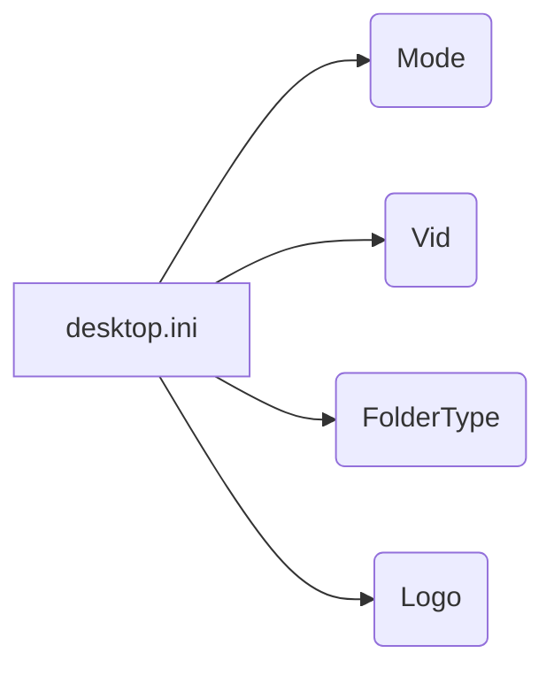

```MD
# Анализ кода

**1. <input code>**

```[ViewState]
Mode=
Vid=
FolderType=Generic
Logo=E:\\Users\\user\\images\\LOGOS\\R.png
```

**2. <algorithm>**

Этот код не является исполняемым кодом в привычном понимании.  Он представляет собой файл `.ini` (Initialization) -  конфигурационный файл, используемый для хранения параметров.  В данном случае, вероятно, для управления отображением папки в операционной системе Windows, скорее всего, для настройки виджетов или элементов пользовательского интерфейса, связанных с отображением данных с AliExpress.  Алгоритм работы заключается в том, что эти параметры (Mode, Vid, FolderType, Logo) используются для управления визуальными аспектами папки.  Пошаговая блок-схема не применима, так как здесь нет логики обработки данных или вычислений, только хранение констант.

* **Пример:** Значение `Logo=E:\\Users\\user\\images\\LOGOS\\R.png` указывает на то, что папка должна отображаться с логотипом "R.png", находящимся в указанном пути.

**3. <mermaid>**



**Описание диаграммы:**

Файл `desktop.ini` хранит набор параметров (Mode, Vid, FolderType, Logo).  Диаграмма отображает непосредственные связи между этим файлом и хранимыми в нем параметрами.

**4. <explanation>**

* **Импорты**:  В данном случае нет импортов, т.к. код представляет собой простой конфигурационный файл.

* **Классы**:  Нет классов.

* **Функции**:  Нет функций.

* **Переменные**: Все строки в файле `.ini` представляют собой пары ключ-значение. Ключи (например, `Mode`, `Vid`) определяют параметр, а значения (например, пустая строка `Mode=`, `Generic` в `FolderType=`) задают его значение.

* **Возможные ошибки или области для улучшений**: 

    * Нет проверки корректности данных:  Нет гарантии, что файл `desktop.ini` содержит правильные значения параметров.  Например, путь к логотипу может быть некорректным, или значение `FolderType` может быть недопустимым.

    * Нет логики обработки ошибок: Если в файле есть недопустимые значения, нет механизма для обработки этого.

    * Зависимость от операционной системы:  Этот файл предназначен для работы в Windows, и его структура может отличаться в других ОС.

**Цепочка взаимосвязей с другими частями проекта**:

Файл `desktop.ini`  предполагает использование в контексте приложений, работающих с папками.  Вероятнее всего, этот файл используется приложением, взаимодействующим с директориями, чтобы настроить отображение нужной папки, например, с визуальными элементами, такими как логотип или типом представления.  Связь с приложением может быть реализована через вызовы функции или метода, которые интерпретируют параметры из файла `.ini`.  Без доступа к коду приложений, взаимодействующих с `desktop.ini`, точная взаимосвязь с другими частями проекта остаётся гипотетической.