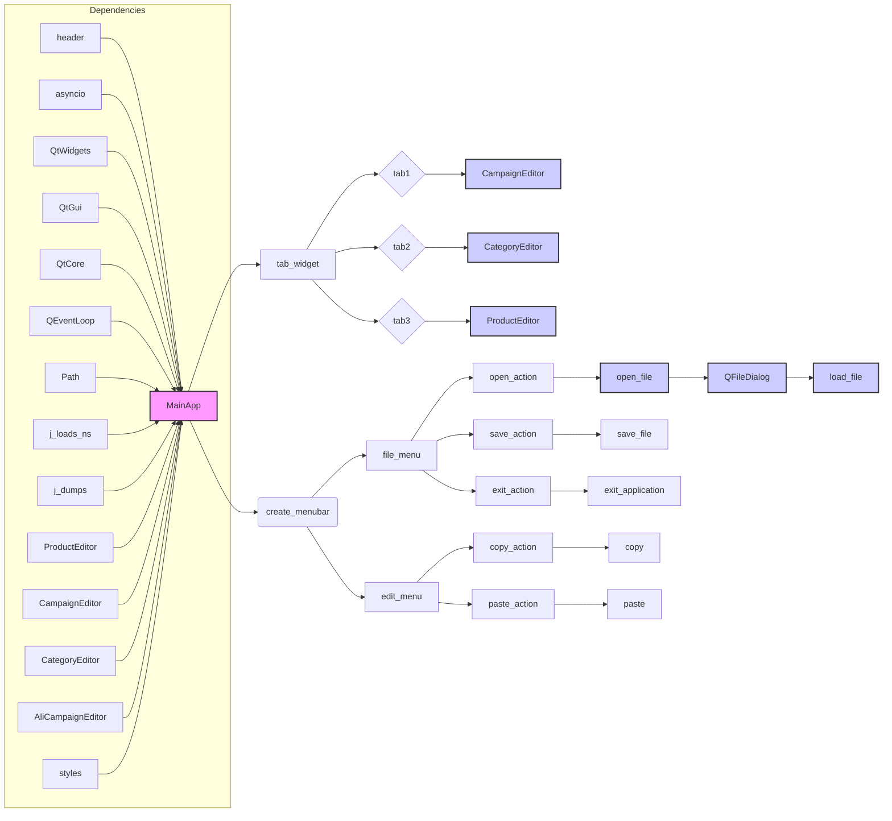

# <input code>

```python
## \file hypotez/src/suppliers/aliexpress/gui/main.py
# -*- coding: utf-8 -*-\
#! venv/Scripts/python.exe
#! venv/bin/python/python3.12

"""
.. module: src.suppliers.aliexpress.gui 
	:platform: Windows, Unix
	:synopsis:

"""
MODE = 'dev'


"""
	:platform: Windows, Unix
	:synopsis:

"""


"""
	:platform: Windows, Unix
	:synopsis:

"""


"""
  :platform: Windows, Unix

"""
"""
  :platform: Windows, Unix
  :platform: Windows, Unix
  :synopsis:
"""MODE = 'dev'
  
""" module: src.suppliers.aliexpress.gui """


""" Main window interface for managing advertising campaigns """


import header
import asyncio
import sys
from PyQt6 import QtWidgets, QtGui, QtCore
from qasync import QEventLoop
from pathlib import Path
from src.utils import j_loads_ns, j_dumps
from product import ProductEditor
from campaign import CampaignEditor
from category import CategoryEditor
from src.suppliers.aliexpress.campaign import AliCampaignEditor
from styles import set_fixed_size

class MainApp(QtWidgets.QMainWindow):
    def __init__(self):
        """ Initialize the main application with tabs """
        super().__init__()
        self.setWindowTitle("Main Application with Tabs")
        self.setGeometry(100, 100, 1800, 800)

        self.tab_widget = QtWidgets.QTabWidget()
        self.setCentralWidget(self.tab_widget)

        # Create the JSON Editor tab and add it to the tab widget
        self.tab1 = QtWidgets.QWidget()
        self.tab_widget.addTab(self.tab1, "JSON Editor")
        self.promotion_app = CampaignEditor(self.tab1, self)

        # Create the Campaign Editor tab and add it to the tab widget
        self.tab2 = QtWidgets.QWidget()
        self.tab_widget.addTab(self.tab2, "Campaign Editor")
        self.campaign_editor_app = CategoryEditor(self.tab2, self)

        # Create the Product Editor tab and add it to the tab widget
        self.tab3 = QtWidgets.QWidget()
        self.tab_widget.addTab(self.tab3, "Product Editor")
        self.product_editor_app = ProductEditor(self.tab3, self)

        self.create_menubar()

    # ... (rest of the code)
```

# <algorithm>

**Шаг 1:**  Инициализация приложения `MainApp`.
    - Создается главное окно (`QtWidgets.QMainWindow`) с заголовком "Main Application with Tabs" и размерами.
    - Создается `QTabWidget` для размещения вкладок.
    - Создаются виджеты `QWidget` для каждой вкладки ("JSON Editor", "Campaign Editor", "Product Editor").
    - В каждой вкладке размещаются соответствующие редакторы (`CampaignEditor`, `CategoryEditor`, `ProductEditor`).


**Шаг 2:**  Создание меню.
    - Создается главное меню с пунктами "File" и "Edit".
    - Создаются пункты меню "Open", "Save", "Exit", "Copy", "Paste", "Open Product File" и настраиваются обработчики событий.


**Шаг 3:** Обработчики событий меню.
     - `open_file`: Открывает диалог выбора файла, загружает выбранный JSON файл в соответствующий редактор (JSON Editor), проверяет текущую вкладку.
     - `save_file`: Сохраняет изменения в выбранном редакторе, проверяя текущую вкладку.
     - `copy`: Копирует выделенный текст в буфер обмена, если активен подходящий виджет.
     - `paste`: Вставляет текст из буфера обмена в активный виджет.
     - `exit_application`: Закрывает приложение.


**Шаг 4:** Загрузка файла.
     - Функция `load_file` загружает содержимое файла в `promotion_app` (в вкладке "JSON Editor").


**Шаг 5:**  Инициализация и запуск приложения.
     - Создается экземпляр приложения `QtWidgets.QApplication`.
     - Создается цикл событий `QEventLoop` для асинхронных операций.
     - Создается экземпляр `MainApp` и отображается.
     - Запускается главный цикл событий приложения `loop.run_forever()`.


**Пример:** Пользователь выбирает JSON файл. `open_file` вызывает диалог, пользователь выбирает файл. `load_file` загружает содержимое в `promotion_app` на вкладке "JSON Editor".


# <mermaid>



# <explanation>

**Импорты:**

- `header`: Вероятно, файл заголовков, специфичный для проекта (без уточнения трудно сказать, что именно импортируется).
- `asyncio`: Библиотека для асинхронного программирования Python, используется для управления событиями.
- `sys`: Модуль для взаимодействия с системными функциями, используется для получения аргументов командной строки.
- `PyQt6`: Библиотека для создания графического интерфейса пользователя в Python.
    - `QtWidgets`: Классы для построения основных элементов GUI (окна, виджеты).
    - `QtGui`: Классы для графики, изображений и событий.
    - `QtCore`: Классы для работы с временем, событиями, потоками.
- `qasync`: Библиотека для работы с асинхронными операциями в PyQt.
- `pathlib`: Модуль для работы с файлами и путями.
- `src.utils`:  Модуль из пакета `src` с функциями обработки JSON (предположительно `j_loads_ns`, `j_dumps`).
- `product`, `campaign`, `category`, `AliCampaignEditor`: Классы для работы с продуктами, рекламными кампаниями и категориями. Скорее всего, находятся в подпапках `src/suppliers/aliexpress/`.
- `styles`:  Вероятно, содержит функции стилизации (например, `set_fixed_size`).


**Классы:**

- `MainApp`: Главное окно приложения.
    - `__init__`: Инициализирует окно, создает вкладки и связывает с ними редакторы.
    - `create_menubar`: Создает меню.
    - `open_file`, `save_file`, `exit_application`, `copy`, `paste`: Обработчики событий меню.
    - `load_file`: Загружает JSON файл в соответствующий редактор (`promotion_app`).


**Функции:**

- `main`:  Инициализирует приложение и запускает цикл событий.
- `open_file`: Открывает диалог выбора файла, загружает JSON в `promotion_app`.
- `save_file`: Сохраняет изменения, учитывая активную вкладку.
- `exit_application`: Закрывает приложение.
- `copy`, `paste`: Стандартные функции копирования/вставки.

**Переменные:**

- `MODE`:  Вероятно, переменная конфигурации ('dev' или 'prod').
- `promotion_app`, `campaign_editor_app`, `product_editor_app`: Экземпляры классов редакторов.

**Возможные ошибки и улучшения:**

- Отсутствует валидация вводимых данных. При попытке загрузить файл некорректного формата или содержащий некорректный JSON, приложение может рухнуть.
- Отсутствует обработка случаев, когда файл не найден.
- Необходима более детальная обработка ошибок (например, logging).


**Взаимосвязи с другими частями проекта:**

- `src.utils`:  Обработка JSON файлов, без конкретных методов трудно сказать, как они используются.
- `product`, `campaign`, `category`, `AliCampaignEditor`: Классы редакторов зависят от логики работы с этими объектами (предположительно хранятся в соответствующих файлах в `src/suppliers/aliexpress/`).
-  `styles`: Вероятно, используется для настройки внешнего вида.


**Общий вывод:**  Код представляет собой приложение с GUI, управляющее рекламными кампаниями.  Он использует PyQt6 для графического интерфейса и взаимодействует с другими классами, скорее всего, для работы с данными о рекламных кампаниях. Для улучшения кода, необходимо добавить более robustную обработку ошибок, валидацию и логирование.