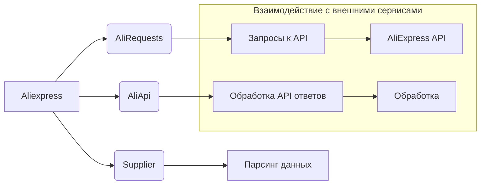

# <input code>

```rst
.. module::
    src.suppliers.aliexpress
```
# Модуль aliexpress

## Обзор

Модуль `aliexpress` предоставляет класс `Aliexpress`, который интегрирует функциональность из классов `Supplier`, `AliRequests` и `AliApi` для работы с AliExpress. Он предназначен для выполнения задач, связанных с парсингом и взаимодействием с API AliExpress.

## Оглавление

- [Модуль aliexpress](#модуль-aliexpress)
- [Класс Aliexpress](#класс-aliexpress)
    - [Метод __init__](#метод-init)


## Класс Aliexpress

### `Aliexpress`

**Описание**: Базовый класс для работы с AliExpress. Объединяет возможности классов `Supplier`, `AliRequests` и `AliApi` для удобной работы с AliExpress.

**Примеры использования**:

```python
# Запуск без вебдрайвера
a = Aliexpress()

# Вебдрайвер Chrome
a = Aliexpress('chrome')

# Режим использования Requests
a = Aliexpress(requests=True)
```


### Метод `__init__`

**Описание**: Инициализирует класс `Aliexpress`.

**Параметры**:

- `webdriver` (bool | str, optional): Режим использования вебдрайвера. Допустимые значения:
    - `False` (по умолчанию): Без вебдрайвера.
    - `'chrome'`: Использование вебдрайвера Chrome.
    - `'mozilla'`: Использование вебдрайвера Mozilla.
    - `'edge'`: Использование вебдрайвера Edge.
    - `'default'`: Использование системного вебдрайвера по умолчанию.
- `locale` (str | dict, optional): Настройки языка и валюты. По умолчанию `{'EN': 'USD'}`.
- `*args`: Дополнительные позиционные аргументы.
- `**kwargs`: Дополнительные именованные аргументы.

**Примеры**:

```python
# Запуск без вебдрайвера
a = Aliexpress()

# Вебдрайвер Chrome
a = Aliexpress('chrome')
```

**Возвращает**:
-  Не имеет возвращаемого значения.

**Вызывает исключения**:
- Возможны исключения, связанные с инициализацией вебдрайвера или другими ошибками, возникающими при взаимодействии с AliExpress.
```

# <algorithm>

Этот код описывает класс `Aliexpress`, но не содержит реализацию его методов.  Алгоритм работы определяется реализацией методов внутри класса, которая отсутствует в этом фрагменте.  Без реализации невозможно построить подробную блок-схему.  Однако, можно представить общий алгоритм инициализации:

1. **Инициализация класса `Aliexpress` (метод `__init__`):**
   - Принимает аргументы `webdriver`, `locale`, `*args`, `**kwargs`.
   - **Обработка `webdriver`:**
     - Если `webdriver` имеет значение `False`, то не используется вебдрайвер.
     - В противном случае, запускается соответствующий вебдрайвер (Chrome, Mozilla, Edge, или по умолчанию). 
     - Важно, что это может быть только указание на выбор вебдрайвера, а не его непосредственный запуск.
   - **Обработка `locale`:**
     - Если `locale` - строка,  интерпретируется как значение по умолчанию `{'EN': 'USD'}`.
     - Если `locale` - словарь, используется переданное значение.
   - **Обработка `*args` и `**kwargs`:**  Учёт дополнительных аргументов, которые могут потребоваться классам `Supplier`, `AliRequests` или `AliApi`.
   - **Внутренняя инициализация:** возможно, создание экземпляров классов `Supplier`, `AliRequests` и `AliApi` с использованием полученных параметров.
   - **Возвращение:**  Ничего не возвращается.


# <mermaid>



**Описание диаграммы:**

Диаграмма показывает классы `Aliexpress`, `Supplier`, `AliRequests`, и `AliApi` и их взаимосвязи.  `Aliexpress` взаимодействует с другими классами, используя их функциональность.  `Supplier` отвечает за парсинг данных, `AliRequests` - за запросы к API, и `AliApi` - за обработку ответов. Диаграмма также предполагает взаимодействие с AliExpress API и последующую обработку данных.  Отсутствующие в коде детали реализации взаимодействий между этими классами требуют дополнительной информации.

# <explanation>

- **Импорты**:  В предоставленном коде нет импортов.  Реализации классов `Supplier`, `AliRequests`, `AliApi` и  связанных функций находятся в других модулях, подключаемых к модулю `aliexpress`.
- **Классы**:
    - `Aliexpress`:  Представляет собой интеграционный класс для работы с AliExpress.  Он объединяет функциональность других классов (`Supplier`, `AliRequests`, `AliApi`).  Его метод `__init__` служит для настройки и инициализации работы с AliExpress.
    - `Supplier`:  (Подразумевается) класс для парсинга данных с AliExpress через вебдрайвер.
    - `AliRequests`: (Подразумевается) класс для работы с API AliExpress.
    - `AliApi`: (Подразумевается) класс для обработки ответов от API AliExpress, преобразования данных и т.п.

- **Функции**:  Нет функций в этом коде.  Функциональность определяется внутри методов класса `Aliexpress`, которые не представлены.
- **Переменные**:  В коде есть параметры метода `__init__`.  Они определяют поведение класса `Aliexpress` и могут быть разных типов. `webdriver`, `locale` - примеры переменных.

- **Возможные ошибки или улучшения**:
    - Не указана реализация методов класса `Aliexpress`.  Это ключевой момент, так как без реализации невозможно оценить полную функциональность.
    - Не указаны зависимости от внешних библиотек, таких как `selenium` для вебдрайверов или `requests` для работы с API.  Они необходимы для корректной работы.
    - Не определена логика обработки ошибок (исключения).  Необходимо предусмотреть обработку ситуаций, когда вебдрайвер не запустился, API вернул ошибку или данные не были получены.
    - Не хватает документации для `Supplier`, `AliRequests`, `AliApi`, что затрудняет использование `Aliexpress`.
    -  Не описаны возможные возвращаемые значения и типы ошибок для каждого метода.
    -   Отсутствие ясности относительно того, как происходит подключение к вебдрайверам.  Нужно уточнение, какая инфраструктура используется.

**Цепочка взаимосвязей с другими частями проекта**:  Этот модуль зависит от классов `Supplier`, `AliRequests`, и `AliApi`, которые предположительно находятся в других модулях или пакетах `src`.  Он также, вероятно, использует внешние библиотеки (например, `selenium`, `requests`) для взаимодействия с AliExpress.  Для более точной оценки необходим доступ к полному коду проекта `src`.