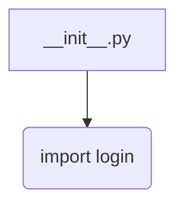
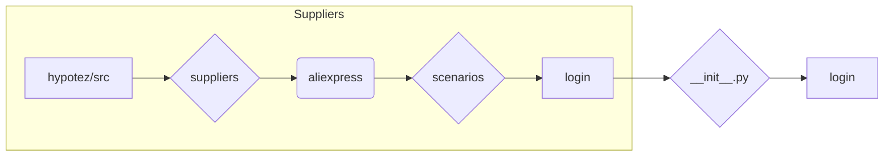

# <input code>

```python
## \file hypotez/src/suppliers/aliexpress/scenarios/__init__.py
# -*- coding: utf-8 -*-
#! venv/Scripts/python.exe
#! venv/bin/python/python3.12

"""
.. module: src.suppliers.aliexpress.scenarios 
	:platform: Windows, Unix
	:synopsis: Сценарии для алиэкспресс

"""
MODE = 'dev'


from .login import login
```

# <algorithm>

Нет явной логики алгоритма в данном файле.  Файл `__init__.py`  в папке `scenarios`  — это модуль инициализации.  Он импортирует другой модуль, `login`, из вложенной папки `login` внутри `scenarios`.  Этот импорт позволяет использовать функции и классы из `login.py` в текущем файле.  В данном случае, `login` видимо содержит функции для аутентификации на сайте Алиэкспресс.  Блок-схема минимальна и представляет только импорт:




Пример: Если в `login.py` определена функция `authenticate_user()`, то `__init__.py` может ее использовать после импорта.

# <mermaid>



**Объяснение к диаграмме:**

Диаграмма показывает иерархическое расположение файлов.  Модуль `__init__.py` в папке `scenarios` импортирует функции из модуля `login` в той же иерархии.  Это типичный подход организации модулей в Python, который позволяет структурировать код и повторно использовать функции.  Зависимости здесь простые, и нет внешних библиотек.

# <explanation>

* **Импорты**: Файл `__init__.py` импортирует модуль `login` из подпапки `.login`.  Это стандартный прием в Python для организации пакета.  `login` предполагает содержать функции и классы, относящиеся к авторизации на Алиэкспресс.  Путь импорта `from .login import login` указывает, что `login` находится в той же директории.  Этот подход облегчает организацию и использование кода в проекте, где файлы логически группируются по функциональности.

* **Классы**: В данном файле нет объявления классов.  `__init__.py`  служит для инициализации модуля и экспорта функций/классов из него.

* **Функции**:  Главная функция этого файла — `login` — экспортируется из  `login.py` (импорт). Файл предполагает, что в модуле `login` есть функции, связанные с авторизацией, например, для входа в систему.

* **Переменные**: Переменная `MODE` имеет строковое значение 'dev'.  Она, скорее всего, используется для выбора режима работы приложения (например, режим разработки или продакшен), но в данном файле не используется напрямую.  Ее значение может использоваться в других частях проекта.


* **Возможные ошибки/улучшения**:
    *  Отсутствует документация для переменной `MODE` (что она означает).
    *  В идеале,  файл `login.py` должен быть более подробно документирован (документировать функции, классы, переменные в нём).
    * Необходимо добавить обработку ошибок (например, исключения) в функциях `login.py`, чтобы избежать неожиданных остановок.


**Цепочка взаимосвязей с другими частями проекта:**

Этот файл является частью модуля `aliexpress`, который, вероятно, связан с обработкой данных или взаимодействием с сервисом Алиэкспресс.  Дальнейшее выполнение кода будет зависеть от импорта и использования функций/классов из `login.py` в других сценариях или модулях проекта `hypotez`.  Например, следующая стадия работы могла бы включать обработку полученной информации после успешной авторизации.