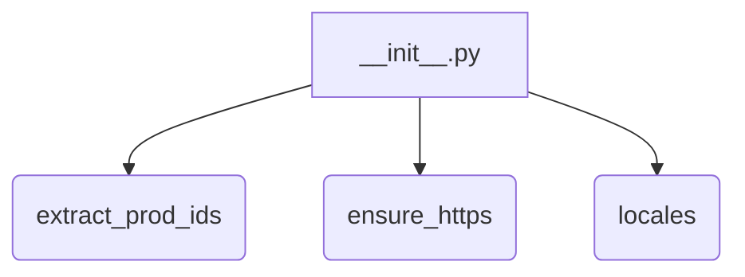
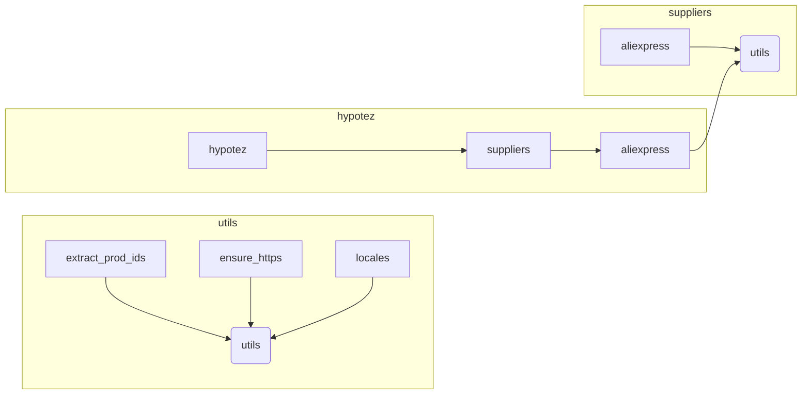

# <input code>

```python
## \file hypotez/src/suppliers/aliexpress/utils/__init__.py
# -*- coding: utf-8 -*-
#! venv/Scripts/python.exe
#! venv/bin/python/python3.12

"""
.. module: src.suppliers.aliexpress.utils 
	:platform: Windows, Unix
	:synopsis:

"""
MODE = 'dev'

from .extract_product_id import extract_prod_ids
from .ensure_https import ensure_https
from .locales import locales
```

# <algorithm>

Этот код представляет собой инициализационный модуль (`__init__.py`) для пакета `utils` внутри подпакета `aliexpress` модуля `suppliers` в проекте `hypotez`.  Алгоритм состоит в основном из импорта функций из других модулей этого пакета.  Блок-схема проста:



Функция `extract_prod_ids`, `ensure_https` и `locales` определены в отдельных файлах в подпапке `utils` того же уровня.  Этот `__init__.py` предоставляет доступ к этим функциям как к общедоступным функциям пакета.  Переменная `MODE` инициализирована со значением 'dev' и доступна внутри пакета.

# <mermaid>



Диаграмма показывает иерархию модулей.  Модуль `utils` находится внутри пакета `aliexpress` внутри пакета `suppliers` внутри проекта `hypotez`.  Зависимости в этом случае - только импорт функций друг из друга.  Нет зависимостей от внешних пакетов, кроме стандартной библиотеки Python.

# <explanation>

* **Импорты**:
    * `from .extract_product_id import extract_prod_ids`: Импортирует функцию `extract_prod_ids` из модуля `extract_product_id` в той же папке (`.` означает текущую папку). Эта функция, скорее всего, отвечает за извлечение идентификаторов продуктов.
    * `from .ensure_https import ensure_https`: Импортирует функцию `ensure_https`, вероятно, для перенаправления HTTP-ссылок на HTTPS, что важно для безопасности.
    * `from .locales import locales`: Импортирует функцию (или переменную, если `locales` это словарь или структура данных) `locales`, возможно, для работы с локализацией.

* **Классы**: Нет классов в этом файле.

* **Функции**:
    * `extract_prod_ids`: Не описана, но по имени предполагается, что функция извлекает списки идентификаторов продуктов, возможно, из веб-страниц или другой структуры данных.
    * `ensure_https`: Не описана, но предполагается, что функция принимает URL-адрес как вход, и, если он не начинается с `https://`, она преобразует его к соответствующему виду.
    * `locales`: Не описана, но предположительно, представляет доступ к данным, относящимся к локализации, или к функции для работы с ними.


* **Переменные**:
    * `MODE = 'dev'`: Переменная, которая, вероятно, определяет режим работы программы (например, 'dev', 'prod'). Она используется для конфигурации или логирования.

* **Возможные ошибки или области для улучшений**:
    * Отсутствие документации внутри функций/классов:  Необходимо добавить комментарии с описанием входных данных, выходных значений и предназначения каждой функции.
    * Возможна неявная зависимость от настроек пути (venv/Scripts/python.exe) - эти пути предположительно указывают на интерпретатор Python, но стоит задуматься о том, чтобы использовать абсолютные пути или переменные среды для их определения, чтобы код был более переносимым.

* **Взаимосвязи с другими частями проекта**:
    * Этот модуль является частью пакета обработки данных, относящихся к поставщику Aliexpress.  Скорее всего, функция `extract_prod_ids` используется в других частях проекта, где происходит обработка информации о продуктах с Aliexpress, а `ensure_https` и `locales` тоже используются в других модулях для обработки информации, относящейся к этому поставщику.