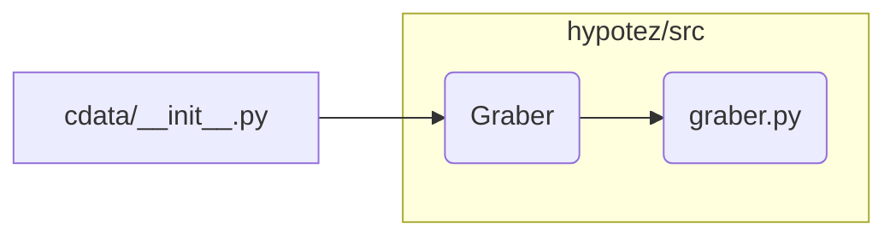

# <input code>

```python
## \file hypotez/src/suppliers/cdata/__init__.py
# -*- coding: utf-8 -*-
#! venv/Scripts/python.exe
#! venv/bin/python/python3.12

"""
.. module: src.suppliers.cdata 
	:platform: Windows, Unix
	:synopsis:

"""
MODE = 'dev'


from .graber import Graber
```

# <algorithm>

Этот код представляет собой инициализационный модуль для пакета `cdata` в проекте `hypotez`.  Он импортирует класс `Graber` из подпакета `graber`.  В данном случае, алгоритм очень прост: импортирование класса.  Нет каких-либо вызовов функций или других сложных операций.

**Пошаговая блок-схема:**

1. **Импорт:** Модуль `graber.py` импортируется.
2. **Инициализация:** Переменная `MODE` получает значение 'dev'.
3. **Конец:** Программа завершает выполнение.

**Пример:**

Нет явных данных, которые перемещаются в этом коде.  Данные могут перемещаться между модулем, но они уже должны были существовать в `graber.py` и импортироваться в другие части проекта.

# <mermaid>



# <explanation>

* **Импорты:**
    `from .graber import Graber`: Этот импорт необходим для использования класса `Graber` из модуля `graber.py`, который находится в той же директории (`./graber.py`).  В данном случае, `./` означает текущую директорию пакета `cdata`.
    - Связь с другими пакетами:  Это импорт показывает зависимость `cdata` от `graber`.  Без `graber` код `cdata` не будет работать.

* **Классы:**
    `Graber`: Этот класс, вероятно, определен в модуле `hypotez/src/suppliers/cdata/graber.py`.  Его функциональность описывает способ получения и обработки данных.  Подробная информация о нем может быть найдена в `graber.py`.  Сам `__init__.py` не содержит реализации логики класса `Graber`.

* **Функции:**
    Нет функций, определенных в `__init__.py`.  Функциональность кода предоставляется внутри класса `Graber`.

* **Переменные:**
    `MODE = 'dev'`:  Это константа, вероятно, используемая для определения режима работы. В режиме разработки (`dev`), например, можно использовать разные настройки или отладку.

* **Возможные ошибки или области для улучшений:**

    * **Неопределенное поведение:** Если в `graber.py` не определен класс `Graber`, то при попытке выполнения кода произойдет ошибка.
    * **Документация:**  Нет документированных строк для переменной `MODE`, что уменьшает читабельность кода. Желательно добавить комментарий, поясняющий назначение переменной.
    * **Документирование зависимостей:**  Хотя импорт правильно указывает зависимость, добавить описание к `graber.py` было бы полезно, что показывает кто или что его использует.

* **Взаимосвязь с другими частями проекта:**

    `graber.py` отвечает за сбор данных.  Модуль `cdata/__init__.py` экспортирует `Graber` для использования другими частями проекта (например, `data_processing.py`, `main.py`).  Данные, собранные `Graber`, будут передаваться в другие части приложения, но точный способ их использования будет определен в этих других компонентах.  Важно понимать, что этот импорт создает зависимость между `cdata` и `graber` (модуль, содержащий класс `Graber`).