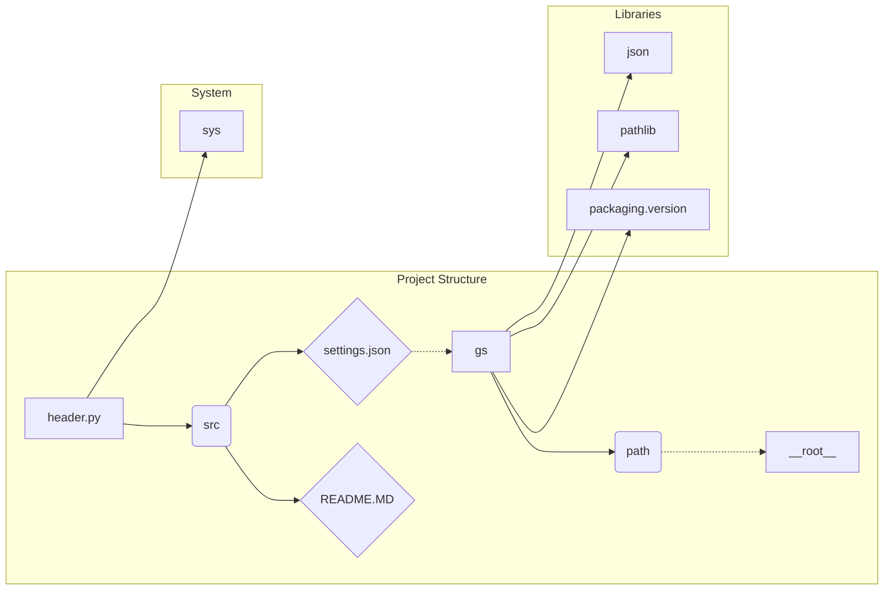

# <input code>

```python
## \file hypotez/src/suppliers/cdata/header.py
# -*- coding: utf-8 -*-
#! venv/Scripts/python.exe
#! venv/bin/python/python3.12

"""
.. module: src.suppliers.cdata 
	:platform: Windows, Unix
	:synopsis:

"""
MODE = 'dev'


import sys
import json
from packaging.version import Version

from pathlib import Path
def set_project_root(marker_files=('pyproject.toml', 'requirements.txt', '.git')) -> Path:
    """
    Finds the root directory of the project starting from the current file's directory,
    searching upwards and stopping at the first directory containing any of the marker files.

    Args:
        marker_files (tuple): Filenames or directory names to identify the project root.
    
    Returns:
        Path: Path to the root directory if found, otherwise the directory where the script is located.
    """
    __root__:Path
    current_path:Path = Path(__file__).resolve().parent
    __root__ = current_path
    for parent in [current_path] + list(current_path.parents):
        if any((parent / marker).exists() for marker in marker_files):
            __root__ = parent
            break
    if __root__ not in sys.path:
        sys.path.insert(0, str(__root__))
    return __root__


# Get the root directory of the project
__root__ = set_project_root()
"""__root__ (Path): Path to the root directory of the project"""

from src import gs

settings:dict = None
try:
    with open(gs.path.root / 'src' /  'settings.json', 'r') as settings_file:
        settings = json.load(settings_file)
except (FileNotFoundError, json.JSONDecodeError):
    ...

doc_str:str = None
try:
    with open(gs.path.root / 'src' /  'README.MD', 'r') as settings_file:
        doc_str = settings_file.read()
except (FileNotFoundError, json.JSONDecodeError):
    ...


__project_name__ = settings.get("project_name", 'hypotez') if settings  else 'hypotez'
__version__: str = settings.get("version", '')  if settings  else ''
__doc__: str = doc_str if doc_str else ''
__details__: str = ''
__author__: str = settings.get("author", '')  if settings else ''
__copyright__: str = settings.get("copyrihgnt", '')  if settings else ''
__cofee__: str = settings.get("cofee", "Treat the developer to a cup of coffee for boosting enthusiasm in development: https://boosty.to/hypo69")  if settings else "Treat the developer to a cup of coffee for boosting enthusiasm in development: https://boosty.to/hypo69"
```

# <algorithm>

```mermaid
graph TD
    A[Start] --> B{Find Project Root};
    B -- True --> C[set_project_root()];
    B -- False --> D[Current Dir];
    C --> E[__root__ = Path];
    E --> F[Check marker files];
    F -- True --> G[__root__ = parent];
    F -- False --> H[Iterate parents];
    G --> I[Insert __root__ to sys.path];
    I --> J[Return __root__];
    H --> F;
    D --> J;
    J --> K[Get settings];
    K --> L{Load settings.json?};
    L -- True --> M[settings = json.load()];
    L -- False --> N[settings = None];
    M --> O[Get README.MD];
    O --> P{Load README.MD?};
    P -- True --> Q[doc_str = settings_file.read()];
    P -- False --> R[doc_str = None];
    Q --> S[Set project details];
    N --> S;
    R --> S;
    S --> T[End];
```

**Example:**

If `__file__` points to `hypotez/src/suppliers/cdata/header.py`, the algorithm would traverse up the directory tree (`hypotez/src/suppliers/cdata`, `hypotez/src/suppliers`, `hypotez/src`, `hypotez`). If it finds `pyproject.toml`, `requirements.txt`, or `.git`, it will use that directory as the project root.

# <mermaid>



**Explanation:**

The `header.py` file establishes the project root directory and loads settings from `settings.json` and `README.MD` if they exist. It depends on several libraries:
- `json`: Used for loading/parsing JSON data from `settings.json`.
- `pathlib`: Used for working with file paths and directories.
- `packaging.version`: Used for handling software versions (though not directly used in this file, the dependency is present).
- `sys`: Used for manipulating the Python path.

The `gs` module (likely a part of this project) provides the `gs.path.root` object, which represents the project's root directory.

# <explanation>

**Imports:**

- `sys`: Used for manipulating the Python path, specifically adding the project root to it.
- `json`: Used for loading configuration data from `settings.json`.
- `packaging.version`: Used for handling versions, not directly used here but required for more comprehensive version handling, likely used in other parts of the project.
- `pathlib`: Used for working with file paths in a more object-oriented way, enhancing code readability and maintainability.

**Classes:**

There are no classes defined in this code snippet.

**Functions:**

- `set_project_root(marker_files)`: Finds the project root directory by traversing up the directory tree from the current file.
    - Takes an optional `marker_files` argument that defines the file/directories that signal the root of the project. Defaults to `pyproject.toml`, `requirements.txt`, and `.git`.
    - Returns the `Path` object representing the root directory.
    - Adds the root directory to `sys.path` for easier importing of modules from the project.
    - Crucial for ensuring that modules in the project's subdirectories are accessible.

**Variables:**

- `__root__`: Stores the absolute path to the project's root directory.
- `settings`: Stores the loaded configuration data from `settings.json`.
- `doc_str`: Stores the content of `README.MD` file.

- `MODE`:  Stores the project mode (likely 'dev' for development).

**Possible Errors/Improvements:**

- Error handling for `settings.json` and `README.MD` is improved by using `try...except` blocks to gracefully handle `FileNotFoundError` and `json.JSONDecodeError` if the files are missing or corrupted.
- Consider using `Pathlib.cwd()` to get the current working directory to simplify the initial path retrieval.
- Robust input validation for `marker_files` (e.g., checking if all entries are strings).


**Relationship with Other Parts:**

This file is a foundational piece of the project, providing essential utility for setting up the development environment and loading essential project configurations.  It relies on the existence of `settings.json`, `README.MD`, and the `gs` module (likely a utility module), which in turn depends on the project structure. Other parts of the project will rely on the `__root__`, `settings`, and `doc_str` variables for their operations.  The presence of `src.gs` implies a package management or global settings structure within the application.