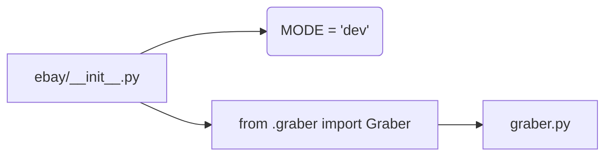

# <input code>

```python
## \file hypotez/src/suppliers/ebay/__init__.py
# -*- coding: utf-8 -*-
#! venv/Scripts/python.exe
#! venv/bin/python/python3.12

"""
.. module: src.suppliers.ebay 
	:platform: Windows, Unix
	:synopsis:

"""
MODE = 'dev'

from .graber import Graber
```

# <algorithm>

Этот файл `__init__.py` служит для инициализации модуля `ebay` в пакете `suppliers` проекта `hypotez`.  В нём нет сложного алгоритма, а лишь импорты.  В этом случае алгоритм - это непосредственное импортирование модуля `Graber` из подпапки `.graber`.

**Пошаговая блок-схема:**

1. **Импорт:** Модуль `__init__.py` импортирует класс `Graber` из файла `graber.py` в текущем каталоге (`./graber.py`).  Это делается с помощью инструкции `from .graber import Graber`.

2. **Инициализация:**  Переменная `MODE` устанавливается в строку 'dev'. Это, скорее всего, константа, определяющая режим работы, например,  разработка, тестирование или производство.


# <mermaid>



**Описание диаграммы:**

Диаграмма отображает прямую зависимость файла `ebay/__init__.py` от файла `graber.py`.  Файл `ebay/__init__.py` использует `graber.py` в качестве зависимости.  В файле `ebay/__init__.py` определяется константа `MODE`.

# <explanation>

* **Импорты:**
    `from .graber import Graber`: Эта строка импортирует класс `Graber` из модуля `graber.py`, который находится в той же директории, что и `__init__.py`. Символ `.` указывает на то, что импортируемый модуль находится в текущем пакете.  Это типичный способ организации кода в Python пакетах.   `graber.py` предположительно содержит код для сбора данных с eBay.

* **Классы:**
    В данном `__init__.py` файле не определены никакие классы, а только импортируется класс `Graber` из файла `graber.py`.

* **Функции:**
   Нет функций в файле.

* **Переменные:**
    `MODE = 'dev'`:  Это глобальная переменная, которая хранит строку 'dev'. Вероятно, она используется для настройки поведения программы в разных средах (например, 'dev', 'test', 'prod').


* **Возможные ошибки и улучшения:**

    * **Документация:**  Документация (docstrings) в коде должна быть более полной. Нужно описать, что делает модуль, какие параметры принимает, какие значения возвращает.
    * **Использование MODE:**  В коде не показано, как переменная `MODE` используется в других частях программы. Необходимо показать, как значение `MODE` влияет на поведение программы.
    * **Обработка ошибок:**  Не видно механизмов обработки возможных исключений при работе с eBay API, например, ошибок сети, аутентификации или валидации данных.


**Цепочка взаимосвязей:**

Файл `hypotez/src/suppliers/ebay/__init__.py` является частью иерархии пакетов проекта `hypotez`. Он импортирует класс `Graber` из подпакета `graber.py` в том же пакете `ebay`, который, в свою очередь, скорее всего, взаимодействует с внешним API eBay для извлечения данных.  Эта цепочка подразумевает, что проект `hypotez` использует модули для обработки данных с разных источников (в данном случае с eBay).