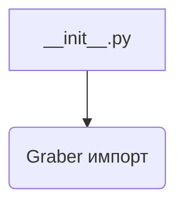
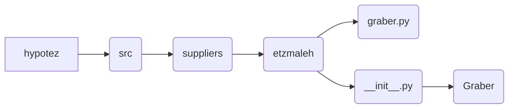

# <input code>

```python
## \file hypotez/src/suppliers/etzmaleh/__init__.py
# -*- coding: utf-8 -*-
#! venv/Scripts/python.exe
#! venv/bin/python/python3.12

"""
.. module: src.suppliers.etzmaleh 
	:platform: Windows, Unix
	:synopsis:

"""
MODE = 'dev'


from .graber import Graber
```

# <algorithm>

Этот код представляет собой модуль `__init__.py` для пакета `etzmaleh` внутри пакета `suppliers` проекта `hypotez`.  В нём импортируется класс `Graber` из модуля `graber.py` в той же директории.  Блок-схема в данном случае простая, поскольку основная функциональность сводится к импорту.



Пример:

- Модуль `__init__.py` импортирует `Graber` из `graber.py`.  Это позволяет другим частям кода использовать класс `Graber` без необходимости указывать полный путь.


# <mermaid>



**Объяснение диаграммы:**

Диаграмма показывает иерархическое расположение файлов. `hypotez` - основной проект, содержащий `src` (источник).  `suppliers` - пакет, содержащий различные поставщики данных. `etzmaleh` - конкретный поставщик.  Модуль `__init__.py` находится в папке `etzmaleh` и импортирует класс `Graber` из файла `graber.py` внутри этой же папки.  Это типичное использование `__init__.py` для создания "пакетов" в Python.


# <explanation>

* **Импорты:**
    - `from .graber import Graber`:  Этот импорт подключает класс `Graber` из модуля `graber.py`, расположенного в той же директории.  `.` указывает на то, что `graber.py` находится в текущем пакете `etzmaleh`. Это стандартный способ импорта модулей внутри одного проекта.
* **Классы:**
    - `Graber`:  Данный код *не определяет* класс `Graber`, а лишь импортирует его. Подробности реализации класса `Graber` находятся в файле `graber.py`.

* **Функции:**
    - Нет определенных функций.
* **Переменные:**
    - `MODE = 'dev'`:  Эта переменная, вероятно, определяет режим работы (например, разработка `dev`, производство `prod`).  Этот атрибут будет доступен в коде, который использует `etzmaleh`.
* **Возможные ошибки или области для улучшений:**
    - Файл `graber.py` отсутствует в предоставленном коде.  Без определения `Graber` трудно сказать, какая функциональность ожидается. 


**Цепочка взаимосвязей:**

Код в `hypotez/src/suppliers/etzmaleh/__init__.py` импортирует и предоставляет доступ к классу `Graber`, который, скорее всего, отвечает за взаимодействие с источником данных (например, API).  Далее этот класс будет использован в других частях проекта (`hypotez`), например, в скриптах сбора данных или анализа.  Без `graber.py` неизвестна точная логика получения данных.