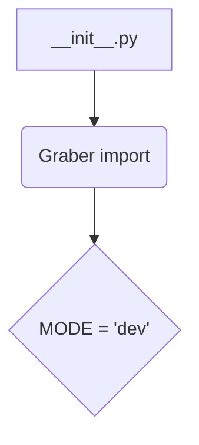
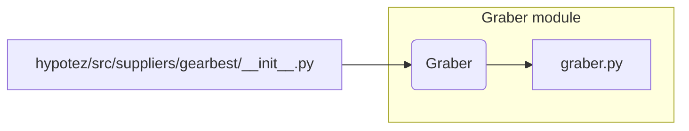

# <input code>

```python
## \file hypotez/src/suppliers/gearbest/__init__.py
# -*- coding: utf-8 -*-\
#! venv/Scripts/python.exe
#! venv/bin/python/python3.12

"""
.. module: src.suppliers.gearbest 
	:platform: Windows, Unix
	:synopsis:

"""
MODE = 'dev'


from .graber import Graber
```

# <algorithm>



**Пошаговый алгоритм:**

1. Модуль `__init__.py` импортирует класс `Graber` из модуля `graber.py` внутри папки `gearbest`.  В этом случае, `graber.py` должно находиться в той же директории, что и `__init__.py`.

2. Переменная `MODE` инициализируется значением 'dev'. Это, скорее всего, конфигурационная переменная, определяющая режим работы модуля (например, разработка, производство).

**Примеры:**

* Если в `graber.py` находится класс с методом для получения данных с GearBest, то `__init__.py` подключает эту функциональность.

**Передача данных:**

Данные не передаются между этим модулем и другими на этом этапе.  Модуль `__init__.py` просто импортирует необходимый функционал и устанавливает конфигурацию.  Возможная дальнейшая передача данных будет определена в других файлах, которые используют класс `Graber`.


# <mermaid>



**Описание диаграммы:**

Диаграмма отображает зависимость модуля `__init__.py` от класса `Graber`, который определен в модуле `graber.py`.  `__init__.py` импортирует класс `Graber` из `graber.py`, таким образом, `graber.py` является зависимостью.


# <explanation>

* **Импорты:**
    `from .graber import Graber`: Этот импорт подключает класс `Graber` из модуля `graber.py` внутри папки `gearbest`. `.` означает, что Python ищет `graber.py` в текущей папке (в данном случае, `hypotez/src/suppliers/gearbest`).  Это типичная практика для организации импорта связанных модулей в Python пакете.

* **Переменные:**
    `MODE = 'dev'`: Эта переменная, скорее всего, конфигурационная переменная, которая определяет режим работы модуля.  В данном случае, она установлена в 'dev', указывающая на режим разработки.  Такой подход позволяет легко переключаться между режимами работы (например, производство, разработка) путём изменения этой константы.

* **Классы:**
    `Graber`:  Этот класс не определен в текущем файле.  Он должен быть определен в модуле `graber.py` и, вероятно, содержит методы для получения данных с сайта GearBest (извлечение данных, обработка, проверка).

* **Функции:**
    Нет функций в данном `__init__.py` файле.

* **Возможные ошибки или области для улучшений:**
    - Не указано, как именно `Graber` будет использоваться в дальнейшем. В `__init__.py` отсутствует какая-либо функциональность кроме импорта.
    - Не видно, как значение `MODE` влияет на поведение модуля. Должен быть какой-то способ использования этой переменной в других частях кода.


**Цепочка взаимосвязей:**

Модуль `__init__.py` является частью пакета `gearbest`, который входит в состав пакета `suppliers`. Пакет `suppliers` скорее всего предназначен для работы с разными поставщиками данных.  Последующие модули (например, `main.py` или другие файлы в проекте), которые нуждаются в работе с данными с GearBest, будут импортировать этот `__init__.py` файл, чтобы получить доступ к классу `Graber` и использовать его методы для сбора информации.