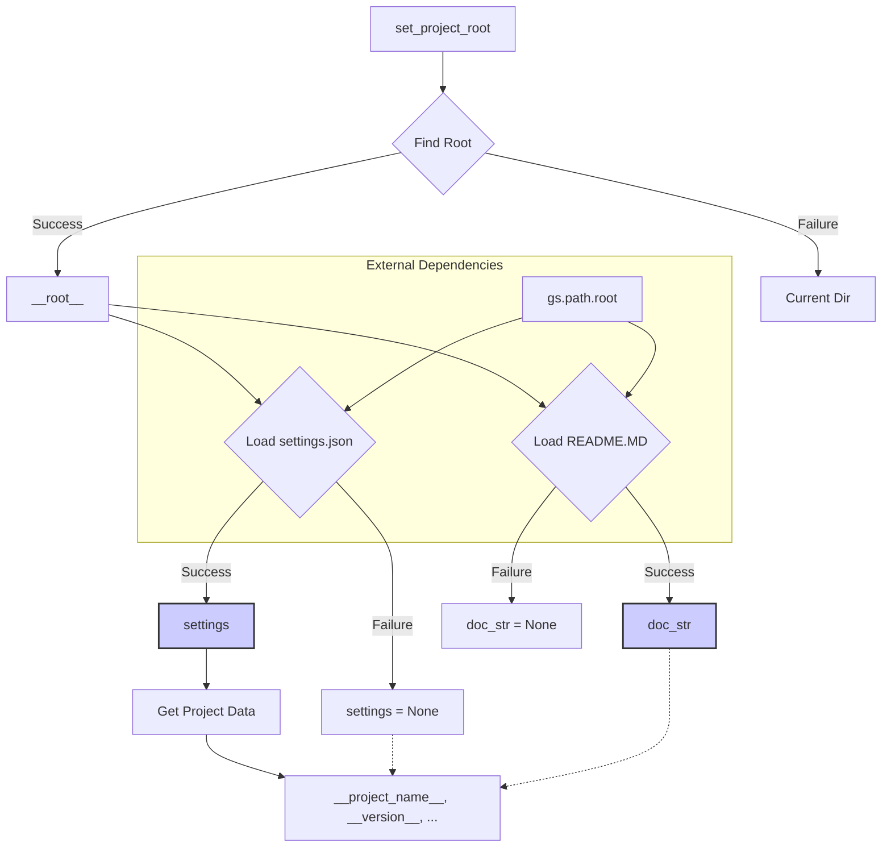

# <input code>

```python
## \file hypotez/src/suppliers/grandadvance/header.py
# -*- coding: utf-8 -*-\
#! venv/Scripts/python.exe
#! venv/bin/python/python3.12

"""
.. module: src.suppliers.grandadvance 
	:platform: Windows, Unix
	:synopsis:

"""
MODE = 'dev'


import sys
import json
from packaging.version import Version

from pathlib import Path
def set_project_root(marker_files=('pyproject.toml', 'requirements.txt', '.git')) -> Path:
    """
    Finds the root directory of the project starting from the current file's directory,
    searching upwards and stopping at the first directory containing any of the marker files.

    Args:
        marker_files (tuple): Filenames or directory names to identify the project root.
    
    Returns:
        Path: Path to the root directory if found, otherwise the directory where the script is located.
    """
    __root__:Path
    current_path:Path = Path(__file__).resolve().parent
    __root__ = current_path
    for parent in [current_path] + list(current_path.parents):
        if any((parent / marker).exists() for marker in marker_files):
            __root__ = parent
            break
    if __root__ not in sys.path:
        sys.path.insert(0, str(__root__))
    return __root__


# Get the root directory of the project
__root__ = set_project_root()
"""__root__ (Path): Path to the root directory of the project"""

from src import gs

settings:dict = None
try:
    with open(gs.path.root / 'src' /  'settings.json', 'r') as settings_file:
        settings = json.load(settings_file)
except (FileNotFoundError, json.JSONDecodeError):
    ...

doc_str:str = None
try:
    with open(gs.path.root / 'src' /  'README.MD', 'r') as settings_file:
        doc_str = settings_file.read()
except (FileNotFoundError, json.JSONDecodeError):
    ...


__project_name__ = settings.get("project_name", 'hypotez') if settings  else 'hypotez'
__version__: str = settings.get("version", '')  if settings  else ''
__doc__: str = doc_str if doc_str else ''
__details__: str = ''
__author__: str = settings.get("author", '')  if settings else ''
__copyright__: str = settings.get("copyrihgnt", '')  if settings else ''
__cofee__: str = settings.get("cofee", "Treat the developer to a cup of coffee for boosting enthusiasm in development: https://boosty.to/hypo69")  if settings else "Treat the developer to a cup of coffee for boosting enthusiasm in development: https://boosty.to/hypo69"
```

# <algorithm>

**Шаг 1:**  Функция `set_project_root` ищет корневую директорию проекта.
*   **Вход:** кортеж `marker_files` содержащий имена файлов/папок для определения корня проекта.
*   **Действия:** Начинает поиск с текущей директории, ищет вверх по дереву директорий до тех пор, пока не найдет директорию, содержащую один из файлов из `marker_files`.
*   **Пример:** Если `marker_files` содержит `pyproject.toml`, функция ищет `pyproject.toml` в текущей директории, а если нет, то в родительской и так далее.
*   **Вывод:** Путь к корневой директории проекта (`Path` объект).  Если корень не найден, возвращает путь к текущей директории.

**Шаг 2:** Получение корневой директории проекта.
*   **Вход:**  Вызов `set_project_root()`.
*   **Действия:** Функция `set_project_root` возвращает путь к корню проекта, который сохраняется в переменной `__root__`.
*   **Вывод:**  Переменная `__root__` получает путь к корневой директории проекта.

**Шаг 3:** Чтение файла настроек `settings.json`.
*   **Вход:** Путь к файлу настроек (`gs.path.root / 'src' / 'settings.json'`).
*   **Действия:** Файл открывается на чтение. Содержимое файла парсится как JSON и сохраняется в `settings`.
*   **Вывод:** Переменная `settings` содержит словарь с настройками проекта или `None` если файл не найден или содержит недопустимые данные.

**Шаг 4:** Чтение файла `README.MD`.
*   **Вход:** Путь к файлу `README.MD` (`gs.path.root / 'src' / 'README.MD'`).
*   **Действия:** Файл открывается на чтение.  Его содержимое сохраняется в `doc_str`.
*   **Вывод:** Переменная `doc_str` содержит текст из `README.MD`, или `None` если файл не найден или при ошибке чтения.

**Шаг 5:** Получение значений настроек из `settings` и задание переменных `__project_name__`, `__version__`, `__doc__`, `__details__`, `__author__`, `__copyright__`, `__cofee__`.
*   **Вход:** Словарь `settings`.
*   **Действия:**  Функция `get` извлекает значения настроек с дефолтными значениями, если они не определены в файле `settings.json`.
*   **Пример:** Если в `settings` нет "project_name", то `__project_name__` получит значение 'hypotez'.
*   **Вывод:**  Переменные, содержащие информацию о проекте.


# <mermaid>



# <explanation>

**Импорты:**

- `sys`: Для работы со средой выполнения Python, в частности, добавления корневой директории проекта в `sys.path`.
- `json`: Для работы с файлами JSON (чтение и парсинг настроек).
- `packaging.version`: Для работы с версиями пакетов (не используется напрямую в данном примере).
- `pathlib`: Для работы с путями к файлам и директориям.
- `src.gs`:  (Объект `gs`):  Подключает модуль `gs` из пакета `src`,  вероятно, предоставляющий функциональность для работы с путями к файлам проекта.  Этот модуль критически важен для нахождения корневого каталога проекта, так как он используется для создания путей к `settings.json` и `README.MD`.


**Функции:**

- `set_project_root`: Ищет корневую директорию проекта, начиная с текущей директории и идя вверх по дереву.  Это важная функция, потому что она позволяет проекту быть независимым от того, где скрипт был запущен. Она вставляет корневой путь в `sys.path`, что позволяет импортировать модули из `src` пакета.


**Классы:**

-  Нет явных классов в этом фрагменте кода.


**Переменные:**

- `MODE`, `__root__`, `settings`, `doc_str`, `__project_name__`, `__version__`, `__doc__`,  `__details__`, `__author__`, `__copyright__`, `__cofee__`: Все эти переменные хранят различные данные, относящиеся к проекту (настройки, версия, документация).

**Возможные ошибки и улучшения:**

- **Обработка ошибок:**  Используются `try...except` блоки для обработки `FileNotFoundError` и `json.JSONDecodeError`.  Это хорошо, но можно добавить более специфичные обработчики, например, чтобы логгировать ошибки или настраивать значения по умолчанию, если файл настроек поврежден или отсутствует.
- **Проверка типов:**  Можно добавить проверку типов для `settings` и `doc_str` после загрузки, чтобы избежать проблем, связанных с типом данных в файлах.
- **Использование `importlib.resources`:**  Вместо `Path` и ручного поиска корневого каталога, можно использовать `importlib.resources`. Это позволит избежать проблем с относительными путями и сделает код более портативным.

**Взаимосвязь с другими частями проекта:**

Этот код из `header.py` служит как начальная точка входа для доступа к настройкам проекта, `README.md` и другим ресурсам, что показывает его центральную роль в инициализации проекта.  Он использует модуль `gs` из пакета `src`, который, предположительно, отвечает за предоставление пути к важным ресурсам проекта, таким как директория проекта и файлы конфигурации.  Таким образом, `header.py` устанавливает контекст для работы других модулей и классов, делая его критическим для запуска проекта.