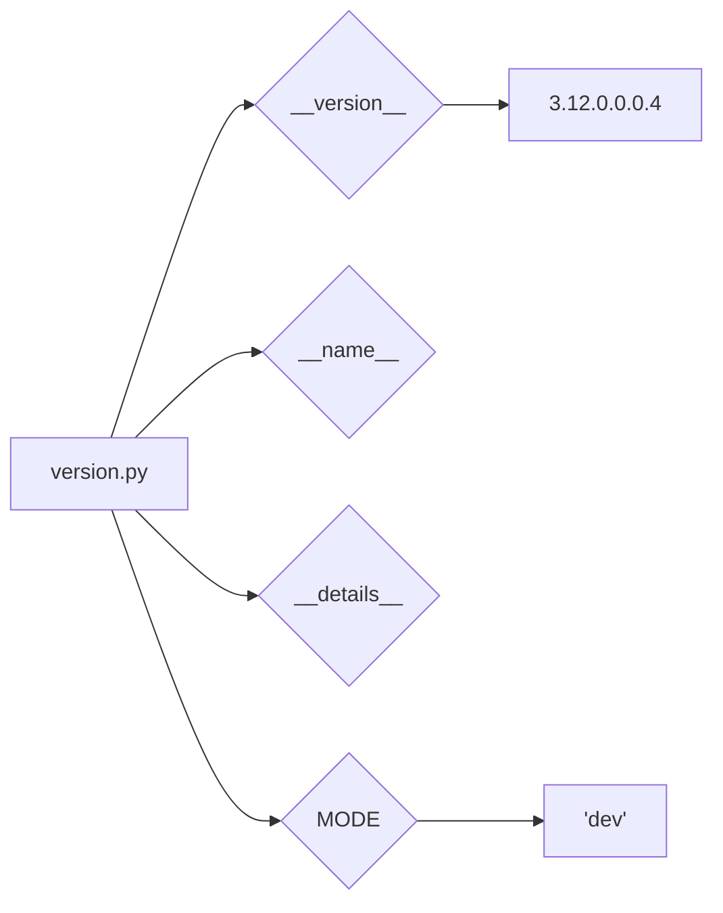

# <input code>

```python
## \file hypotez/src/suppliers/hb/scenarios/version.py
# -*- coding: utf-8 -*-\
#! venv/Scripts/python.exe
#! venv/bin/python/python3.12

"""
.. module: src.suppliers.hb.scenarios 
	:platform: Windows, Unix
	:synopsis:

"""
MODE = 'dev'

"""
	:platform: Windows, Unix
	:synopsis:

"""


"""
	:platform: Windows, Unix
	:synopsis:

"""


"""
  :platform: Windows, Unix

"""
"""
  :platform: Windows, Unix
  :platform: Windows, Unix
  :synopsis:
"""MODE = 'dev'
  
""" module: src.suppliers.hb.scenarios """


"""
- `__version__`: This variable holds the version of the module or package.
- `__name__`: Contains the name of the module. If the script is being run directly, the value will be `"__main__"`.
- `__doc__`: The module's documentation string.
- `__details__`: This variable likely contains additional details about the module, but the exact purpose depends on the specific module or package.
- `__annotations__`: Contains type annotations for variables and functions in the module.
- `__author__`: The name(s) of the author(s) of the module.
"""
__name__:str
__version__="3.12.0.0.0.4"
__doc__:str
__details__:str="Details about version for module or class"
__annotations__

__author__='hypotez '
```

# <algorithm>

Этот код не содержит алгоритма в традиционном смысле.  Это файл, содержащий константы и переменные, описывающие версию и другую информацию о модуле `src.suppliers.hb.scenarios`.  Нет циклов, ветвлений или вызовов функций, которые можно изобразить блок-схемой.  Данные не перемещаются между функциями.

# <mermaid>




# <explanation>

Этот Python-файл определяет переменные, описывающие модуль `src.suppliers.hb.scenarios`.

**Импорты:**  Нет импортов. Код самодостаточен.

**Классы:** Нет классов.

**Функции:** Нет функций.

**Переменные:**

* `__version__`: Строковая переменная, содержащая версию модуля (`3.12.0.0.0.4`).
* `__name__`: Переменная, содержащая имя модуля. В случае непосредственного запуска файла будет `"__main__"`.
* `__details__`: Строковая переменная, предназначенная для хранения дополнительных сведений о модуле (не используется).
* `MODE`: Переменная, вероятно, используемая для управления режимами работы приложения. Текущее значение `'dev'`.
* `__doc__`, `__annotations__`, `__author__`:  Стандартные атрибуты модуля Python, определяющие его документацию, аннотации типов и авторство.


**Возможные ошибки или области для улучшений:**

* **Недостаточно информации:** Файл содержит только метаданные.  Для реального использования необходим код, использующий эти переменные.  Непонятно, как будет использоваться `MODE` или `__details__`.
* **Документация:**  Комментарии с  `""" """`  (docstrings)  хорошо документируют  `__version__` и `MODE`, но нуждаются в улучшении. Они могут быть менее подробными, чем ожидается.
* **Стиль:**  Использование `# -*- coding: utf-8 -*-`  и  `#! ...` в начале файла, вероятно,  излишне в современном Python.  Это часто остатки устаревших или специфичных настроек, которые не влияют на работу кода.


**Взаимосвязи с другими частями проекта:**

Этот файл определяет информацию о модуле, который, вероятно, будет использоваться другими частями проекта (например, для управления версиями, создания документации или логирования).  Без дополнительного контекста трудно определить точные взаимосвязи.  Для более глубокого анализа нужно посмотреть, как этот файл используется в других частях проекта.