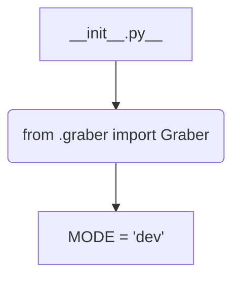
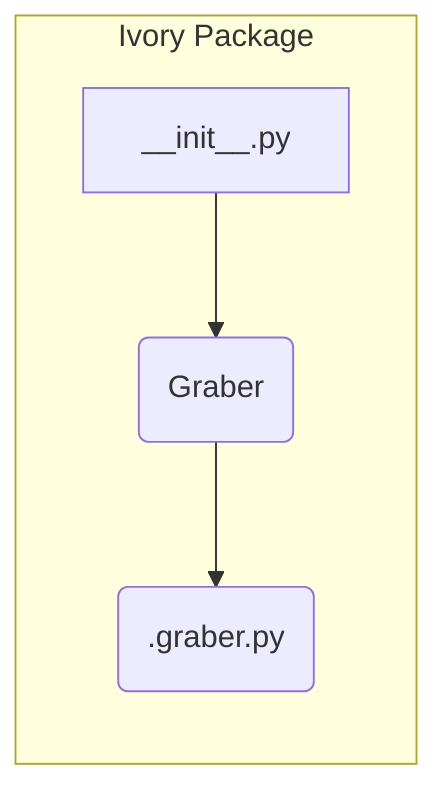

# <input code>

```python
## \file hypotez/src/suppliers/ivory/__init__.py
# -*- coding: utf-8 -*-
#! venv/Scripts/python.exe
#! venv/bin/python/python3.12

"""
.. module: src.suppliers.ivory 
	:platform: Windows, Unix
	:synopsis:

"""
MODE = 'dev'

from .graber import Graber
```

# <algorithm>

Этот код представляет собой инициализационный модуль для пакета `ivory` в рамках проекта `hypotez`. Он не содержит логики обработки данных, а только импортирует класс `Graber`.

**Блок-схема:**



**Примеры:**

- `MODE = 'dev'` - Пример конфигурационной переменной, скорее всего, устанавливающей режим работы модуля (например, режим разработки или производства).
- Импорт `Graber`: Пример импорта класса из другого модуля внутри пакета.

**Передача данных:**  В данном коде нет явной передачи данных между функциями или классами.  Данные будут передаваться и обрабатываться в методах класса `Graber`.


# <mermaid>



**Описание диаграммы:**

Диаграмма демонстрирует, что модуль `__init__.py` из пакета `ivory` импортирует класс `Graber` из модуля `.graber.py` внутри того же пакета.  `Graber` - это, вероятно, класс, отвечающий за получение и обработку данных от источника данных.

# <explanation>

* **Импорты:**
   - `from .graber import Graber`: Импортирует класс `Graber` из подпакета `graber` внутри пакета `ivory`.  Символ `.` указывает на импорт из текущего пакета (`hypotez/src/suppliers/ivory`). Это типичная практика для организации модулей в проекте.  Используя относительные импорты, код становится более независимым от структуры импорта проекта.

* **Переменные:**
   - `MODE = 'dev'`: Строковая переменная, определяющая режим работы (вероятно, режим разработки).  Она используется для конфигурации и управления поведением программы.  В дальнейшем эта переменная может быть использована для выбора различных конфигураций или настроек.

* **Классы:**
    - `Graber`: Класс, который в данный момент не определен в `__init__.py`. Этот класс скорее всего определён в файле `hypotez/src/suppliers/ivory/graber.py` и отвечает за получение данных от определённого источника (например, API или базы данных).


**Взаимосвязи с другими частями проекта:**

Модуль `__init__.py` не содержит прямой логики, но является частью иерархии пакета `ivory`.  Он отвечает за экспорт класса `Graber`, который будет использоваться в других частях проекта, где требуется взаимодействие с источником данных.  Этот класс `Graber` скорее всего взаимодействует с другими модулями для получения, обработки и использования данных.  Примеры взаимодействия могут включать:

- Вызовы методов `Graber` из других модулей для извлечения данных.
- Передача данных, полученных `Graber`, для обработки другим компонентам проекта.


**Возможные ошибки или области для улучшений:**

- **Документация:** Документация в `""" """` может быть более подробной, описывая назначение класса `Graber`, его методы и необходимые параметры для его работы.
- **Типизация:** Отсутствие явной типизации переменных. Добавьте аннотации типов для лучшей читабельности и поддержки статического анализа кода.
- **Обработка исключений:**  Отсутствие обработки потенциальных исключений при работе с внешними источниками данных. Включить обработку `try-except` блоков.