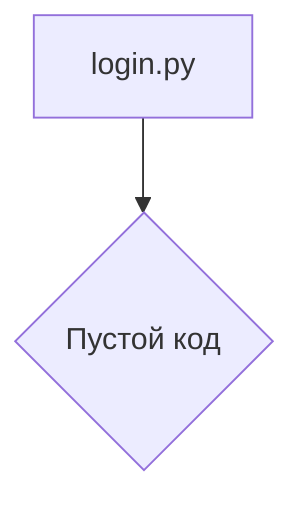

```MD
# Анализ кода из файла hypotez/src/suppliers/ivory/login.py

## <input code>

```python
## \file hypotez/src/suppliers/ivory/login.py
# -*- coding: utf-8 -*-\
#! venv/Scripts/python.exe
#! venv/bin/python/python3.12

"""
.. module: src.suppliers.ivory 
	:platform: Windows, Unix
	:synopsis:

"""
MODE = 'dev'

"""
	:platform: Windows, Unix
	:synopsis:

"""


"""
	:platform: Windows, Unix
	:synopsis:

"""


"""
  :platform: Windows, Unix

"""
"""
  :platform: Windows, Unix
  :platform: Windows, Unix
  :synopsis:
"""MODE = 'dev'
  
""" module: src.suppliers.ivory """


""" supplier: IVORY """
```

## <algorithm>

Код представляет собой пустой файл, содержащий только комментарии.  Алгоритм работы не определен, поскольку нет операторов или логики.  Данные не перемещаются между функциями или классами.


## <mermaid>



## <explanation>

Файл `login.py` в каталоге `hypotez/src/suppliers/ivory` — пустой, за исключением многочисленных комментариев.  Эти комментарии, вероятно, являются заготовками для будущего кода или служат документацией для проекта.

**Импорты:**  В файле нет импортов, так как в нём нет функций или классов, которые нуждаются в использовании других модулей.

**Классы:** Нет объявлений классов.

**Функции:** Нет функций.

**Переменные:**  Единственная переменная — `MODE`, присваиваемая строковое значение `'dev'`.  Эта переменная, скорее всего, используется для определения режима работы системы (например, "разработка", "производство").  В пустом файле её практическое использование пока не прослеживается.

**Возможные ошибки/улучшения:**

* **Недостаток кода:** Файл не содержит никакого исполняемого кода. Это может быть пустой заготовка или ошибка в процессе создания файла.
* **Избыточные комментарии:** В файле много комментариев, которые ничего не описывают.  Необходимо либо убрать излишние комментарии, либо преобразовать их в более полезную документацию.  В частности, одинаковые комментарии `:synopsis:` не несут никакой информации.
* **Несоответствие наименования:** Хотя присутствует `login.py`, сам код на логин не указывает.  Имя файла может не соответствовать функциональности.

**Взаимосвязи с другими частями проекта:**  Без кода в файле трудно определить связи с другими частями проекта.  Можно предположить, что этот файл предназначен для модуля аутентификации поставщика услуг `IVORY`, но без кода невозможно определить точные зависимости.