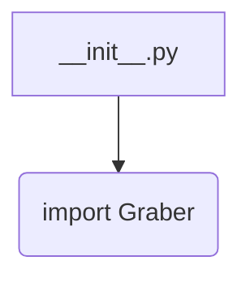
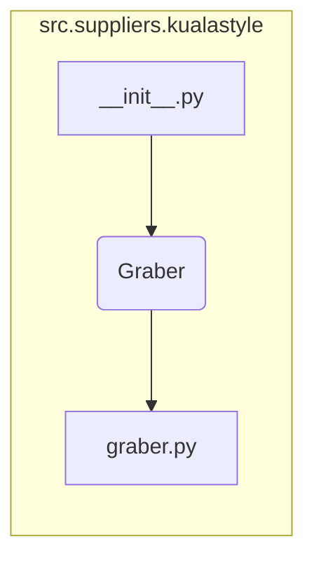

```MD
# Анализ кода hypotez/src/suppliers/kualastyle/__init__.py

1. **<input code>**

```python
## \file hypotez/src/suppliers/kualastyle/__init__.py
# -*- coding: utf-8 -*-\
#! venv/Scripts/python.exe
#! venv/bin/python/python3.12

"""
.. module: src.suppliers.kualastyle 
	:platform: Windows, Unix
	:synopsis:

"""
MODE = 'dev'

from .graber import Graber
```

2. **<algorithm>**

Алгоритм работы этого файла сводится к импорту модуля `Graber` из подпапки `graber`.  Поскольку данный файл является инициализатором пакета `kualastyle`,  он  осуществляет  необходимую  подготовку для  использования  класса `Graber`.  В данном случае алгоритм  ограничивается  одним шагом: импортом.



Пример:

Файл `__init__.py`  служит  путеводителем для импорта  `Graber`.  При последующем  импорте  пакета  `kualastyle` Python будет  искать  `Graber` в директории `graber`.


3. **<mermaid>**



Объяснение диаграммы:

* `__init__.py` импортирует `Graber` из подпапки `graber`.
* `graber.py` (или аналогичный файл) содержит определение класса `Graber`.


4. **<explanation>**

* **Импорты:**
    * `from .graber import Graber`:  Этот импорт подключает класс `Graber` из модуля `graber.py`, который находится в той же директории. Символ `.` указывает на поиск модуля `graber` внутри текущего пакета (`kualastyle`).  Этот импорт необходим для использования класса `Graber` в других частях проекта `hypotez`.

* **Классы:**
    * `Graber`: Класс `Graber` определен в файле `graber.py` и, вероятно, содержит методы для получения данных (сбор данных).  Подробное описание этого класса доступно в файле `graber.py`.  Пока `__init__.py` лишь сообщает интерпретатору где искать определение класса `Graber`.

* **Функции:**
    * Нет функций в данном файле.

* **Переменные:**
    * `MODE = 'dev'`: Эта переменная, вероятно, используется для определения режима работы (например, 'dev', 'prod'), который определяет поведение других частей кода.


**Возможные ошибки/улучшения:**

* **Должен быть файл `graber.py`**: Для корректной работы необходим файл `graber.py`, который содержит определение класса `Graber`.
* **Документация:** Добавьте подробную документацию к классу `Graber` (и потенциально к `__init__.py`) для описания функциональности, параметров, возвращаемых значений и примеров использования.
* **Управление конфигурацией:** Переменная `MODE` должна быть лучше управлена, например, занесена в отдельный конфигурационный файл или объект, для большей гибкости.


**Цепочка взаимосвязей:**

Файл `__init__.py` служит в качестве точки входа для пакета `kualastyle` и предоставляет доступ к классу `Graber`, который, предположительно, взаимодействует с внешними источниками данных (например, веб-сайтами, API).  Дальнейшее использование класса `Graber` может быть в других частях проекта `hypotez`, например, в модулях обработки данных или анализа.