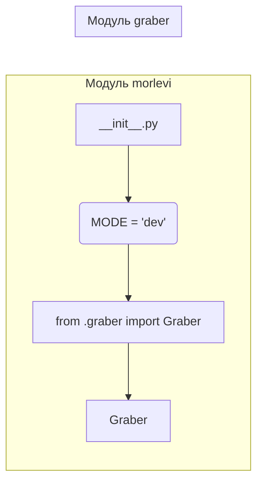

```MD
# <input code>

```python
## \file hypotez/src/suppliers/morlevi/__init__.py
# -*- coding: utf-8 -*-\
#! venv/Scripts/python.exe
#! venv/bin/python/python3.12

"""
.. module: src.suppliers.morlevi 
	:platform: Windows, Unix
	:synopsis:

"""
MODE = 'dev'

from .graber import Graber
```

# <algorithm>

Этот код является инициализационным модулем для пакета `morlevi` внутри `suppliers` в проекте `hypotez`.  Алгоритм состоит из определения константы `MODE` и импорта класса `Graber` из модуля `graber`.  В данном случае алгоритм прост и не включает сложных вычислений или циклов.  Он только задаёт переменную и импортирует необходимый класс.

**Пример:**

1. **Инициализация:** Модуль загружается, и константа `MODE` получает значение `'dev'`.
2. **Импорт:** Модуль `graber` импортируется, и класс `Graber` становится доступен для использования в других частях проекта.


# <mermaid>



**Объяснение диаграммы:**

* **__init__.py:**  Инициализационный модуль для пакета `morlevi`.
* **MODE = 'dev':** Определяет переменную `MODE` со значением `'dev'`.
* **from .graber import Graber:** Импортирует класс `Graber` из модуля `graber`.  Обратите внимание на `.` - это указывает на импорт из подмодулей текущего пакета.
* **Graber:**  Класс `Graber` (из модуля `graber`), вероятно, отвечает за получение данных от источника данных.

# <explanation>

* **Импорты:**
    `from .graber import Graber`: Импортирует класс `Graber` из подмодуля `graber` пакета `morlevi`. Это указывает, что модуль `graber` содержит реализацию класса `Graber`, который, вероятно, отвечает за извлечение данных (grabbing). `.` указывает на поиск класса `Graber` в подпапке `graber` текущего пакета `morlevi`.

* **Классы:**
    `Graber`:  Это класс, который, по всей видимости, отвечает за получение данных.  Подробный анализ требует просмотра кода файла `graber.py`.

* **Функции:**
    Этот файл не содержит функций, а только константу и импорт.  Функциональность, связанная с работой с данными, будет реализована в классе `Graber` (или в других функциях в `graber.py`).


* **Переменные:**
    `MODE = 'dev'`:  Переменная, которая вероятно, используется для определения режима работы.  `dev` может означать "разработка".

* **Возможные ошибки или улучшения:**
    * Нет явных ошибок, но для лучшей читаемости можно добавить комментарии, описывающие назначение переменной `MODE`.
    * Без кода `graber.py` трудно оценить полноту реализации.  Необходимо проверить, что класс `Graber` содержит необходимые методы для работы с данными и имеет корректную логику.

**Цепочка взаимосвязей:**

Модуль `__init__.py` из пакета `morlevi` импортирует класс `Graber` из подмодуля `graber`.  Это указывает, что `graber.py` содержит классы и функции, которые обрабатывают извлечение данных. В дальнейшем, код из других частей `hypotez` будет использовать класс `Graber` для взаимодействия с источниками данных, реализованными в `graber.py`.