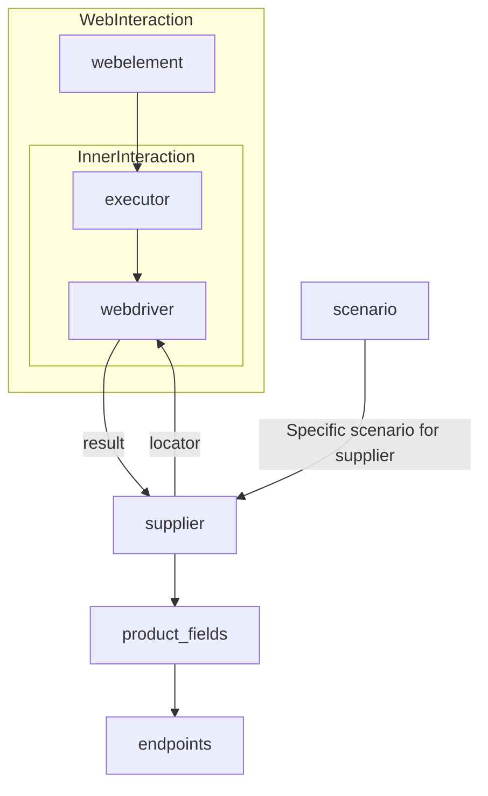
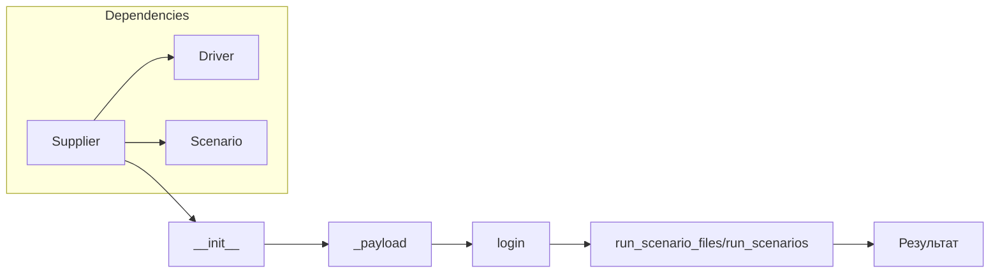

```MD
# Анализ кода класса Supplier

## <input code>

```
# **Класс** `Supplier`
### **Базовый класс для всех поставщиков**
*В контексте кода `Supplier` - поставщик информации.
Поставщиком может быть производитель какого-либо тавара, данных или информации
Источники потавщика - целевая страница сайта, документ, база данных, таблица.
Класс сводит разных поставщиков к одинаковому алгоритму действий внутри класса.
У каждого поставщика есть свой уникальный префикс. ([подробно о префиксах](prefixes.md))*\n

Класс `Supplier` служит основой для управления взаимодействиями с поставщиками. 
Он выполняет инициализацию, настройку, аутентификацию и запуск сценариев для различных источников данных, таких как `amazon.com`, `walmart.com`, `mouser.com` и `digikey.com`. Клиент может определить дополнительные поставщики.

---
## Список реализованныx поставщиков:

[aliexpress](aliexpress/README.RU.MD)  - Реализован в двух варианах сценариев: `webriver` и `api` 
[amazon](amazon/README.RU.MD) - `webdriver` 
[bangood](bangood/README.RU.MD)  - `webdriver` 
[cdata](cdata/README.RU.MD)  - `webdriver` 
[chat_gpt](chat_gpt/README.RU.MD)  - Работа с чатом chatgpt (НЕ С МОДЕЛЬЮ!) 
[ebay](ebay/README.RU.MD)  - `webdriver` 
[etzmaleh](etzmaleh/README.RU.MD)  - `webdriver` 
[gearbest](gearbest/README.RU.MD)  - `webdriver` 
[grandadvance](grandadvance/README.RU.MD)  - `webdriver` 
[hb](hb/README.RU.MD)  - `webdriver` 
[ivory](ivory/README.RU.MD) - `webdriver` 
[ksp](ksp/README.RU.MD) - `webdriver`
[kualastyle](kualastyle/README.RU.MD) `webdriver` 
[morlevi](morlevi/README.RU.MD) `webdriver` 
[visualdg](visualdg/README.RU.MD) `webdriver` 
[wallashop](wallashop/README.RU.MD) `webdriver`  
[wallmart](wallmart/README.RU.MD) `webdriver` 
[подробно о вебдрайвере :class: `Driver`](../webdriver/README.RU.MD)    
[подробно о сценариях :class: `Scenario`](../scenarios/README.RU.MD)
---

## <algorithm>

Алгоритм работы класса `Supplier` можно представить следующей блок-схемой:

1. Инициализация (`__init__`):  Принимает `supplier_prefix`, `locale` и `webdriver`.  Сохраняет эти значения в атрибуты класса.  Пример: `supplier = Supplier(supplier_prefix='aliexpress', locale='ru', webdriver='chrome')`.

2. Загрузка настроек (`_payload`):  Загружает настройки из файла (JSON или другого формата), связанные с конкретным `supplier_prefix`. Инициализирует `webdriver`.  Пример: `supplier._payload(webdriver='firefox')`.

3. Аутентификация (`login`):  Производит вход на сайт поставщика, используя сохранённые данные входа и локаторы.  Пример: `supplier.login()`.

4. Выполнение сценариев (`run_scenario_files` или `run_scenarios`):  Запускает сценарии, указанные в `scenario_files` или `scenarios`. Сценарии определяют действия, которые нужно выполнить на сайте (например, парсинг данных).  Примеры:
    - Запуск списка сценариев: `supplier.run_scenario_files(['scenario1.json', 'scenario2.json'])`
    - Запуск одного сценария: `supplier.run_scenarios([{'action': 'scrape', 'target': 'product_list'}])`

## <mermaid>



## <explanation>

**Импорты:**  Код не предоставляет импортов.  Для работы этого класса требуются импорты из других модулей (например, `webdriver`, `scenarios`).  Информация о них содержится в `README`-файлах, на которые ссылается код.


**Классы:**

* `Supplier`: Базовый класс для взаимодействия с поставщиками. Содержит атрибуты (например, `supplier_id`, `driver`) и методы для инициализации, настройки, аутентификации и выполнения сценариев.  Этот класс предоставляет общий интерфейс для различных поставщиков.

**Функции:**

* `__init__`:  Инициализирует экземпляр класса `Supplier`.  Принимает имя поставщика, локаль, тип веб-драйвера.
* `_payload`: Загружает настройки поставщика и инициализирует веб-драйвер.
* `login`:  Производит аутентификацию на сайте поставщика.
* `run_scenario_files`:  Запускает сценарии, указанные в файлах.
* `run_scenarios`: Запускает сценарии, предоставленные в виде списка словарей.

**Переменные:**

* `supplier_id`, `supplier_prefix`, `supplier_settings`, `locale`, `price_rule`, `related_modules`, `scenario_files`, `current_scenario`, `login_data`, `locators`, `driver`, `parsing_method`:  Атрибуты класса `Supplier`.  Их типы указаны в описании.

**Возможные ошибки и улучшения:**

* Не указано, как происходит загрузка настроек и локаторов.  Необходимо добавить обработку исключений для ситуаций, когда файлы настроек не найдены или повреждены.  
* Отсутствует валидация входных данных для методов.  Проверьте корректность входных данных (например, проверка типов данных).
* Не описана обработка ошибок во время выполнения сценариев.  Добавьте логирование или обработку исключений для более надежной работы.
* Не указаны зависимости от внешних библиотек.  Укажите, какие библиотеки требуются для работы с WebDriver и парсингом.

**Взаимосвязь с другими частями проекта:**

Класс `Supplier` зависит от классов `Driver` (для взаимодействия с веб-драйвером) и `Scenario` (для выполнения сценариев).  Это прямо обозначено в комментариях и ссылках на другие `README`-файлы.