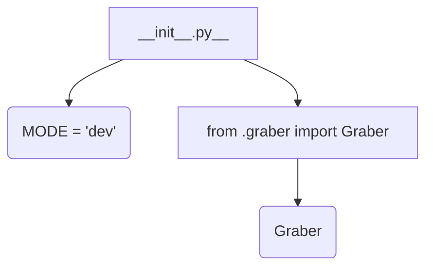
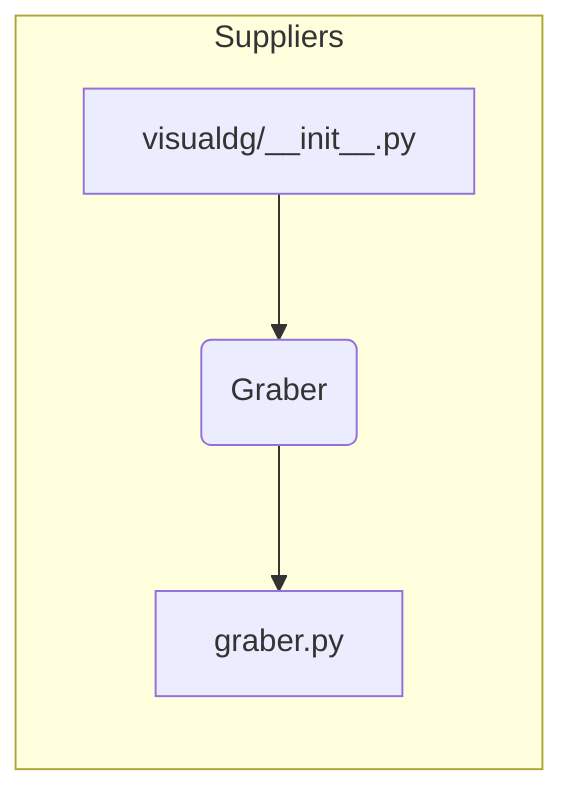

# <input code>

```python
## \file hypotez/src/suppliers/visualdg/__init__.py
# -*- coding: utf-8 -*-\
#! venv/Scripts/python.exe
#! venv/bin/python/python3.12

"""
.. module: src.suppliers.visualdg 
	:platform: Windows, Unix
	:synopsis:

"""
MODE = 'dev'

from .graber import Graber
```

# <algorithm>



**Пошаговая блок-схема:**

1. **Инициализация:** Модуль `__init__.py` инициализирует глобальную переменную `MODE` со значением 'dev'.
2. **Импорт:** Модуль импортирует класс `Graber` из подмодуля `graber.py` в текущий модуль.

**Примеры данных:**

* `MODE`: Строка 'dev'.
* `Graber`: Объект класса `Graber` (детали зависят от реализации `graber.py`).

# <mermaid>



# <explanation>

**Импорты:**

* `from .graber import Graber`: Этот импорт подключает класс `Graber` из файла `graber.py`, находящегося в той же директории (`.`) что и текущий файл `__init__.py`. Это стандартный способ импортировать классы и функции из модулей в пакетах Python.  `src` указывает на корневую директорию проекта, `suppliers` - подпапку в ней, а `visualdg` - пакет, содержащий `__init__.py` и `graber.py`.

**Классы:**

* `Graber`:  Этот класс (его реализация находится в файле `graber.py`) определенно является ключевым компонентом, но без его кода сложно дать подробное описание.  Он, вероятно, содержит методы для работы с визуальными данными (отсюда название `visualdg`).


**Функции:**

* В этом `__init__.py` нет собственных функций.  Функциональность модуля сосредоточена на импорте класса `Graber`.

**Переменные:**

* `MODE`: Глобальная переменная, хранящая строковое значение, вероятно, используемое для настройки поведения модуля (например, в режиме разработки или производства).

**Возможные ошибки или области для улучшений:**

* **Отсутствие документации:**  В `__init__.py` есть docstring, но он слишком общий. Должны быть более подробные описания переменных, классов и их поведения.  Это поможет понять поведение модуля и его использование.
* **Отсутствие обработки ошибок:**  Неизвестно, обрабатывает ли `Graber` потенциальные ошибки при работе с визуальными данными.
* **Непонятность назначения `MODE`:** Не понятно, как `MODE` используется в других частях кода.  Описание использования `MODE` должно быть указано.

**Взаимосвязи с другими частями проекта:**

* `Graber` (класс)  будет использоваться в других модулях, которые импортируют `visualdg`.  Вероятно, в этих модулях будут создаваться экземпляры `Graber` и вызываться его методы для работы с визуальными данными.  Без знания кода других модулей сложно описать полную цепочку.


**Вывод:**

Данный `__init__.py` является лишь началом модуля, отвечающего за получение визуальных данных. Он импортирует ключевой класс `Graber` но не предоставляет функциональности для работы с ним.  Для полного понимания необходимо изучить `graber.py`.