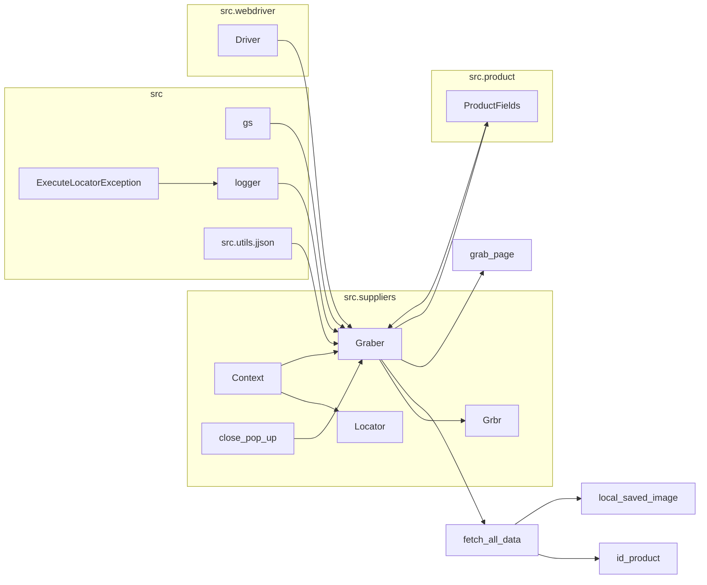

# <input code>

```python
## \file hypotez/src/suppliers/visualdg/graber.py
# -*- coding: utf-8 -*-\
#! venv/Scripts/python.exe
#! venv/bin/python/python3.12

"""
.. module: src.suppliers.visualdg 
	:platform: Windows, Unix
	:synopsis: Класс собирает значение полей на странице  товара `visualdg.co.il`. 
    Для каждого поля страницы товара сделана функция обработки поля в родительском классе.
    Если нужна нестандертная обработка, функция перегружается в этом классе.
    ------------------
    Перед отправкой запроса к вебдрайверу можно совершить предварительные действия через декоратор. 
    Декоратор по умолчанию находится в родительском классе. Для того, чтобы декоратор сработал надо передать значение 
    в `Context.locator`, Если надо реализовать свой декоратор - раскоментируйте строки с декоратором и переопределите его поведение

"""
MODE = 'dev'


import asyncio
from pathlib import Path
from types import SimpleNamespace
from typing import Any, Callable, Optional
from dataclasses import dataclass, field
from functools import wraps
from pydantic import BaseModel
from src import gs

from src.suppliers import Graber as Grbr, Context, close_pop_up, Locator
from src.product import ProductFields
from src.webdriver import Driver
from src.utils.jjson import j_loads_ns
from src.logger import logger
from src.logger.exceptions import ExecuteLocatorException

from dataclasses import dataclass, field
from types import SimpleNamespace
from typing import Any, Callable


# # Определение декоратора для закрытия всплывающих окон
# # В каждом отдельном поставщике (`Supplier`) декоратор может использоваться в индивидуальных целях
# # Общее название декоратора `@close_pop_up` можно изменить 


# def close_pop_up(value: Any = None) -> Callable:
#     """Создает декоратор для закрытия всплывающих окон перед выполнением основной логики функции.

#     Args:
#         value (Any): Дополнительное значение для декоратора.

#     Returns:
#         Callable: Декоратор, оборачивающий функцию.
#     """
#     def decorator(func: Callable) -> Callable:
#         @wraps(func)
#         async def wrapper(*args, **kwargs):
#             try:
#                 # await Context.driver.execute_locator(Context.locator.close_pop_up)  # Await async pop-up close  
#                 ... 
#             except ExecuteLocatorException as e:
#                 logger.debug(f'Ошибка выполнения локатора: {e}')
#             return await func(*args, **kwargs)  # Await the main function
#         return wrapper
#     return decorator


class Graber(Grbr):
    """Класс для операций захвата Morlevi."""
    supplier_prefix: str

    def __init__(self, driver: Driver):
        """Инициализация класса сбора полей товара."""
        self.supplier_prefix = 'visualdg'
        super().__init__(supplier_prefix=self.supplier_prefix, driver=driver)
        # Устанавливаем глобальные настройки через Context
        
        Context.locator_for_decorator = None # <- если будет уастановлено значение - то оно выполнится в декораторе `@close_pop_up`


    async def grab_page(self, driver: Driver) -> ProductFields:
        """Asynchronous function to grab product fields.

        Args:
            driver (Driver): The driver instance to use for grabbing.

        Returns:
            ProductFields: The grabbed product fields.
        """
        global d
        d = self.d = driver  
        
        ...
        # Логика извлечения данных
        async def fetch_all_data(**kwards):
        
            # Call function to fetch specific data
            # await fetch_specific_data(**kwards)  

            # Uncomment the following lines to fetch specific data
            await self.id_product(kwards.get("id_product", ''))
            # ... (many more await calls)
            await self.local_saved_image(kwards.get("local_saved_image", ''))


        # Call the function to fetch all data
        await fetch_all_data()
        return self.fields
```



```markdown
# <algorithm>

1. **Инициализация:** Класс `Graber` наследуется от `Grbr`, принимая `driver` в конструкторе. Устанавливаются `supplier_prefix` и глобальная переменная `Context.locator_for_decorator` (возможно для декоратора).

2. **Обработка страницы:** Метод `grab_page` получает данные с помощью вложенной асинхронной функции `fetch_all_data`.

3. **Обработка данных:** Функция `fetch_all_data` вызывает различные методы класса `Graber` (например, `id_product`, `local_saved_image`), передавая им соответствующие данные из `kwards`. Каждый метод отвечает за извлечение определенного поля из HTML страницы.

4. **Возврат данных:** После выполнения всех вызовов `fetch_all_data` метод `grab_page` возвращает заполненный объект `ProductFields`.

**Пример:**

Если вызвать `grab_page(driver)` с `kwards = {"id_product": "123"}`, то функция `fetch_all_data` обработает запрос для получения поля `id_product` и передаст его в `self.fields`.


# <explanation>

**Импорты:**

- `asyncio`: Для асинхронного программирования.
- `pathlib`: Для работы с путями файлов.
- `types`: Для работы с типами данных.
- `typing`: Для определения типов данных.
- `dataclasses`: Для создания данных классов.
- `functools`: Для работы с функциями.
- `pydantic`: Для валидации данных.
- `src.gs`: Возможно, это собственная библиотека для работы с Google Sheets.
- `src.suppliers.Graber`: Родительский класс для сбора данных.
- `src.suppliers.Context`: Класс для хранения контекстной информации (например, драйвера).
- `src.suppliers.close_pop_up`: Декоратор для закрытия всплывающих окон.
- `src.suppliers.Locator`: Класс для работы с локаторами.
- `src.product.ProductFields`: Класс для хранения данных о товаре.
- `src.webdriver.Driver`: Класс для взаимодействия с веб-драйвером.
- `src.utils.jjson`: Для парсинга JSON данных.
- `src.logger`: Система логирования.
- `src.logger.exceptions`: Классы для обработки исключений.

**Классы:**

- `Graber`: Класс для сбора данных со страницы visualdg.co.il. Наследуется от `Grbr`. Имеет методы для извлечения данных о товаре.
- `ProductFields`: Класс для структурирования полученных данных (не показан в примере, но предполагается).

**Функции:**

- `grab_page`: Асинхронный метод для сбора всех данных с страницы.
- `fetch_all_data`: Вспомогательная функция для выполнения вызовов методов для извлечения конкретных данных.

**Переменные:**

- `d`: Глобальная переменная, содержащая экземпляр `Driver` (видимо, для доступа к нему в других функциях).

**Возможные ошибки и улучшения:**

- **Недостаток конкретики в комментариях**:  Комментарии в коде содержат общие описания, а не подробности реализации конкретных функциональных блоков. Нужно дополнять пояснениями об алгоритмах и логике работы каждого метода.
- **Отсутствие обработки ошибок**: Внутри `fetch_all_data` отсутствует обработка потенциальных исключений, что может привести к сбою программы.  В каждом `await` вызове нужно добавить `try...except` блоки.
- **Неполное понимание контекста**: `Context.locator_for_decorator` может не иметь смысла без понимания работы декоратора `close_pop_up`.

**Связь с другими частями проекта:**

- `Graber` взаимодействует с `Driver` для работы с веб-драйвером.
- `ProductFields` служит для хранения результатов работы `Graber` и, скорее всего, используется другими частями проекта для дальнейшей обработки.
- `Context` предоставляет общий доступ к драйверу и другим ресурсам.
- `logger` используется для регистрации событий и ошибок, а `ExecuteLocatorException` - для специфических ошибок локатора.
- `src.utils.jjson` служит для парсинга JSON, вероятно, для обработки ответов веб-сервера.