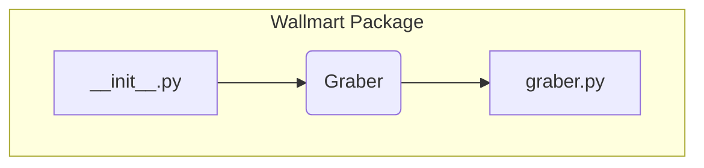

```MD
# Анализ файла hypotez/src/suppliers/wallmart/__init__.py

## <input code>

```python
## \file hypotez/src/suppliers/wallmart/__init__.py
# -*- coding: utf-8 -*-\
#! venv/Scripts/python.exe
#! venv/bin/python/python3.12

"""
.. module: src.suppliers.wallmart 
	:platform: Windows, Unix
	:synopsis:

"""


from .graber import Graber
```

## <algorithm>

Файл `__init__.py` - это инициализирующий файл для пакета `wallmart`.  Он не содержит собственных алгоритмов.  Его основная задача - импортировать и сделать доступными классы и функции из других файлов этого пакета.  В данном случае, он импортирует класс `Graber` из файла `graber.py`.  Пошаговый алгоритм сводится к единственному шагу:

1. Импортировать класс `Graber` из модуля `graber.py` в текущем пакете.


## <mermaid>



## <explanation>

**1. Импорты:**

* `from .graber import Graber`: Этот импорт делает класс `Graber` из файла `graber.py` в подпапке `wallmart` доступным в текущем модуле (`__init__.py`).  Символ `.` указывает на то, что файл `graber.py` находится в той же директории, что и `__init__.py`.  Это типичная структура для организации Python-проектов.

**2. Классы:**

* **`Graber`:** Этот класс (определённый, скорее всего, в `graber.py`) является ключевым классом для взаимодействия с источником данных Walmart.  Без просмотра `graber.py` трудно сказать о его функциональности, но исходя из имени, он скорее всего содержит методы для сбора данных из Walmart.

**3. Функции:**

Файл `__init__.py` не содержит собственных функций.  Все функции, которые могут быть, определены в файле `graber.py`.

**4. Переменные:**

Файл не содержит переменных.

**5. Возможные ошибки и улучшения:**

* **Отсутствие документации:** Класс `Graber` и все другие функции/классы, которые он использует, должны быть должным образом задокументированы.
* **Сложность зависимостей:**  Если `graber.py` зависит от других модулей, это следует отразить.
* **Тестирование:** Необходимо наличие тестов для класса `Graber`, чтобы убедиться в его корректной работе.

**Цепочка взаимосвязей:**

* `__init__.py` импортирует `Graber` и делает его доступным для других частей проекта.
* `Graber` (определённый в `graber.py`) вероятно взаимодействует с API или другими источниками данных Walmart.
* Другие части проекта (например, обработка, анализ данных) могут использовать класс `Graber` для извлечения данных из Walmart.  Подробности этой связи зависят от архитектуры всего приложения.


**Общий вывод:**

`__init__.py` выполняет роль инициализатора для пакета `wallmart`. Он предоставляет доступ к классу `Graber`, который, скорее всего, содержит логику для сбора данных из Walmart. Для более глубокого анализа необходимо изучить содержимое `graber.py`.