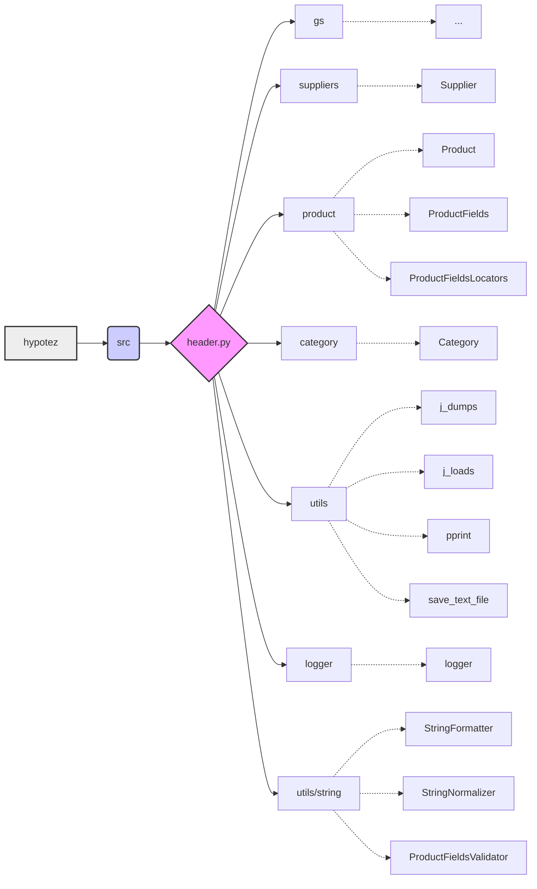

# <input code>

```python
## \file hypotez/src/templates/_examples/header.py
# -*- coding: utf-8 -*-
#! venv/Scripts/python.exe
#! venv/bin/python/python3.12

"""
.. module: src.templates._examples 
	:platform: Windows, Unix
	:synopsis:

"""
MODE = 'dev'

"""
	:platform: Windows, Unix
	:synopsis:

"""


"""
	:platform: Windows, Unix
	:synopsis:

"""


"""
  :platform: Windows, Unix

"""
"""
  :platform: Windows, Unix
  :platform: Windows, Unix
  :synopsis:
"""MODE = 'dev'
  
""" module: src.templates._examples """


import sys
import os
from pathlib import Path

dir_root : Path = Path (os.getcwd()[:os.getcwd().rfind('hypotez')+11])
sys.path.append (str (dir_root) )  # Добавляю корневую папку в sys.path
dir_src = Path (dir_root, 'src')
sys.path.append (str (dir_root) ) 
...

print(dir_root)
# ----------------
from pathlib import Path
import json
import re
# ----------------

from src import gs
from src.suppliers import Supplier
from src.product import Product, ProductFields, ProductFieldsLocators
from src.category import Category
from src.utils import j_dumps, j_loads,   pprint, save_text_file
from src.logger import logger
from src.utils.string import StringFormatter, StringNormalizer, ProductFieldsValidator
...
```

# <algorithm>

(Блок-схема невозможна, т.к. код фрагментарный и неполный.  Также сложно представить алгоритм без контекста. Приведённая схема является гипотетической.)

**Гипотетический пример:**

1. **Инициализация:** Определяется `MODE` (вероятно, режим работы). 
2. **Путь к корню проекта:** `dir_root` определяется как путь к корню проекта `hypotez`.
3. **Добавление пути к `sys.path`:** Путь к корню проекта добавляется в `sys.path` для правильного импорта модулей из других частей проекта.
4. **Импорт модулей:** Импортируются необходимые модули из пакета `src` и его подпапок (например, `gs`, `suppliers`, `product`, `category`, `utils`, `logger`).
5. **Вывод пути:** Выводится значение `dir_root`.
6. **Дополнительные импорты:** Импортируются стандартные модули (`json`, `re`, `Path`).
7. **Использование модулей**: далее в коде подразумевается использование импортированных классов и функций для работы с данными.

# <mermaid>



**Объяснение диаграммы:**

* `hypotez` - корневая папка проекта.
* `src` - основной пакет проекта, содержащий другие пакеты (модули).
* `header.py` - файл, содержащий импорты и переменные, необходимые для работы проекта.
* Стрелки отображают зависимости между модулями. `header.py` зависит от модулей из пакета `src`. Модули `src` могут зависеть друг от друга, и есть зависимости от стандартных библиотек Python.

# <explanation>

* **Импорты:** Код импортирует модули из собственного проекта (`src`, `src.suppliers`, `src.product`, `src.category`, `src.utils`, `src.logger`, `src.utils.string`) и стандартные библиотеки Python (`sys`, `os`, `pathlib`, `json`, `re`). Импорты из `src` указывают на наличие структурированного проекта, организованного в пакеты. Импорт `src.utils.string` предполагает наличие в проекте модулей для работы со строками (форматирование, нормализация, валидация).

* **Классы:** Код демонстрирует импорт нескольких классов: `Supplier`, `Product`, `ProductFields`, `ProductFieldsLocators`, `Category`. Эти классы, вероятно, определены в модулях пакета `src`, и используются для представления разных сущностей (поставщиков, продуктов, категорий) и их атрибутов.

* **Функции:** Код демонстрирует импорт функций `j_dumps`, `j_loads`, `pprint`, `save_text_file`, `StringFormatter`, `StringNormalizer`, `ProductFieldsValidator`, `logger`. Эти функции, вероятно, реализуют вспомогательные действия, связанные с обработкой данных (сериализация/десериализация JSON, вывод в консоль, сохранение в файл, работа со строками и валидация данных). Функции `pprint` и `logger` предполагают использование модулей для удобного вывода данных и логирования.

* **Переменные:** Код определяет переменную `dir_root` типа `Path` для хранения пути к корневой директории проекта. Это необходимо для корректного определения пути к файлам и модулям внутри проекта. Переменная `MODE`  вероятно, используется для выбора режимов работы приложения (например, `dev`, `prod`).

* **Возможные ошибки/улучшения:**
    * Фрагмент кода неполный, и невозможно дать полное объяснение его цели и работы.
    * Недостаточно информации о том, как используется `dir_root` и как он взаимодействует с другими частями проекта.
    * Непонятно, что происходит в `...`, следовательно, не ясен алгоритм работы и полное взаимодействие с другими модулями.
    * Отсутствует информация о том, какие данные обрабатывает этот код и как это повлияет на общую архитектуру проекта.


**Связь с другими частями проекта:**

Фрагмент кода, содержащий импорты из пакета `src`, напрямую указывает на связь с другими частями проекта, которые находятся в пакете `src` и его подпапках.  Подробная картина взаимодействия станет ясна только при просмотре всего кода.