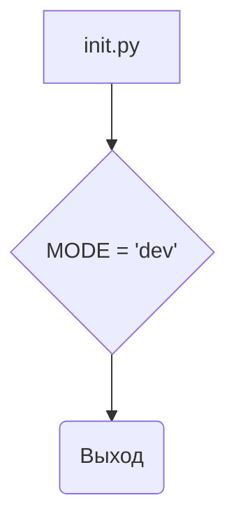
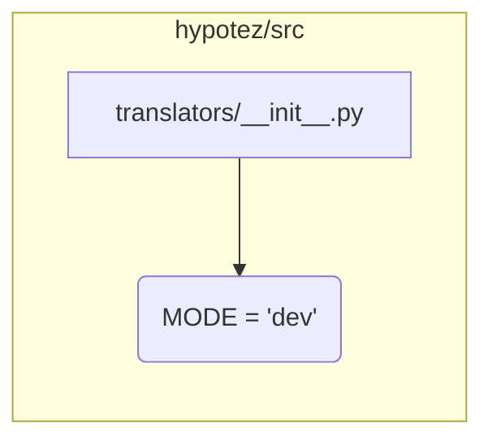

# <input code>

```python
## \file hypotez/src/translators/__init__.py
# -*- coding: utf-8 -*-
#! venv/Scripts/python.exe
#! venv/bin/python/python3.12

"""
.. module: src.translators 
	:platform: Windows, Unix
	:synopsis:

"""
MODE = 'dev'
```

# <algorithm>

Этот файл представляет собой инициализирующий модуль для пакета `translators` в проекте `hypotez`.  Он не содержит логики выполнения, а скорее задаёт константу `MODE`.

**Блок-схема:**



**Пример:**

При импорте модуля `translators` из другой части проекта (например, `hypotez/src/main.py`), значение `MODE` будет доступно в виде `translators.MODE = 'dev'`.


# <mermaid>



**Объяснение диаграммы:**

Диаграмма показывает, что файл `translators/__init__.py` находится в подпапке `src` проекта `hypotez`. Он содержит переменную `MODE`, которая, скорее всего, используется для выбора режимов работы (`dev`, `prod` и т.п.) в других частях проекта.


# <explanation>

* **Импорты:** Нет импортов. Файл `__init__.py` часто используется для инициализации пакета, определяет переменные, доступные из подпапки.

* **Классы:** Нет классов.

* **Функции:** Нет функций.

* **Переменные:**
    * `MODE = 'dev'`:  Строковая переменная, вероятно, используемая для выбора режима работы (например,  разработка `dev`, продакшен `prod`).  Значение будет доступно в других модулях пакета.

* **Возможные ошибки или области для улучшений:**

    * **Дополнения:** В идеале, в файле `__init__.py` стоило бы импортировать и инициализировать классы или функции, которые будут доступны из других модулей пакета `translators`. 
    * **Документация:**  Документирование переменной `MODE` (и её возможных значений) сделает код более понятным.
    * **Использование констант:** Использование строки `'dev'` для режима лучше заменить константой из `enum`, если таких режимов несколько.

* **Взаимосвязи с другими частями проекта:**

    * Файл `__init__.py` из пакета `translators` будет импортирован в другие части проекта, например, в файлы `main.py`, `processing.py` и т.п.  Тогда эти части смогут использовать переменную `translators.MODE` для выбора режимов обработки данных.

**Дополнительные пояснения:**

Строки `#! venv/Scripts/python.exe` и `#! venv/bin/python/python3.12` - это *shebang* строки.  Они указывают интерпретатору Python, какой исполняемый файл использовать для запуска скрипта.  Они обычно присутствуют в скриптах, которые нужно запускать из командной строки, но не всегда обязательны внутри пакета Python.  В данном случае эти строки могут быть наследием от прошлых попыток запуска, и лучше избавиться от них, поскольку они не имеют прямого отношения к логике работы файла `__init__.py`.

В общем, файл `__init__.py` – это очень простой, но важный файл для управления пакетом. Он определяет, что входит в пакет, и как импортируются из него компоненты.