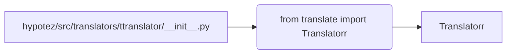

# <input code>

```python
## \file hypotez/src/translators/ttranslator/__init__.py
# -*- coding: utf-8 -*-\
#! venv/Scripts/python.exe
#! venv/bin/python/python3.12

"""
.. module: src.translators.ttranslator 
	:platform: Windows, Unix
	:synopsis:

"""
MODE = 'dev'

"""
	:platform: Windows, Unix
	:synopsis:

"""


"""
	:platform: Windows, Unix
	:synopsis:

"""


"""
  :platform: Windows, Unix

"""
"""
  :platform: Windows, Unix
  :platform: Windows, Unix
  :synopsis:
"""MODE = 'dev'
  
""" module: src.translators.ttranslator """


# https://github.com/terryyin/translate-python?tab=readme-ov-file

from translate import Translatorr
```

# <algorithm>

Этот код импортирует модуль `Translatorr` из внешней библиотеки `translate`.  Подробной блок-схемы алгоритма нет, так как в файле только импорт.  Данные не перемещаются между функциями или классами.

# <mermaid>



# <explanation>

**Импорты:**

Файл `hypotez/src/translators/ttranslator/__init__.py` импортирует класс `Translatorr` из модуля `translate`.  Этот импорт подключает функциональность для перевода текста, предоставляемую библиотекой `translate` (судя по имени).  Ссылку на GitHub проекта `translate-python`  указывает, что  модуль `Translatorr`  принадлежит сторонней библиотеке, не разработанной внутри проекта `hypotez`.

**Классы:**

Код не содержит определения классов.  Он просто импортирует класс `Translatorr`.

**Функции:**

Код не содержит функций.  

**Переменные:**

`MODE = 'dev'`:  Переменная, скорее всего, используется для настройки режима работы.  В данном случае, она определена как 'dev'. Это переменная глобального уровня, доступная во всем модуле.


**Возможные ошибки или области для улучшений:**

* **Отсутствие документации:**  Комментарии вида `"""Docstring"""` не описывают функциональность.
* **Неясная задача:** Непонятно, для чего используется импорт в контексте проекта.  Код требует дополнительного контекста, чтобы понять его цель.
* **Зависимость от внешней библиотеки:**  Код зависит от сторонней библиотеки `translate`. Если `translate` не установлена, возникнет ошибка при импорте. Нужно указать требования к установке `translate`.

**Взаимосвязь с другими частями проекта:**

Без дополнительного контекста невозможно определить взаимосвязь с другими частями проекта.  Возможно, этот импорт будет использоваться в других модулях проекта для перевода текста.

**Рекомендации:**

1. **Добавить описание**:  Добавить подробные комментарии, объясняющие назначение переменной `MODE`.
2. **Документацию**:  Документировать импортируемый класс, добавить подробный `docstring` для `Translatorr` (если доступна).
3. **Управление зависимостями**: Использовать `requirements.txt` для управления зависимостями, чтобы другие разработчики могли легко установить `translate`.

```