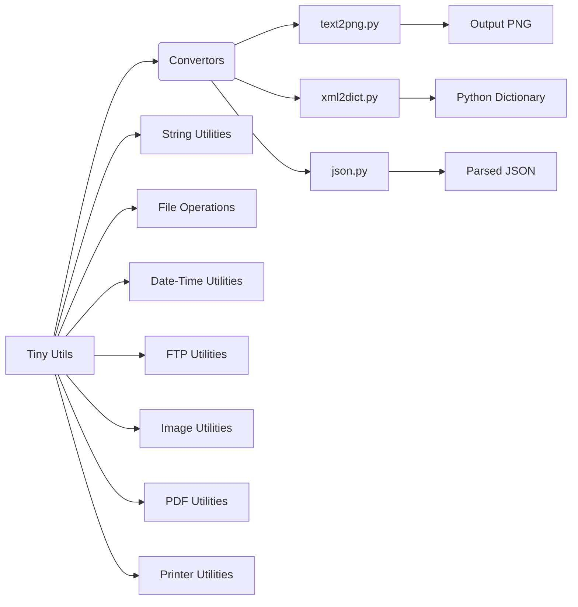
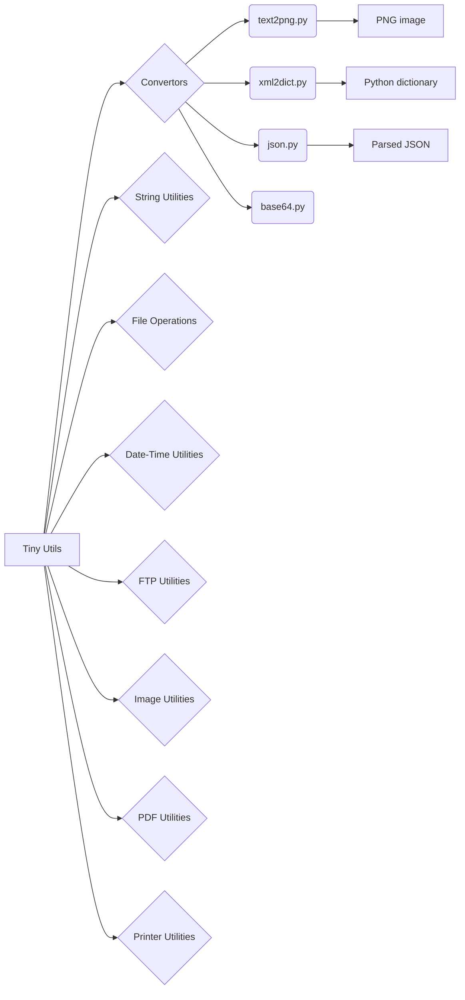

# <input code>

```
# Tiny Utils

**Tiny Utils** is a utility library providing a collection of lightweight helper functions for various common tasks. This library includes utilities for data format conversion, text and file manipulation, string operations, date-time formatting, image processing, and more. It is organized into several modules for easy access to specific functionalities.

## Table of Contents

- [Tiny Utils](#tiny-utils)
  - [Table of Contents](#table-of-contents)
  - [Installation](#installation)
  - [Modules Overview](#modules-overview)
  - [Module Descriptions](#module-descriptions)
    - [Convertors](#convertors)
      - [Files:](#files)
    - [String Utilities](#string-utilities)
    - [File Operations](#file-operations)
    - [Date-Time Utilities](#date-time-utilities)
    - [FTP Utilities](#ftp-utilities)
    - [Image Utilities](#image-utilities)
    - [PDF Utilities](#pdf-utilities)
    - [Printer Utilities](#printer-utilities)
  - [Usage Examples](#usage-examples)
    - [Convert Text to PNG Image](#convert-text-to-png-image)
    - [Convert XML to Dictionary](#convert-xml-to-dictionary)
    - [Parse and Manipulate JSON](#parse-and-manipulate-json)
  - [Contributing](#contributing)
  - [License](#license)

## Installation

To use **Tiny Utils**, clone the repository and install any necessary dependencies as specified in the `requirements.txt` file.

```bash
git clone https://github.com/hypo69/tiny-utils.git
cd tiny_utils
pip install -r requirements.txt
```

## Modules Overview

This library contains several sub-modules, each handling a specific task:

- **Convertors**: Modules for converting data formats, such as text-to-image, webp-to-png, JSON, XML, Base64 encoding, and more.
- **String Utilities**: Tools for advanced string manipulation.
- **File Operations**: Functions for file handling and manipulation.
- **Date-Time Utilities**: Tools for date and time formatting.
- **FTP Utilities**: FTP file handling functions.
- **Image Utilities**: Basic image processing functions.
- **PDF Utilities**: PDF file manipulation and conversion.
- **Printer Utilities**: Functions for sending data to a printer.

## Module Descriptions

### Convertors

The `convertors` module contains utilities for converting data between formats. These modules can handle diverse data types, from CSV to JSON and text to images.

#### Files:

- **text2png.py**: Converts text data to a PNG image file.
- **tts.py**: Converts text to speech and saves it as an audio file.
- **webp2png.py**: Converts images from WebP format to PNG format.
- **xls.py**: Handles conversions and manipulations of XLS files.
- **xml2dict.py**: Converts XML data to a Python dictionary.
- **base64.py**: Encodes or decodes data using Base64 encoding.
- **csv.py**: Provides CSV parsing and manipulation tools.
- **dict.py**: Utilities for handling Python dictionaries.
- **html.py**: Converts HTML content to various formats.
- **json.py**: Utilities for JSON parsing and manipulation.
- **md2dict.py**: Converts Markdown content to a dictionary.
- **ns.py**: Specialized namespace conversion utilities.

... (rest of the README file)
```



```markdown
# <algorithm>

The provided code is a README file, not executable code.  It describes a library (`Tiny Utils`) and its modules.  It outlines the purpose, installation, and usage of the library, as well as its modules (like `convertors`). No algorithm in the traditional sense can be described for a README file. The README provides high-level information about the organization and functionality of a Python library.  It's a guide to using the library; no specific algorithm for executing functions is described.

# <explanation>

The README file describes a Python library named "Tiny Utils".

* **Overall Purpose:** The library provides utility functions for various tasks, including data conversion (text to image, XML to dictionary, etc.), string manipulation, file operations, date/time formatting, FTP interaction, image processing, PDF handling, and printer functionalities.
* **Organization:** The library is structured into modules (`convertors`, `string`, `file`, `date_time`, `ftp`, `image`, `pdf`, `printer`) for better organization and easier access to specific functionalities.  The `convertors` module is further subdivided (e.g., into `text2png.py`, `xml2dict.py`, etc.).
* **Installation:** The README instructs users on how to clone the repository and install required dependencies using `pip install -r requirements.txt`.
* **Modules:** Each module section provides details on the functionalities available within that module. For instance, the `convertors` module contains utilities for converting data between different formats (e.g., XML to dictionary), as seen in the sub-sections detailing specific conversion methods (e.g., `text2png.py`, `xml2dict.py`).  Other modules have similar sections for `string`, `file`, `date_time`, `ftp`, `image`, `pdf`, and `printer` operations.
* **Usage Examples:** The README provides example code snippets demonstrating how to use specific functions within the library (e.g., converting text to a PNG image).
* **Documentation:** The README directs users to the project's wiki for further information and examples.
* **Contributing:**  The README outlines procedures for contributing to the library.
* **License:** Information regarding the project's license (e.g., MIT License).

This README serves as a comprehensive guide to understanding the library's structure, purpose, and how to use it.  The provided code sample does *not* contain executable code; it's a set of instructions and documentation.


# <mermaid>



The diagram illustrates the library structure, showing how different modules (like `Convertors`, `String Utilities`) relate to the main library `Tiny Utils`.  It also shows how the conversion modules connect to various outputs (e.g., `PNG image`).  Importantly, the diagram is a representation of the library's *structure*; it isn't an algorithm or process flow of code execution.