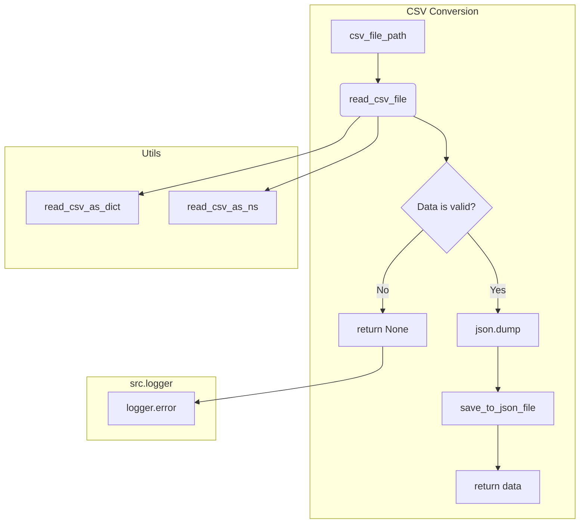

# <input code>

```python
## \file hypotez/src/utils/convertors/csv.py
# -*- coding: utf-8 -*-\
#! venv/Scripts/python.exe
#! venv/bin/python/python3.12

"""
.. module: src.utils.convertors.csv 
	:platform: Windows, Unix
	:synopsis: CSV and JSON conversion utilities

"""
MODE = 'dev'


""" Functions:
    - `csv2dict`: Convert CSV data to a dictionary.
    - `csv2ns`: Convert CSV data to SimpleNamespace objects.

.. code-block:: python

    # Example usage:

    # Using JSON list of dictionaries
    json_data_list = [{"name": "John", "age": 30, "city": "New York"}, {"name": "Alice", "age": 25, "city": "Los Angeles"}]
    json_file_path = 'data.json'
    csv_file_path = 'data.csv'

    # Convert JSON to CSV
    json2csv.json2csv(json_data_list, csv_file_path)

    # Convert CSV back to JSON
    csv_data = csv2json(csv_file_path, json_file_path)
    if csv_data:
        if isinstance(csv_data, list):
            if isinstance(csv_data[0], dict):
                print("CSV data (list of dictionaries):")
            else:
                print("CSV data (list of values):")
            print(csv_data)
        else:
            print("Failed to read CSV data.")
"""


import json
import csv
from pathlib import Path
from typing import List, Dict
from types import SimpleNamespace
from src.logger import logger
from src.utils.csv import read_csv_as_dict, read_csv_as_ns, save_csv_file, read_csv_file


def csv2dict(csv_file: str | Path, *args, **kwargs) -> dict | None:
    """
    Convert CSV data to a dictionary.

    Args:
        csv_file (str | Path): Path to the CSV file to read.

    Returns:
        dict | None: Dictionary containing the data from CSV converted to JSON format, or `None` if conversion failed.

    Raises:
        Exception: If unable to read CSV.
    """
    return read_csv_as_dict(csv_file, *args, **kwargs)


def csv2ns(csv_file: str | Path, *args, **kwargs) -> SimpleNamespace | None:
    """
    Convert CSV data to SimpleNamespace objects.

    Args:
        csv_file (str | Path): Path to the CSV file to read.

    Returns:
        SimpleNamespace | None: SimpleNamespace object containing the data from CSV, or `None` if conversion failed.

    Raises:
        Exception: If unable to read CSV.
    """
    return read_csv_as_ns(csv_file, *args, **kwargs)


def csv_to_json(
    csv_file_path: str | Path,
    json_file_path: str | Path,
    exc_info: bool = True
) -> List[Dict[str, str]] | None:
    """ Convert a CSV file to JSON format and save it to a JSON file.

    Args:
        csv_file_path (str | Path): The path to the CSV file to read.
        json_file_path (str | Path): The path to the JSON file to save.
        exc_info (bool, optional): If True, includes traceback information in the log. Defaults to True.

    Returns:
        List[Dict[str, str]] | None: The JSON data as a list of dictionaries, or None if conversion failed.

    Example:
        >>> json_data = csv_to_json('dialogue_log.csv', 'dialogue_log.json')
        >>> print(json_data)
        [{\'role\': \'user\', \'content\': \'Hello\'}, {\'role\': \'assistant\', \'content\': \'Hi there!\'}]
    """
    try:
        data = read_csv_file(csv_file_path, exc_info=exc_info)
        if data is not None:
            with open(json_file_path, 'w', encoding='utf-8') as jsonfile:
                json.dump(data, jsonfile, indent=4)
            return data
        return
    except Exception as ex:
        logger.error("Failed to convert CSV to JSON", ex, exc_info=exc_info)
        return
```



```markdown
# <algorithm>

**1. `csv_to_json` function:**
   - Takes `csv_file_path`, `json_file_path`, and `exc_info` as input.
   - Attempts to read the CSV file using `read_csv_file`.
   - If the reading is successful and the data is valid:
      - Opens the JSON file in write mode.
      - Dumps the read data to the JSON file with indentation using `json.dump`.
      - Returns the read data.
   - If reading the file fails or the data is not valid, returns `None`.
   - Handles potential exceptions with `try...except` block, logging errors using `logger.error`.


**2. `csv2dict` and `csv2ns` functions:**
   - These functions are wrappers around `read_csv_as_dict` and `read_csv_as_ns` respectively.
   - They accept a CSV file path and potentially other arguments.
   - They forward the arguments to the respective utility functions.
   - They return the data read by the underlying functions, or `None` if the conversion fails.


**Example Data Flow (for `csv_to_json`):**

1. Input: `csv_file_path = 'data.csv'`, `json_file_path = 'data.json'`
2. `read_csv_file` reads the CSV file.
3. If the file is successfully read and the data is valid, `json.dump` writes the data to `data.json`.
4. `csv_to_json` returns the read data.


# <explanation>

**Imports:**

- `json`: For working with JSON data.
- `csv`: For working with CSV data.
- `pathlib`: For working with file paths in a more object-oriented way.
- `typing`: For type hinting.
- `types`: For using `SimpleNamespace`.
- `src.logger`: For logging errors and information.
- `src.utils.csv`: Contains utility functions likely for reading and saving CSV data. This is a crucial dependency as it defines the core logic for interacting with the CSV files.

**Classes:**

- None (No classes are defined in this file).

**Functions:**

- `csv2dict`: Takes a CSV file path and potentially other arguments, forwarding the call to `read_csv_as_dict` for converting to a dictionary.
- `csv2ns`: Takes a CSV file path and potentially other arguments, forwarding the call to `read_csv_as_ns` for converting to `SimpleNamespace` objects.
- `csv_to_json`:  Converts a CSV file to JSON format and saves it. It takes the paths to both files and an optional `exc_info` parameter that controls error reporting. This function combines CSV reading, data validation, JSON formatting, and writing.


**Variables:**

- `MODE`: A global variable, likely for specifying the mode of operation (e.g., 'dev', 'prod').


**Possible Errors/Improvements:**

- **Error Handling:** While the code has `try...except` blocks, consider using more specific exception types (e.g., `IOError` for file issues) for better error handling and more informative error messages.
- **Input Validation:** The code lacks validation for the input CSV data. If the CSV structure is not expected, or there are header issues, this might lead to exceptions. Add input validation before passing the data to `read_csv_as_dict`/`read_csv_as_ns` for better robustness.
- **Resource Management:** The `with open(...)` statement is good practice. However, consider closing files or streams explicitly if this operation becomes more complex.
- **`read_csv_file` Dependency:** The `read_csv_file` function is an external dependency and should be documented or provided. It would be more robust to document or ensure this function is available in the same package structure.

**Relationships with other parts of the project:**

The `src.logger` and `src.utils.csv` modules are clearly crucial dependencies for the functionality of this file. The `read_csv_file` function needs to be available in the `src.utils.csv` module to ensure the conversion works properly.  There is a strong dependency on the underlying CSV parsing logic in the external modules.  Missing this dependency will cause problems when running the file.