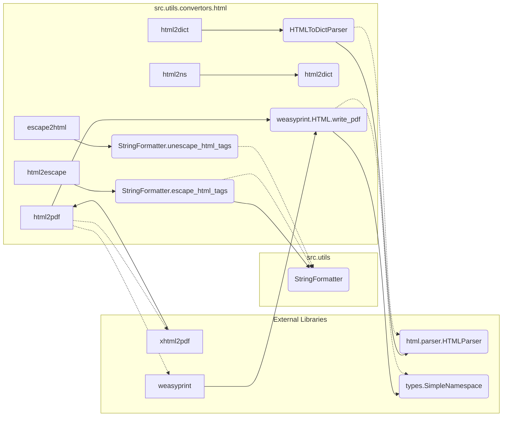

# <input code>

```python
## \file hypotez/src/utils/convertors/html.py
# -*- coding: utf-8 -*-
#! venv/Scripts/python.exe
#! venv/bin/python/python3.12

"""
.. module: src.utils.convertors.html 
	:platform: Windows, Unix
	:synopsis: HTML conversion utilities
Functions:
    - `html2escape`: Convert HTML to escape sequences.
    - `escape2html`: Convert escape sequences to HTML.
    - `html2dict`: Convert HTML to dictionaries.
    - `html2ns`: Convert HTML to SimpleNamespace objects.
    https://stackoverflow.com/questions/73599970/how-to-solve-wkhtmltopdf-reported-an-error-exit-with-code-1-due-to-network-err
https://chatgpt.com/share/672266a3-0048-800d-a97b-c38f647d496b
"""
MODE = 'dev'
import re
from typing import Dict
from pathlib import Path
from venv import logger
from src.utils.string import StringFormatter
from src.logger import logger
from types import SimpleNamespace
from html.parser import HTMLParser
from xhtml2pdf import pisa
try:
    from weasyprint import HTML
except Exception as ex:
    logger.error(ex)
    ...

def html2escape(input_str: str) -> str:
    """
    Convert HTML to escape sequences.

    Args:
        input_str (str): The HTML code.

    Returns:
        str: HTML converted into escape sequences.

    Example:
        >>> html = "<p>Hello, world!</p>"
        >>> result = html2escape(html)
        >>> print(result)
        &lt;p&gt;Hello, world!&lt;/p&gt;
    """
    return StringFormatter.escape_html_tags(input_str)

def escape2html(input_str: str) -> str:
    """
    Convert escape sequences to HTML.

    Args:
        input_str (str): The string with escape sequences.

    Returns:
        str: The escape sequences converted back into HTML.

    Example:
        >>> escaped = "&lt;p&gt;Hello, world!&lt;/p&gt;"
        >>> result = escape2html(escaped)
        >>> print(result)
        <p>Hello, world!</p>
    """
    return StringFormatter.unescape_html_tags(input_str)

def html2dict(html_str: str) -> Dict[str, str]:
    """
    Convert HTML to a dictionary where tags are keys and content are values.

    Args:
        html_str (str): The HTML string to convert.

    Returns:
        dict: A dictionary with HTML tags as keys and their content as values.

    Example:
        >>> html = "<p>Hello</p><a href='link'>World</a>"
        >>> result = html2dict(html)
        >>> print(result)
        {'p': 'Hello', 'a': 'World'}
    """
    class HTMLToDictParser(HTMLParser):
        def __init__(self):
            super().__init__()
            self.result = {}
            self.current_tag = None

        def handle_starttag(self, tag, attrs):
            self.current_tag = tag

        def handle_endtag(self, tag):
            self.current_tag = None

        def handle_data(self, data):
            if self.current_tag:
                self.result[self.current_tag] = data.strip()

    parser = HTMLToDictParser()
    parser.feed(html_str)
    return parser.result

def html2ns(html_str: str) -> SimpleNamespace:
    """
    Convert HTML to a SimpleNamespace object where tags are attributes and content are values.

    Args:
        html_str (str): The HTML string to convert.

    Returns:
        SimpleNamespace: A SimpleNamespace object with HTML tags as attributes and their content as values.

    Example:
        >>> html = "<p>Hello</p><a href='link'>World</a>"
        >>> result = html2ns(html)
        >>> print(result.p)
        Hello
        >>> print(result.a)
        World
    """
    html_dict = html2dict(html_str)
    return SimpleNamespace(**html_dict)

def html2pdf(html_str: str, pdf_file: str | Path) -> bool | None:
    """Converts HTML content to a PDF file using WeasyPrint."""
    try:
        HTML(string=html_str).write_pdf(pdf_file)
        return True
    except Exception as e:
        print(f"Error during PDF generation: {e}")
        return
```

# <algorithm>

```mermaid
graph TD
    A[Input HTML string] --> B{html2escape};
    B --True--> C[StringFormatter.escape_html_tags];
    C --> D[Output escaped string];
    A --> E{html2dict};
    E --True--> F[HTMLToDictParser];
    F --> G[Resulting Dictionary];
    G --> H[Output Dictionary];
    A --> I{html2ns};
    I --> J[html2dict];
    J --> K[SimpleNamespace];
    K --> L[Output SimpleNamespace];
    A --> M{html2pdf};
    M --True--> N[HTML(string=html_str).write_pdf(pdf_file)];
    N --> O[Output PDF];
    M --False--> P[Error handling];
    P --> Q[Output Error];


```

**Пример**: Для входной строки "<p>Hello</p>"  
`html2escape` преобразует ее в `&lt;p&gt;Hello&lt;/p&gt;`. `html2dict` преобразует в `{'p': 'Hello'}` и `html2ns` в `SimpleNamespace(p='Hello')`.


# <mermaid>



**Описание зависимости**:
* `StringFormatter`: Модуль, вероятно, предоставляющий функции для работы со строками, включая преобразования HTML-тегов.  Расположен в `src.utils.string`.
* `html.parser.HTMLParser`: Библиотечный класс для парсинга HTML-кода.
* `types.SimpleNamespace`: Библиотечный класс для создания объектов с именованными атрибутами.
* `xhtml2pdf` и `weasyprint`: Библиотеки для конвертации HTML в PDF.
* `logger`: Модуль для ведения журнала ошибок. Находится в `src.logger`.

# <explanation>

* **Импорты**:
    * `re`: Для регулярных выражений (например, для обработки HTML-текста).
    * `typing`: Для использования типов (например, `Dict`).
    * `pathlib`: Для работы с файловыми путями.
    * `venv.logger`: Вероятно, для логгирования внутри виртуального окружения.
    * `src.utils.string`: Модуль для работы со строками (видимо, содержит функции для работы с HTML тегами).
    * `src.logger`: Модуль для логгирования, предположительно содержит методы записи сообщений в лог, входящие в инфраструктуру проекта.
    * `types.SimpleNamespace`: Для создания объектов, атрибуты которых соответствуют именам тегов.
    * `html.parser`: Класс `HTMLParser` для разбора HTML-строки.
    * `xhtml2pdf`: Для преобразования HTML в PDF.
    * `weasyprint`: Библиотека для преобразования HTML в PDF. Она имеет более современную поддержку.

* **Классы**:
    * `HTMLToDictParser`:  Наследует `HTMLParser`, предназначен для преобразования HTML-строки в словарь, где ключи – теги, а значения – текст между тегами.  
    * `HTMLParser`: Класс из стандартной библиотеки Python для разбора HTML-документов. В проекте он используется внутри `HTMLToDictParser`.

* **Функции**:
    * `html2escape`: Преобразует HTML-теги в их кодированные эквиваленты. Использует `StringFormatter.escape_html_tags`.
    * `escape2html`: Обратная операция к `html2escape`, преобразует кодированные HTML-теги в обычные. Использует `StringFormatter.unescape_html_tags`.
    * `html2dict`: Преобразует HTML-строку в словарь, где ключи – имена тегов, а значения – текст между ними.  Использует класс `HTMLToDictParser`.
    * `html2ns`: Преобразует HTML-строку в `SimpleNamespace`. Преобразует HTML-строку в словарь, а затем использует словарь для создания объекта `SimpleNamespace`.
    * `html2pdf`:  Преобразует HTML в PDF, используя `weasyprint` (более современный подход, по сравнению с `xhtml2pdf`). Обрабатывает возможные ошибки во время преобразования.


* **Переменные**:
    * `MODE`: Вероятно, константа для указания режима работы (например, `'dev'` или `'prod'`).

* **Возможные ошибки и улучшения**:
    * Обработка исключений при использовании `weasyprint` более подробна, чем при `xhtml2pdf`.
    * Отсутствует валидация входных данных (например, проверка типа входных строк).
    * В некоторых функциях можно добавить `try...except` блоки для обработки потенциальных ошибок.
    * При использовании `xhtml2pdf`  в коде присутствовали лишние и неэффективные действия.


**Взаимосвязи с другими частями проекта**:

Функции `html2escape`, `escape2html`  используются для подготовки данных, перед использованием в других частях проекта, где возможно преобразование текста. `StringFormatter` необходим для обработки строк, скорее всего, в других частях проекта. `logger` используется для записи сообщений, что указывает на связь с системой логирования проекта.