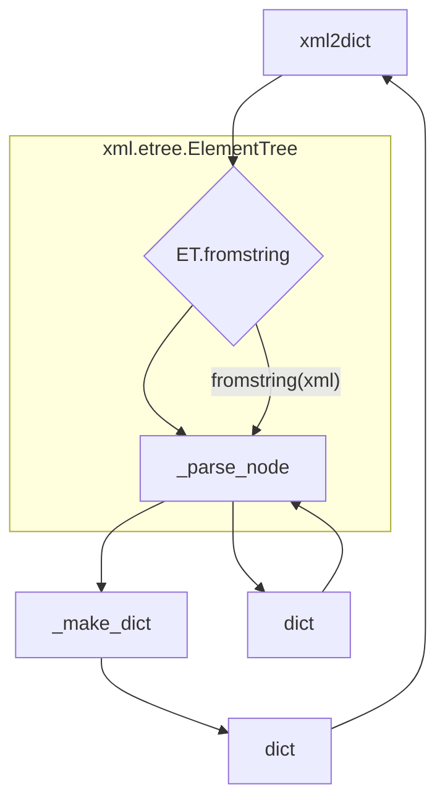

# <input code>

```python
## \file hypotez/src/utils/convertors/xml2dict.py
# -*- coding: utf-8 -*-\
#! venv/Scripts/python.exe
#! venv/bin/python/python3.12

"""
.. module: src.utils.convertors 
	:platform: Windows, Unix
	:synopsis: provides utilities for converting XML data into dictionaries. It includes functions for parsing XML strings and converting XML element trees into dictionary representations.

Functions:
- `_parse_node`: Parses an XML node into a dictionary.
- `_make_dict`: Generates a dictionary with the tag name and value.
- `xml2dict`: Parses an XML string into a dictionary.
- `ET2dict`: Converts an XML element tree into a dictionary.
"""
MODE = 'dev'
import re

try:
    import xml.etree.cElementTree as ET
except ImportError as err:
    import xml.etree.ElementTree as ET

def _parse_node(node: ET.Element) -> dict | str:
    """Parse an XML node into a dictionary.

    Args:
        node (ET.Element): The XML element to parse.

    Returns:
        dict | str: A dictionary representation of the XML node, or a string if the node has no attributes or children.
    """
    tree = {}
    attrs = {}
    for attr_tag, attr_value in node.attrib.items():
        if attr_tag == '{http://www.w3.org/1999/xlink}href':
            continue
        attrs.update(_make_dict(attr_tag, attr_value))

    value = node.text.strip() if node.text is not None else ''

    if attrs:
        tree['attrs'] = attrs

    has_child = False
    for child in list(node):
        has_child = True
        ctag = child.tag
        ctree = _parse_node(child)
        cdict = _make_dict(ctag, ctree)

        if ctree:
            value = ''

        if ctag not in tree:
            tree.update(cdict)
            continue

        old = tree[ctag]
        if not isinstance(old, list):
            tree[ctag] = [old]
        tree[ctag].append(ctree)

    if not has_child:
        tree['value'] = value

    if list(tree.keys()) == ['value']:
        tree = tree['value']
    return tree

def _make_dict(tag: str, value: any) -> dict:
    """Generate a new dictionary with tag and value.

    Args:
        tag (str): The tag name of the XML element.
        value (any): The value associated with the tag.

    Returns:
        dict: A dictionary with the tag name as the key and the value as the dictionary value.
    """
    tag_values = value
    result = re.compile(r'\{(.*)\}(.*)').search(tag)
    if result:
        tag_values = {'value': value}
        tag_values['xmlns'], tag = result.groups()
    return {tag: tag_values}

def xml2dict(xml: str) -> dict:
    """Parse XML string into a dictionary.

    Args:
        xml (str): The XML string to parse.

    Returns:
        dict: The dictionary representation of the XML.
    """
    element_tree = ET.fromstring(xml)
    return ET2dict(element_tree)

def ET2dict(element_tree: ET.Element) -> dict:
    """Convert an XML element tree into a dictionary.

    Args:
        element_tree (ET.Element): The XML element tree.

    Returns:
        dict: The dictionary representation of the XML element tree.
    """
    return _make_dict(element_tree.tag, _parse_node(element_tree))
```

# <algorithm>

**_parse_node(node):**

1. Создает пустой словарь `tree`.
2. Обрабатывает атрибуты узла, исключая `href`.
   - Для каждого атрибута генерирует словарь с помощью `_make_dict` и добавляет его в `attrs`.
   - Добавляет `attrs` в `tree` под ключом `attrs`.
3. Получает текстовое значение узла `value`.
4. Если у узла есть дочерние элементы, то:
   - Перебирает дочерние элементы.
   - Вызывает рекурсивно `_parse_node` для каждого дочернего элемента, получая `ctree`.
   - Вызывает `_make_dict` для каждого дочернего элемента, получая `cdict`.
   - Если у дочернего элемента есть значение, обнуляет `value`.
   - Если тег дочернего элемента уже существует в `tree`, добавляет `ctree` в список значений для этого тега. В противном случае обновляет `tree` с помощью `cdict`.
5. Если у узла нет дочерних элементов, добавляет `value` в `tree` под ключом `value`.
6. Если в `tree` только ключ `value`, возвращает значение `value`.
7. Возвращает словарь `tree`.

**_make_dict(tag, value):**

1. Создает словарь с ключом `tag` и значением `value`.
2. Если в `tag` есть `@namespace`, то преобразует `value` в словарь с ключом `value`, и сохраняет `@namespace` в `xmlns`.
3. Возвращает словарь.

**xml2dict(xml):**

1. Парсит XML строку `xml` в элемент дерева с помощью `xml.etree.ElementTree.fromstring`.
2. Вызывает `ET2dict` для преобразования элемента дерева в словарь.
3. Возвращает полученный словарь.

**ET2dict(element_tree):**

1. Вызывает `_make_dict` для преобразования элемента дерева в словарь, передавая тег элемента и результат вызова `_parse_node`.
2. Возвращает полученный словарь.


**Пример:**

XML:
```XML
<root attr1="val1" attr2="{http://example.com}val2">
  <child>text1</child>
  <child>text2</child>
</root>
```

`_parse_node` будет рекурсивно обрабатывать `root` и `child`, создавая словарь, подобный этому:

```json
{'root': {'attrs': {'attr1': 'val1', 'attr2': {'value': 'val2', 'xmlns': 'http://example.com'}}, 'child': [{'value': 'text1'}, {'value': 'text2'}]}}
```


# <mermaid>



# <explanation>

**Импорты:**

- `import re`: Импортирует модуль для работы с регулярными выражениями, используемыми для обработки атрибутов с именованными пространствами имен.
- `import xml.etree.ElementTree as ET`: Импортирует модуль для работы с XML, используемый для парсинга XML-строк. Используется импорт `cElementTree` если он доступен.

**Классы:**

- Нет классов, только функции.

**Функции:**

- `_parse_node(node: ET.Element) -> dict | str`: Парсит XML узел в словарь. Рекурсивно обрабатывает дочерние узлы. Обрабатывает атрибуты и текстовое значение узла.  Ключевой аспект - обработка множественных значений для одного тега, которые представлены в виде списка. Важно, что функция обрабатывает атрибуты с именованными пространствами имен.  Возвращает словарь или строку.

- `_make_dict(tag: str, value: any) -> dict`: Создает словарь с заданным тегом и значением.  Обрабатывает теги с именованными пространствами имен, чтобы сохранить данные о namespace.

- `xml2dict(xml: str) -> dict`: Преобразует XML-строку в словарь. Использует `ET.fromstring` для парсинга XML и делегирует обработку `ET2dict`.

- `ET2dict(element_tree: ET.Element) -> dict`: Преобразует XML-дерево в словарь. Вызывает `_parse_node` для рекурсивной обработки и `_make_dict` для конечного формирования словаря.


**Переменные:**

- `MODE`: Строковая переменная, вероятно, для выбора режима работы (например, `dev` или `prod`).
- `node`, `child`: Переменные, содержащие XML узлы, используемые внутри функций.

**Возможные ошибки и улучшения:**

- **Обработка ошибок:**  В коде есть `try...except` для импорта `xml.etree.cElementTree`, что хорошо, но более обширная обработка ошибок (например, проверка типа входных данных) сделала бы код более надежным.
- **Исключения:**  Если XML-строка содержит невалидный XML, `ET.fromstring` может генерировать исключение, которое не обрабатывается в коде.
- **Тестирование:** Добавление тестов значительно улучшило бы надежность кода.
- **Документация:** Документация немного неполная, можно добавить описание аргументов и возвращаемых значений.
- **Скорость:**  Если производительность критична,  может быть целесообразно использовать более специализированные библиотеки для работы с XML.

**Взаимосвязи с другими частями проекта:**

Функции этой утилиты преобразуют XML в формат словарей, которые, вероятно, будут использоваться в других частях проекта (например, для хранения данных, обработки или отображения).  Цепочка взаимосвязей выглядит примерно так: XML-данные → `xml2dict` → Словарь → Другие части проекта (обработка, сохранение, отображение).


```