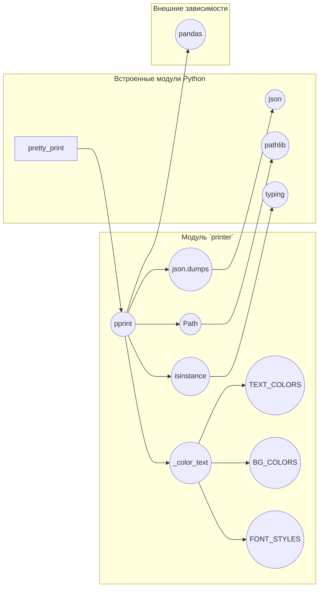

```MD
# Анализ кода файла hypotez/src/utils/printer.py

## <input code>

```python
## \file hypotez/src/utils/printer.py
# -*- coding: utf-8 -*-
#! venv/Scripts/python.exe
#! venv/bin/python/python3.12

"""
.. module:: src.utils
    :platform: Windows, Unix
    :synopsis: Utility functions for pretty printing and text styling.

This module provides functions to print data in a human-readable format with optional text styling, including color, background, and font styles.

Functions:
    - :func:`_color_text`
    - :func:`pprint`
"""

MODE = 'dev'

import json
import csv
import pandas as pd
from pathlib import Path
from typing import Any
from pprint import pprint as pretty_print

# ANSI escape codes
RESET = "\\033[0m"

TEXT_COLORS = {
    "red": "\\033[31m",
    "green": "\\033[32m",
    "blue": "\\033[34m",
    "yellow": "\\033[33m",
    "white": "\\033[37m",
}

BG_COLORS = {
    "bg_red": "\\033[41m",
    "bg_green": "\\033[42m",
}

FONT_STYLES = {
    "bold": "\\033[1m",
    "underline": "\\033[4m",
}

def _color_text(text: str, text_color: str = "", bg_color: str = "", font_style: str = "") -> str:
    """Apply color, background, and font styling to the text."""
    return f"{font_style}{text_color}{bg_color}{text}{RESET}"

def pprint(print_data: Any = None, text_color: str = "white", bg_color: str = "", font_style: str = "") -> None:
    """Pretty prints the given data with optional color, background, and font style."""
    text_color = TEXT_COLORS.get(text_color.lower(), TEXT_COLORS["white"])
    bg_color = BG_COLORS.get(bg_color.lower(), "")
    font_style = FONT_STYLES.get(font_style.lower(), "")

    if print_data is None:
        print(_color_text("No data to print!", text_color=TEXT_COLORS["red"]))
        return

    try:
        if isinstance(print_data, dict):
            print(_color_text(json.dumps(print_data, indent=4), text_color))
        elif isinstance(print_data, list):
            for item in print_data:
                print(_color_text(str(item), text_color))
        elif isinstance(print_data, (str, Path)) and Path(print_data).is_file():
            ext = Path(print_data).suffix.lower()
            if ext in ['.csv', '.xls']:
                print(_color_text("File reading supported for .csv, .xls only.", text_color))
            else:
                print(_color_text("Unsupported file type.", text_color))
        else:
            print(_color_text(str(print_data), text_color))
    except Exception as ex:
        print(_color_text(f"Error: {ex}", text_color=TEXT_COLORS["red"]))

if __name__ == '__main__':
    pprint({"name": "Alice", "age": 30}, text_color="green")
```

## <algorithm>

```mermaid
graph TD
    A[Входные данные print_data] --> B{Тип данных?};
    B -- dict --> C[Вывод json.dumps с отступами];
    B -- list --> D[Цикл по элементам списка, вывод каждого элемента];
    B -- str/Path & file --> E[Проверка расширения файла];
    E -- .csv/.xls --> F[Вывод сообщения поддержки формата];
    E -- другое --> G[Вывод сообщения о недопустимом типе файла];
    B -- другое --> H[Вывод данных как строки];
    C --> I[Вывод с форматированием];
    D --> I;
    F --> I;
    G --> I;
    H --> I;
    I --> J[Конец];
    B -- None --> K[Вывод сообщения "No data to print!"];
    K --> J;
    subgraph Ошибка
        I -- Exception --> L[Обработка исключений и вывод ошибки];
        L --> J;
    end
```

Пример: Если `print_data` - это список `["apple", "banana"]`, то алгоритм проходит по блоку `D`, выводит каждый элемент списка с заданным стилем цвета.


## <mermaid>



## <explanation>

* **Импорты**:
    * `json`, `csv`, `pandas`: Используются для работы с различными форматами данных (JSON, CSV, данные pandas).
    * `pathlib`: Обеспечивает удобный способ работы с файловыми путями.
    * `typing`: Используется для аннотирования типов данных, что повышает читаемость и позволяет статическому анализу.
    * `pprint`: Импортирует функцию `pprint` из модуля `pprint`.  
    * Файлы `venv/Scripts/python.exe` и `venv/bin/python/python3.12` -- указывают на интерпретатор Python, который нужно использовать.  Это устаревшая практика и не обязательно в текущем коде.

* **Классы**: Нет классов, только функции.

* **Функции**:
    * `_color_text`: Принимает текст и параметры стиля (цвет, фон, шрифт) и возвращает отформатированный текст с ANSI escape кодами.
    * `pprint`:  Основная функция для форматированного вывода данных. Принимает данные произвольного типа и параметры форматирования.  Внутри обрабатывает различные типы данных (словари, списки, строки и пути к файлам), применяя соответствующее форматирование. Обрабатывает ошибки во время выполнения и выводит предупреждения.

* **Переменные**:
    * `MODE`:  Содержит строку 'dev'. В контексте файла `printer` она не имеет очевидной функции. Вероятно, используется для конфигурации/различных режимов работы.
    * `RESET`, `TEXT_COLORS`, `BG_COLORS`, `FONT_STYLES`:  Константы, содержащие ANSI escape-коды для форматирования текста (цвет, фон, шрифт).

* **Возможные ошибки или области для улучшений**:
    * **Обработка ошибок**:  Функция `pprint` обрабатывает исключения при работе с данными, но могла бы быть более явной и подробной в сообщении об ошибке.
    * **Поддержка CSV/XLS**:  Логика для работы с файлами CSV и XLS является специализированной, но могла бы быть обобщена с помощью библиотек для чтения CSV и XLS.
    * **Дополнения**:  Добавление возможности обработки других типов данных (например, NumPy массивов).
    * **Документация**:  Описание `MODE` и его использования не указано в коде, что могло бы повысить понятность кода.  Рекомендуется добавить теги `:param` и `:return` для функций `_color_text` и `pprint`.

* **Взаимосвязи с другими частями проекта:**  Функции `pprint` и `_color_text` из модуля `hypotez/src/utils/printer.py` предназначены для вывода данных. Они могут быть использованы в других модулях проекта для вывода информации в красивом и удобочитаемом формате.  Это общий модуль для форматирования вывода, он может быть использован в любых частях проекта.