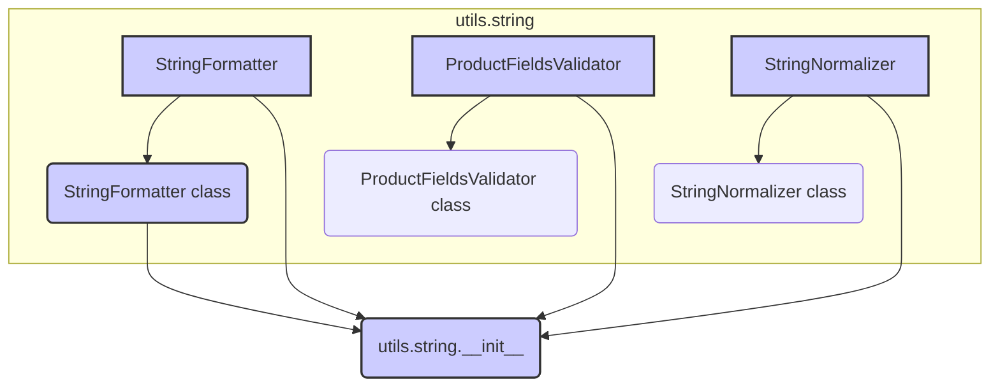

```MD
# Анализ кода hypotez/src/utils/string/__init__.py

**1. <input code>**

```python
## \file hypotez/src/utils/string/__init__.py
# -*- coding: utf-8 -*-
#! venv/Scripts/python.exe
#! venv/bin/python/python3.12

"""
.. module: src.utils.string 
	:platform: Windows, Unix
	:synopsis:

"""
MODE = 'dev'

from .formatter import StringFormatter
from .validator import ProductFieldsValidator
from .normalizer import StringNormalizer
```

**2. <algorithm>**

Данный файл является инициализатором модуля `utils.string`.  Алгоритм работы сводится к импорту необходимых подмодулей (классов и функций).  Пошаговой блок-схемы нет, так как код просто импортирует другие файлы.  Нет данных, которые перемещаются между функциями/классами.

**3. <mermaid>**



Описание диаграммы:

Диаграмма демонстрирует импорты, происходящие в файле `utils/string/__init__.py`.  Файл `__init__.py` импортирует классы `StringFormatter`, `ProductFieldsValidator` и `StringNormalizer` из подмодулей `formatter`, `validator` и `normalizer` соответственно.  Взаимодействия между классами в данном файле не определены, так как это лишь импорт, а не взаимодействие.


**4. <explanation>**

* **Импорты:**
    * `from .formatter import StringFormatter`: Импортирует класс `StringFormatter` из модуля `formatter`, расположенного в той же директории (`./formatter.py`).
    * `from .validator import ProductFieldsValidator`: Импортирует класс `ProductFieldsValidator` из модуля `validator` в той же директории (`./validator.py`).
    * `from .normalizer import StringNormalizer`: Импортирует класс `StringNormalizer` из модуля `normalizer` в той же директории (`./normalizer.py`).
    * Данные импорты в контексте файла `__init__.py` не содержат никакой обработки данных, а лишь предоставляют доступ к классам и функциям импортированных модулей.

* **Классы:**
    * `StringFormatter`:  (предполагается, что он находится в `hypotez/src/utils/string/formatter.py`) - вероятно, содержит методы для форматирования строк.
    * `ProductFieldsValidator`: (предполагается, что он находится в `hypotez/src/utils/string/validator.py`) - вероятно, содержит методы для валидации полей продукта.
    * `StringNormalizer`: (предполагается, что он находится в `hypotez/src/utils/string/normalizer.py`) - вероятно, содержит методы для нормализации строк.

* **Функции:**
    * Нет функций.  Файл содержит только импорты.

* **Переменные:**
    * `MODE = 'dev'`:  Константа, вероятно, определяет режим работы, например, 'dev' (разработка) или 'prod' (производство).  Это переменная-константа.

* **Возможные ошибки или улучшения:**
    * Не хватает документации в самих `formatter.py`, `validator.py`, `normalizer.py`, чтобы понять детали работы импортированных классов и их методы.
    * Хорошим улучшением будет добавление `docstrings` к классам и методам в `formatter.py`, `validator.py`, `normalizer.py` для детального объяснения назначения, аргументов и возвращаемых значений.

**Цепочка взаимосвязей:**

Файл `hypotez/src/utils/string/__init__.py` является точкой входа для использования функций и классов, определенных в подмодулях `formatter`, `validator` и `normalizer`.  Эти подмодули, скорее всего, содержат функционал, связанный с обработкой строк, необходимый для других частей проекта (например, для работы с данными о продуктах).  Без изучения кода этих модулей трудно дать более точную взаимосвязь с другими частями проекта.