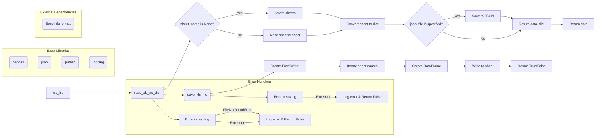

```MD
# <input code>

```python
## \file hypotez/src/utils/xls.py
# -*- coding: utf-8 -*-\
#! venv/Scripts/python.exe
#! venv/bin/python/python3.12

"""
.. module: src.utils 
	:platform: Windows, Unix
	:synopsis: Converter for Excel (`xls`) to JSON and JSON to Excel (`xls`)

"""
MODE = 'dev'


""" This module provides functions to convert Excel files to JSON format, handle multiple sheets, and save JSON data back to Excel files.

Functions:
    read_xls_as_dict(xls_file: str, json_file: str = None, sheet_name: Union[str, int] = None) -> Union[Dict, List[Dict], bool]:
        Reads an Excel file and converts it to JSON.  Optionally, converts a specific sheet and saves the result to a JSON file.  Handles errors gracefully.

    save_xls_file(data: Dict[str, List[Dict]], file_path: str) -> bool:
        Saves JSON data to an Excel file.  The data should be a dictionary where keys are sheet names and values are lists of dictionaries representing rows. Handles errors gracefully.

Examples:
    # Reading and optionally saving to JSON
    data = read_xls_as_dict('input.xlsx', 'output.json', 'Sheet1')  # Reads sheet named 'Sheet1'
    if data:
        print(data)  # Output will be {'Sheet1': [{...}]}

    # Saving from JSON data
    data_to_save = {'Sheet1': [{'column1': 'value1', 'column2': 'value2'}]}
    success = save_xls_file(data_to_save, 'output.xlsx')
    if success:
        print("Successfully saved to output.xlsx")
"""


import pandas as pd
import json
from typing import List, Dict, Union
from pathlib import Path
import logging

# Configure logging
logging.basicConfig(level=logging.INFO, format='%(asctime)s - %(levelname)s - %(message)s')


def read_xls_as_dict(
    xls_file: str,
    json_file: str = None,
    sheet_name: Union[str, int] = None
) -> Union[Dict, List[Dict], bool]:
    """
    Reads an Excel file and converts it to JSON.  Optionally, converts a specific sheet and saves the result to a JSON file.
    Handles errors gracefully.
    """
    try:
        xls_file_path = Path(xls_file)
        if not xls_file_path.exists():
            logging.error(f"Excel file not found: {xls_file}")
            return False  # Indicate failure

        xls = pd.ExcelFile(xls_file)

        if sheet_name is None:
            data_dict = {}
            for sheet in xls.sheet_names:
                try:
                    df = pd.read_excel(xls, sheet_name=sheet)
                    data_dict[sheet] = df.to_dict(orient='records')
                except Exception as e:
                    logging.error(f"Error processing sheet '{sheet}': {e}")
                    return False

        else:
            try:
                df = pd.read_excel(xls, sheet_name=sheet_name)
                data_dict = df.to_dict(orient='records')
            except Exception as e:
                logging.error(f"Error processing sheet '{sheet_name}': {e}")
                return False


        if json_file:
            with open(json_file, 'w', encoding='utf-8') as f:
                json.dump(data_dict, f, ensure_ascii=False, indent=4)
                logging.info(f"JSON data saved to {json_file}")

        return data_dict

    except FileNotFoundError as e:
        logging.error(f"File not found: {e}")
        return False
    except Exception as e:
        logging.error(f"An error occurred: {e}")
        return False


def save_xls_file(data: Dict[str, List[Dict]], file_path: str) -> bool:
    """Saves JSON data to an Excel file. Handles errors gracefully."""
    try:
        with pd.ExcelWriter(file_path, engine='xlsxwriter') as writer:
            for sheet_name, rows in data.items():
                df = pd.DataFrame(rows)
                df.to_excel(writer, sheet_name=sheet_name, index=False)
                logging.info(f"Sheet '{sheet_name}' saved to {file_path}")
        return True
    except Exception as e:
        logging.error(f"Error saving Excel file: {e}")
        return False
```

# <algorithm>

**Шаг 1:** Функция `read_xls_as_dict` получает путь к Excel-файлу (`xls_file`), необязательный путь к файлу JSON (`json_file`) и имя листа (`sheet_name`).

**Пример:** `read_xls_as_dict('input.xlsx', 'output.json', 'Sheet1')`

**Шаг 2:** Проверяет, существует ли Excel-файл. Если нет, возвращает `False` и записывает сообщение об ошибке в лог.

**Пример:** Если 'input.xlsx' не найден, выводится сообщение в лог.

**Шаг 3:** Если `sheet_name` не указан, функция читает все листы Excel-файла и преобразует их в словари.

**Пример:** Если `sheet_name` не указано, `data_dict` заполняется словарем {sheet_name: list_of_dicts} для каждого листа.

**Шаг 4:** Если `sheet_name` указан, функция читает только этот лист.

**Пример:** Если `sheet_name` - 'Sheet1',  `data_dict` содержит только данные из 'Sheet1'.

**Шаг 5:** Функция преобразует данные в формат словаря Python.

**Пример:** Данные из листа преобразуются в `list` словарей (строки из листа).

**Шаг 6:** Если `json_file` указан, функция сохраняет данные в JSON-файл.

**Пример:** Если `json_file` - 'output.json', то `data_dict` сохраняется в него.

**Шаг 7:** Функция возвращает `data_dict`, содержащий данные в формате словаря. Если произошла ошибка, возвращает `False`.


**Шаг 8:** Функция `save_xls_file` получает данные в формате словаря (sheet_name: rows) и путь к Excel-файлу.

**Пример:** `save_xls_file({'Sheet1': [{'col1': 'val1'}, {'col1': 'val2'}]}, 'output.xlsx')`

**Шаг 9:** Функция создает Excel-файл с помощью `pd.ExcelWriter`.

**Пример:** Создается `pd.ExcelWriter` с указанием пути к файлу и двигателя.

**Шаг 10:**  Функция циклом перебирает пары `sheet_name` и `rows` из входного словаря.

**Пример:** Для каждого `sheet_name` создается DataFrame, и данные сохраняются на лист с этим именем.

**Шаг 11:** Возвращает `True`, если сохранение прошло успешно, и `False` в случае ошибки.


# <mermaid>



# <explanation>

**Импорты:**

- `pandas as pd`: Используется для работы с Excel-файлами и данными в формате DataFrame. Связан с пакетом `pandas` (уже установлен для проекта), который предоставляет инструменты для анализа и манипулирования данными.
- `json`: Используется для работы с JSON-данными (сериализация/десериализация). Связан с базовым модулем Python.
- `typing.List`, `typing.Dict`, `typing.Union`:  Для явного указания типов данных, что делает код более читаемым и поддерживаемым. Это часть стандартной библиотеки Python и не зависит от сторонних библиотек.
- `pathlib.Path`: Для работы с путями к файлам, что делает код более кросс-платформенным. Часть стандартной библиотеки Python.
- `logging`: Для записи сообщений об ошибках и успешном выполнении операций. Управляет отображением сообщений.
    - `basicConfig`: Настраивает стандартный уровень логирования на `INFO`. Это часть стандартной библиотеки Python.

**Классы:**

- Нет явных классов в файле. Только функции.

**Функции:**

- `read_xls_as_dict(xls_file, json_file=None, sheet_name=None)`: Читает Excel-файл. Принимает путь к Excel-файлу (`xls_file`), необязательный путь к файлу JSON для сохранения (`json_file`) и имя листа (`sheet_name`). Возвращает словарь с данными или `False` при ошибке. Обрабатывает различные типы ошибок (FileNotFoundError, другие исключения).  Важная функция для чтения Excel в формате JSON, а также обработка возможных ошибок, таких как файл не найден или проблема с листом. 
- `save_xls_file(data, file_path)`: Сохраняет данные в Excel-файл. Принимает словарь с данными (`data`), где ключи - имена листов, а значения - списки словарей, представляющие строки. Возвращает `True` при успешном сохранении, и `False` в случае ошибки.  Отлично обрабатывает ошибки сохранения.

**Переменные:**

- `MODE`:  Строковая переменная, вероятно, для обозначения режима работы (например, 'dev' для разработки, 'prod' для производства).
- `xls_file`, `json_file`, `sheet_name`:  Переменные, представляющие строки, пути к файлам или имя листа.
- `data_dict`: Словарь, используемый для хранения данных, извлеченных из Excel.
- `df`:  Представляет DataFrame (из библиотеки pandas) с данными из листа Excel.

**Возможные ошибки и улучшения:**

- Не хватает обработки случаев, когда `data` пустой в `save_xls_file`.
- Дополнительная проверка на корректность входных данных в `read_xls_as_dict` и `save_xls_file` (например, валидация формата данных `data`).
- Возможна перегрузка функции `read_xls_as_dict` для обработки больших файлов.

**Цепочка взаимосвязей:**

Модуль `xls.py` зависит от `pandas`, `json`, `pathlib` и `logging`.  Он предоставляет инструменты для конвертации между Excel и JSON, работая с данными в Excel. Он может быть использован в других частях проекта для работы с данными в Excel-формате.