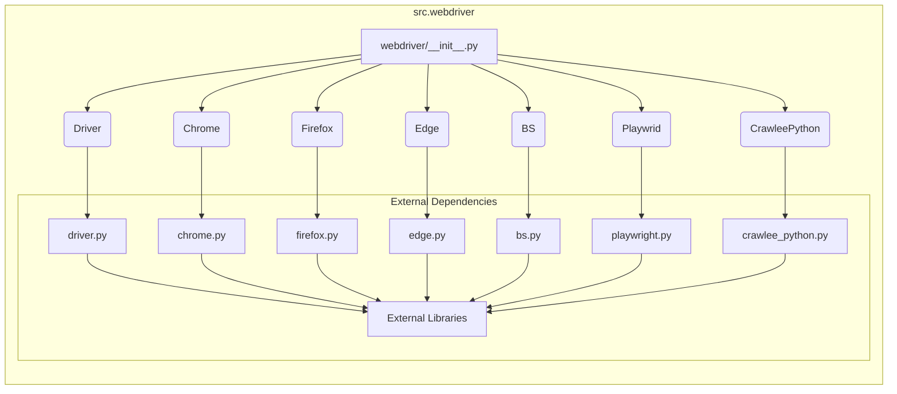

# <input code>

```python
## \file hypotez/src/webdriver/__init__.py
# -*- coding: utf-8 -*-
#! venv/Scripts/python.exe
#! venv/bin/python/python3.12

"""
.. module: src.webdriver 
	:platform: Windows, Unix
	:synopsis:

"""
MODE = 'dev'


from .driver import Driver
from .chrome import Chrome
from .firefox import Firefox
from .edge import Edge
from .bs import BS
from .playwright import Playwrid
from .crawlee_python import CrawleePython

```

# <algorithm>

Этот код представляет собой модуль инициализации для пакета `webdriver`. Он импортирует классы и функции из подпапок `driver`, `chrome`, `firefox`, `edge`, `bs`, `playwright`, и `crawlee_python`.  Алгоритм работы сводится к импорту этих компонентов.  В данном случае нет циклов или сложных вычислений.  Данные не перемещаются между функциями или классами, а лишь импортируются.

**Пример:**

Модуль `src.webdriver` импортирует класс `Driver` из папки `src.webdriver.driver`, который, скорее всего, является базовым классом для управления веб-драйверами.

# <mermaid>



# <explanation>

* **Импорты:** Модуль `webdriver/__init__.py` импортирует классы и функции из других модулей внутри пакета `webdriver`. Это позволяет использовать эти компоненты в других частях проекта, например, для создания и управления различными типами веб-драйверов (Chrome, Firefox, Edge) и другими инструментами веб-автоматизации.  `src.` указывает, что эти модули находятся в подпапках пакета `src`.  Например, `from .driver import Driver` импортирует класс `Driver` из модуля `driver.py` в той же директории, что и текущий файл.

* **Переменные:** `MODE = 'dev'`: Эта переменная скорее всего определяет режим работы (например, `dev` или `prod`).  Её значение используется для настройки поведения или выбора различных компонентов в зависимости от конфигурации.

* **Классы:** Этот код не инициализирует классы, а лишь импортирует их определения.  Классы, такие как `Driver`, `Chrome`, `Firefox`, `Edge`, `BS`, `Playwrid`, и `CrawleePython`, предполагаемо находятся в соответствующих файлах в папке `hypotez/src/webdriver/`, и содержат методы для работы с веб-драйверами, веб-скрапингом, и другими задачами.  Подробная информация о функциональности этих классов находится в `hypotez/src/webdriver/<Имя_файла>`.

* **Функции:** Нет явных функций в данном файле. Все импортируемые элементы, скорее всего, являются классами.


* **Возможные ошибки или области для улучшений:**

    * Отсутствует проверка существования импортированных модулей. Если модуль не существует, возникнет ошибка. Добавьте обработку исключений (try...except) для улучшения устойчивости.

    * Нет описаний для переменной `MODE` или способов её изменения.  Было бы полезно добавить комментарии о возможных значениях этой переменной и контексте её использования.

* **Взаимосвязи с другими частями проекта:**  Этот модуль является частью пакета `webdriver`, который, вероятно, используется для автоматизации задач работы с веб-браузерами.  Следующим шагом после импортирования будет, скорее всего, создание экземпляров классов (`Chrome`, `Firefox` и т.п.) и использование их методов для выполнения задач. Это предполагает взаимодействие с другими частями проекта, где эти классы будут использоваться. Например, в скриптах, выполняющих веб-тестирование, веб-скрапинг или другие задачи автоматизации.