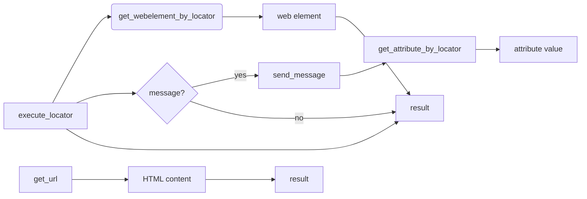

# <input code>

```python
подробные описания для каждой функции модуля `executor`:\n\n### 1. `execute_locator`\n```python\ndef execute_locator(locator: dict, message: str = \'\', typing_speed: float = 0.0, continue_on_error: bool = True) -> any:\n    """ Executes actions on a web element based on the provided locator.\n\n    @param locator: A dictionary or object containing locator information (e.g., type, selector).\n    @param message: Optional message to send to the web element (e.g., text to enter).\n    @param typing_speed: Speed of typing when sending a message (in seconds between keystrokes).\n    @param continue_on_error: Flag indicating whether to continue execution if an error occurs.\n    \n    @return: The result of the locator execution, which could be the web element, a list of elements, an attribute value, or action result.\n    """\n    ...\n```\n- **Назначение**: Выполняет действия на веб-элементе, используя указанный локатор.\n- **Параметры**:\n  - `locator`: Словарь или объект с информацией о локаторе (например, тип поиска и селектор).\n  - `message`: Сообщение для отправки элементу (например, текст для ввода).\n  - `typing_speed`: Скорость набора текста, если отправляется сообщение.\n  - `continue_on_error`: Флаг для продолжения выполнения в случае ошибки.\n- **Возвращаемое значение**: Результат выполнения локатора, который может быть веб-элементом, списком элементов, значением атрибута или результатом действия.\n\n### 2. `get_webelement_by_locator`\n```python\ndef get_webelement_by_locator(locator: dict) -> any:\n    """ Finds and returns a web element based on the provided locator.\n\n    @param locator: A dictionary or object containing locator information (e.g., type, selector).\n    \n    @return: The found web element or a list of elements, depending on the locator\'s specification.\n    """\n    ...\n```\n- **Назначение**: Находит и возвращает веб-элемент(ы) на странице, используя локатор.\n- **Параметры**:\n  - `locator`: Словарь или объект с информацией о локаторе.\n- **Возвращаемое значение**: Один или несколько веб-элементов, найденных по локатору.\n\n### 3. `get_attribute_by_locator`\n```python\ndef get_attribute_by_locator(locator: dict, message: str = \'\') -> any:\n    """ Retrieves the attribute value of a web element identified by the locator.\n\n    @param locator: A dictionary or object containing locator information (e.g., type, selector).\n    @param message: Optional message to send to the web element (e.g., text to enter before retrieving attribute).\n    \n    @return: The value of the attribute of the found web element, or None if an error occurs.\n    """\n    ...\n```\n- **Назначение**: Получает значение атрибута веб-элемента, найденного по локатору.\n- **Параметры**:\n  - `locator`: Словарь или объект с информацией о локаторе.\n  - `message`: Сообщение для отправки элементу перед получением атрибута (необязательно).\n- **Возвращаемое значение**: Значение атрибута веб-элемента.\n\n### 4. `send_message`\n```python\ndef send_message(locator: dict, message: str, typing_speed: float = 0.0, continue_on_error: bool = True) -> bool:\n    """ Sends a message (e.g., text) to a web element identified by the locator.\n\n    @param locator: A dictionary or object containing locator information (e.g., type, selector).\n    @param message: The message to send to the web element.\n    @param typing_speed: Speed of typing when sending the message (in seconds between keystrokes).\n    @param continue_on_error: Flag indicating whether to continue execution if an error occurs.\n    \n    @return: True if the message is sent successfully, otherwise False.\n    """\n    ...\n```\n- **Назначение**: Отправляет сообщение (например, текст) веб-элементу, используя локатор.\n- **Параметры**:\n  - `locator`: Словарь или объект с информацией о локаторе.\n  - `message`: Сообщение для отправки элементу.\n  - `typing_speed`: Скорость набора текста, если сообщение отправляется по частям.\n  - `continue_on_error`: Флаг для продолжения выполнения в случае ошибки.\n- **Возвращаемое значение**: `True`, если сообщение успешно отправлено, или `False`, если произошла ошибка.\n\n### 5. `get_url`\n```python\ndef get_url(url: str, protocol: str = \'https://\') -> bool:\n    """ Retrieves HTML content from a specified URL or file path.\n\n    @param url: The URL or file path to fetch the HTML content from.\n    @param protocol: The protocol to use for URL (default is \'https://\').\n    \n    @return: True if the content is successfully fetched, otherwise False.\n    """\n    ...\n```\n- **Назначение**: Загружает HTML-контент с указанного URL-адреса или локального файла.\n- **Параметры**:\n  - `url`: URL-адрес или путь к файлу для получения HTML-контента.\n  - `protocol`: Протокол для URL (по умолчанию `https://`).\n- **Возвращаемое значение**: `True`, если контент успешно загружен, или `False`, если произошла ошибка.\n"
```

# <algorithm>

**Функция `execute_locator`:**

1. Принимает на вход `locator`, `message`, `typing_speed`, и `continue_on_error`.
2. Использует `locator` для нахождения веб-элемента.
3. Если `message` задано, отправляет сообщение элементу с заданной скоростью.
4. Возвращает результат действия, например, найденный элемент или значение атрибута.

**Функция `get_webelement_by_locator`:**

1. Принимает на вход `locator`.
2. Использует `locator` для поиска веб-элемента(ов).
3. Возвращает найденный элемент(ы).

**Функция `get_attribute_by_locator`:**

1. Принимает на вход `locator` и (необязательно) `message`.
2. Использует `locator` для поиска веб-элемента.
3. Если `message` задано, отправляет сообщение элементу.
4. Возвращает значение атрибута найденного элемента.

**Функция `send_message`:**

1. Принимает на вход `locator`, `message`, `typing_speed`, и `continue_on_error`.
2. Использует `locator` для нахождения веб-элемента.
3. Отправляет `message` элементу с заданной скоростью.
4. Возвращает `True`, если отправка успешна, иначе `False`.

**Функция `get_url`:**

1. Принимает на вход `url` и (необязательно) `protocol`.
2. Загружает HTML-контент с указанного `url`.
3. Возвращает `True`, если загрузка успешна, иначе `False`.

**Пример взаимодействия:**

1. Вызывается `execute_locator` с `locator` для поиска кнопки.
2. `execute_locator` вызывает `get_webelement_by_locator`.
3. `get_webelement_by_locator` находит кнопку.
4. `execute_locator` вызывает `send_message` с текстом для ввода в поле.
5. `send_message` отправляет текст.
6. `execute_locator` возвращает результат.


# <mermaid>



**Описание диаграммы:**

* `execute_locator` — центральная функция, которая вызывает другие функции для выполнения действий.
* `get_webelement_by_locator` ищет веб-элемент по локатору.
* `send_message` отправляет текст в элемент.
* `get_attribute_by_locator` получает значение атрибута элемента.
* `get_url` загружает HTML-контент с URL-адреса.
* Результаты из разных функций передаются в `execute_locator` для последующей обработки.

# <explanation>

**Импорты:**

Код импортов не приведен, поэтому нет информации о связи с другими пакетами в `src`.

**Классы:**

Код содержит только функции. Нет определений классов.

**Функции:**

* **`execute_locator`:** Центральная функция, которая координирует действия с веб-элементами. Принимает локатор, необязательное сообщение, скорость набора и флаг продолжения при ошибке. Использует другие функции для выполнения действий с элементом.
* **`get_webelement_by_locator`:** Ищет веб-элемент по заданному локатору. Возвращает найденный элемент или список элементов.
* **`get_attribute_by_locator`:** Получает значение атрибута веб-элемента по локатору. Возможна отправка сообщения перед получением атрибута.
* **`send_message`:** Отправляет сообщение (например, текст) веб-элементу. Принимает параметры локатора, сообщения, скорости набора и флага продолжения при ошибке.
* **`get_url`:** Загружает HTML-контент с указанного URL-адреса или локального файла.  Возвращает `True` при успешной загрузке, иначе `False`.

**Переменные:**

Переменные, такие как `locator`, `message`, `typing_speed` и `continue_on_error` - передаются в функции для управления поведением.

**Возможные ошибки и улучшения:**

* Отсутствует реализация функций.  Необходимо заполнить `...` в определениях функций.
* Не указано, как происходит обработка ошибок (например, если элемент не найден или действие не выполнено). `continue_on_error` важная опция, но без механизма обработки ошибок теряет смысл.
* Нет проверки корректности входных данных.  Например, `locator` должен быть валидным, `url` должен соответствовать формату URL,  `typing_speed` должен быть положительным числом.

**Взаимосвязь с другими частями проекта:**

Функции `executor` полагаются на внутренние механизмы для работы с веб-драйвером и браузером, скорее всего, они находятся в других модулях проекта (`src`). `get_url` предполагает  существование механизмов для загрузки контента.  Необходимо  ознакомиться с другими модулями `src`, чтобы понять, как  `executor` интегрируется в общую систему.