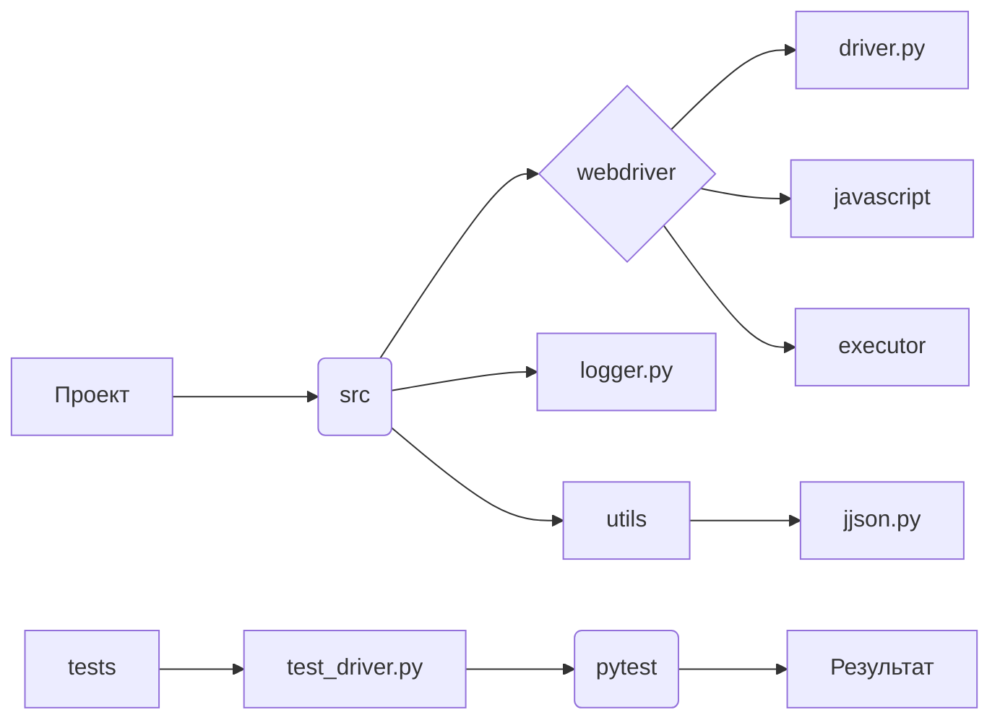

```MD
# Руководство для Тестера класса DriverBase

## <input code>

```
### Руководство для Тестера
# ... (остальной код)
```

## <algorithm>

К сожалению, из предоставленного текста невозможно построить пошаговую блок-схему алгоритма. Текст представляет собой руководство по тестированию, а не код, который можно визуализировать в виде блок-схемы.  Он описывает процесс тестирования, но не содержит самого кода, который бы выполнялся.


## <mermaid>



**Описание диаграммы:**

Диаграмма отображает структуру проекта.
* **Проект (A)** - корневая директория.
* **src (B)** - директория с исходным кодом.
* **webdriver (C)** - поддиректория с драйвером.
* **driver.py (D)** - файл с классом `DriverBase`.
* **javascript (E), executor (F)** - поддиректории с зависимыми компонентами (вероятно, для работы с JavaScript и выполнением задач).
* **logger.py (G)** - файл с логированием.
* **utils (H)** - поддиректория с вспомогательными функциями.
* **jjson.py (I)** - файл с функциями для работы с JSON.
* **tests (J)** - директория с тестовыми сценариями.
* **test_driver.py (K)** - файл с тестами для `DriverBase`.
* **pytest (L)** - инструмент для запуска тестов.
* **Результат (M)** - вывод результатов тестов.

**Зависимости:**

* `driver.py` зависит от компонентов `javascript` и `executor`.
* `test_driver.py` зависит от `driver.py`, `pytest`.
* `utils` предоставляет вспомогательные функции для `driver.py`.
* `jjson.py` предоставляет функции для работы с JSON данными.
* Весь проект зависит от `pytest` для выполнения тестов.
* `logger` -  для ведения журналов тестов, но эта зависимость не отображена на диаграмме в явном виде.


## <explanation>

**Импорты:**

Текст содержит описание процесса тестирования, но не содержит импортов. Никаких импортов в представленном тексте нет.

**Классы:**

Описание присутствует, но сам код класса `DriverBase` отсутствует, поэтому невозможно проанализировать его атрибуты, методы и взаимодействие.

**Функции:**

Текст описывает функции (например, `driver_payload`, `scroll`, `locale`) которые должны присутствовать в `DriverBase` или связанных с ним модулях, но не содержит их определения.

**Переменные:**

Так же как и с функциями, переменные не определены.

**Возможные ошибки или области для улучшения:**

* **Недостаточная детализация:** Руководство слишком общее. Необходимо уточнить шаги тестирования, описывая конкретные тест-кейсы.
* **Отсутствие кода:** Отсутствие кода класса `DriverBase` и связанных функций делает руководство теоретическим.

**Цепочка взаимосвязей:**

Руководство описывает процесс тестирования, который использует `pytest` для запуска тестов. Тесты в `test_driver.py` проверяют класс `DriverBase`, который, скорее всего, реализован в `driver.py`.  Связь с другими модулями (например, `logger.py`, `utils.jjson.py`) указывается в контексте описания, но без кода невозможно сделать детальный анализ.

**Заключение:**

Руководство описывает процесс тестирования, но не содержит деталей кода. Для более глубокого анализа потребуется код `driver.py` и `test_driver.py`, и их взаимосвязи с другими модулями.