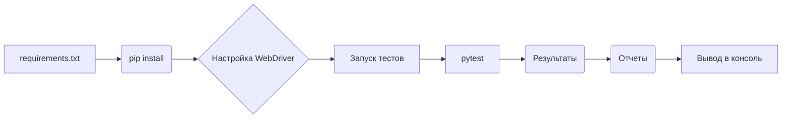

```MD
# Анализ кода файла `hypotez/src/webdriver/_pytest/guide_test_driver_executor.md`

## <input code>

```
Вот руководство для тестеров по запуску и выполнению тестов из файла `test_driver_executor.py`, а также описание тестов и их целей.

---

# Руководство для тестера по запуску и выполнению тестов

## Введение

В этом руководстве описывается, как запустить и выполнить тесты для классов `Driver` и `ExecuteLocator`, расположенные в файле `test_driver_executor.py`. Тесты проверяют функциональность методов классов и взаимодействие между `Driver` и `ExecuteLocator`.

## Структура тестов

Файл `test_driver_executor.py` содержит тесты для двух классов: `Driver` и `ExecuteLocator`. Эти тесты проверяют корректность работы методов классов, взаимодействие между ними, а также сценарии использования в различных ситуациях.

### Тестируемые методы и функции

... (Список методов и функций, тестируемых в файле `test_driver_executor.py`)

## Запуск тестов

### Установка зависимостей

...

### Настройка WebDriver

...

### Запуск тестов

...

## Описание тестов

... (Описание каждого теста)

## Отчеты о тестах

...

## Чеклист

...

## Заключение

---
```

## <algorithm>

Алгоритм работы описывается в данном файле не в виде кода, а в виде документации. Алгоритм запуска тестов следующий:

1. **Установка зависимостей:** Тестер устанавливает необходимые библиотеки (pytest, selenium, и др.) из файла `requirements.txt` с помощью `pip install -r requirements.txt`.
2. **Настройка WebDriver:** Устанавливается путь к исполняемому файлу ChromeDriver (`/path/to/chromedriver`).
3. **Запуск тестов:**  Запуск тестов выполняется командой `pytest src/webdriver/_pytest/test_driver_executor.py`. Эта команда запускает все тестовые функции в указанном файле.
4. **Вывод результатов:** Система pytest выводит результаты тестирования в консоль.  Можно получить более подробные отчеты с помощью флагов командной строки, например `pytest src/webdriver/_pytest/test_driver_executor.py -v`.

* **Пошаговая блок-схема для запуска тестов не приведена**, так как это руководство, а не код.

## <mermaid>




## <explanation>

**Импорты**:  В коде самого руководства отсутствуют импорты, так как это Markdown-файл, содержащий инструкции для тестеров.  Импорты будут в файле `test_driver_executor.py`, который описывает сами тесты.  Эти импорты будут содержать необходимые библиотеки, такие как `pytest`, `selenium` и др.  Связь с другими пакетами  (например, `src.webdriver`)  будет через импортированные модули или классы.

**Классы**: Классы `Driver` и `ExecuteLocator`  определены в файле `test_driver_executor.py`. Это классы, которые представляют логику тестирования.  В руководстве описаны методы этих классов, которые тестеры могут использовать. Подробнее необходимо разбирать файл `test_driver_executor.py`.

**Функции**: Тесты, описанные в файле `test_driver_executor.py`, представляют собой функции (тестовые методы). Они проверяют конкретные аспекты `Driver` и `ExecuteLocator`.  Эти функции принимают необходимые аргументы и возвращают результат. Пример: `test_navigate_to_page`.

**Переменные**:  В данном руководстве, переменные это, в основном, пути к файлам, строковые значения, имена функций, имена тестов, и т.д.  Подробные типы переменных (и значения)  можно увидеть только при анализе кода файла `test_driver_executor.py`.

**Возможные ошибки и улучшения**:

* **Отсутствие кода:** Данное руководство является только описанием, а не кодом. Необходимо посмотреть код файла `test_driver_executor.py` для детального анализа.
* **Недостаточная детализация:** В руководстве не указаны подробности о классах `Driver` и `ExecuteLocator`, их атрибутах и методах, что необходимо для глубокого понимания функциональности.
* **Неполные тесты:** Описания тестов могут быть слишком краткими. Необходимо увидеть, что именно делает каждый тест, с какими аргументами, и что ожидается.


**Взаимосвязи с другими частями проекта**:

Руководство предполагает наличие файла `test_driver_executor.py` с тестами для  `Driver` и `ExecuteLocator`.  Этот файл, скорее всего, находится в подпапке `_pytest` пакета `webdriver` проекта.  Также предполагается наличие файла `requirements.txt` для управления зависимостями.  Цепочка взаимосвязей зависит от структуры проекта.