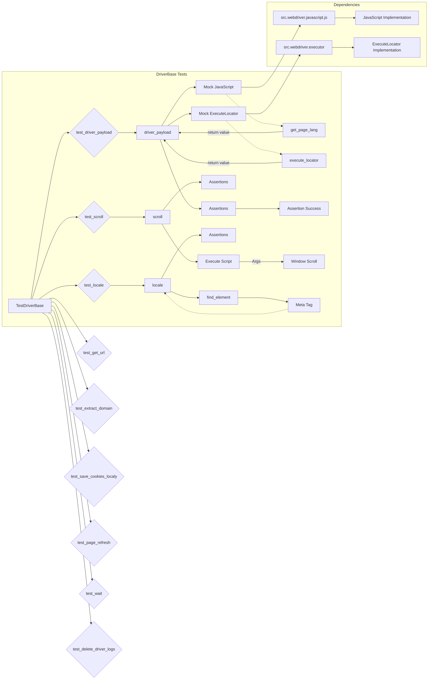

# <input code>

```python
## \file hypotez/src/webdriver/_pytest/test_driver.py
# -*- coding: utf-8 -*-
#! venv/Scripts/python.exe
#! venv/bin/python/python3.12

"""
.. module: src.webdriver._pytest 
	:platform: Windows, Unix
	:synopsis:

"""
MODE = 'dev'


"""
	:platform: Windows, Unix
	:synopsis:

"""


"""
	:platform: Windows, Unix
	:synopsis:

"""


"""
  :platform: Windows, Unix

"""
"""
  :platform: Windows, Unix
  :platform: Windows, Unix
  :synopsis:
"""MODE = 'dev'
  
""" module: src.webdriver._pytest """


""" тестовый файл test_driver.py включает тесты для следующих методов класса DriverBase:
- driver_payload
- scroll
- locale
- get_url
- extract_domain
- _save_cookies_localy
- page_refresh
- wait
- delete_driver_logs
Тесты используют pytest и unittest.mock для создания фиктивных объектов и методов, 
чтобы изолировать тестируемый код и избежать взаимодействия с реальными веб-страницами и файлами.
"""

import pytest
from unittest.mock import Mock, patch, PropertyMock
from selenium.common.exceptions import InvalidArgumentException
from src.webdriver.driver import DriverBase
from src.logger import logger

class TestDriverBase:
    @pytest.fixture
    def driver_base(self):
        """Fixture to create an instance of DriverBase for testing."""
        return DriverBase()

    # ... (rest of the code)
```

# <algorithm>

The code implements unit tests for the `DriverBase` class using `pytest` and `unittest.mock`.  It verifies the functionality of several methods, including `driver_payload`, `scroll`, `locale`, `get_url`, etc., by mocking dependencies.

**General Algorithm (for all test functions):**

1. **Setup:** Create an instance of `DriverBase` (using the `driver_base` fixture).
2. **Mocking:** Use `patch` to replace actual objects or methods (`src.webdriver.javascript.js.JavaScript`, `src.webdriver.executor.ExecuteLocator`, etc.) with mock objects.  This isolates the tested method from its dependencies.
3. **Execution:** Call the method under test, passing any necessary arguments.
4. **Assertions:** Verify the expected behavior by checking the interactions and return values using `assert` statements.  These assertions ensure that the tested method behaves correctly with the mock dependencies.
5. **Verification (using mocks):** Verify that the mock methods were called with the expected arguments (e.g., `mock_js_instance.get_page_lang` was called in `driver_payload`).

**Example (test_driver_payload):**

* Mocks `src.webdriver.javascript.js.JavaScript` and `src.webdriver.executor.ExecuteLocator`.
* Calls `driver_base.driver_payload()`.
* Asserts that the mocked methods (`get_page_lang`, `ready_state`, etc.) were called.

# <mermaid>



**Explanation of Dependencies:**

* `src.webdriver.javascript.js`: Contains the actual JavaScript interaction logic.
* `src.webdriver.executor`: Contains the logic for interacting with the browser's execution environment.
* `DriverBase`: The class under test, which depends on the above modules for execution.
* `unittest.mock`: A library for mocking objects, crucial for isolating tests.
* `pytest`: A testing framework used for running the tests.

# <explanation>

**Imports:**

* `pytest`: A testing framework for Python.
* `unittest.mock`: Provides tools for creating mock objects and patching functions.
* `selenium.common.exceptions`: Contains exception classes specific to Selenium.
* `src.webdriver.driver`: The class being tested, likely part of a larger project structure for web driver interactions.
* `src.logger`: Likely a custom logging module used for recording events within the project.

**Classes:**

* `TestDriverBase`:  A test class defined using `pytest`.  It contains methods for testing `DriverBase`.  The `@pytest.fixture` decorator creates `driver_base` for re-use within tests.

**Functions:**

* `test_driver_payload`: Tests the `driver_payload` method of `DriverBase`.  Mocks `src.webdriver.javascript.js.JavaScript` and `src.webdriver.executor.ExecuteLocator` to isolate the test.
* `test_scroll`: Tests the `scroll` method.  It mocks the `execute_script` and `wait` methods, ensuring they are called correctly and return `True` as expected.


**Possible Errors/Improvements:**

* **Dependency Injection:** Instead of patching modules directly, consider injecting dependencies through constructor parameters. This would make the tests more robust and maintainable.
* **Clearer Assertions:** While the assertions are correct, adding a description to each `assert` statement would improve readability.
* **Edge Cases:** The tests cover some cases, but additional tests for error handling (e.g., invalid input to `scroll`) and unexpected situations (e.g., `find_element` failure in `test_locale`) might improve the test suite.
* **Comments and Documentation:** More comprehensive comments and documentation within the `DriverBase` class itself would clarify its intended purpose and usage, especially if it has complex interactions.


**Relationships:**

The code strongly depends on `src.webdriver.driver` (the class under test) and indirectly on `src.webdriver.javascript.js` and `src.webdriver.executor`.  The `src.logger` module is used for logging, but its impact on this test file is limited (the tests don't use logging directly). The overall structure likely involves a broader web driver implementation architecture within the `src` folder.